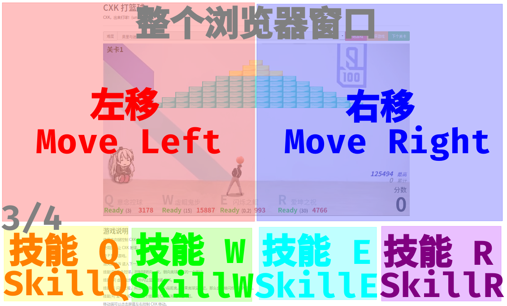

# 🏀 CXK 打篮球

本项目是 CXK 打篮球的游戏，原项目：[h5-game-blockBreaker](https://github.com/yangyunhe369/h5-game-blockBreaker) | [demo](https://sycstudio.com/cxk-ball/)

**ReadMe:** [English Version](README_EN.md)

> ⚠ 警告 ⚠
>
> 本游戏有高难度与高技术性，请 ikun 们不要轻易尝试

最后，喜欢的话欢迎点个 Star，谢谢

## 游戏截图


游戏有更多种难度可选择

从极简单到 I Wanna，总有一个适合你

速度大于等于 8 的难度请勿轻易尝试，否则可能会疯掉（雾


[如果图片挂了的话点这儿](https://s2.ax1x.com/2019/06/10/VyU3bq.gif)

祝您游戏愉快

## 如何体验

你可以访问临时搭建的 [demo](https://sycstudio.com/cxk-ball/)，

也可以直接 clone 到本地

原项目：

```bash
git clone https://github.com/kasuganosoras/cxk-ball
```

这个版本：

```bash
git clone https://github.com/iotang/cxk-ball
```

访问你的站点或者直接浏览器打开 `index.html` 开始玩

## 常见问题

遇到任何问题请尝试刷新，如果刷新不能解决问题，请按下 F12 打开浏览器控制台查看有无报错。

如果有，可尝试自行解决或者截图通过 Issues 反馈给我们，同时请提供浏览器及使用设备的信息，请按照 Issues 规范填写。

> **问：移动端怎么搓技能啊**



> **问：这个游戏是否侵犯他人肖像权**

[请看这篇说明](about.md)

> **问：贴图显示不正确或者很奇怪**

也许是网络问题，尝试刷新一下，或者查看浏览器控制台有无资源加载错误信息。

> **问：我按左右方向键没有反应怎么办**

请使用 A 和 D

> **问：我玩的时候感觉有一点点卡**

可能是你的设备性能太低，建议用电脑玩以获得最好的体验。

并且，建议使用 Firefox、Chrome 等现代浏览器，以获得最佳的支持。

> **问：我听不到音乐**

现在已经没有音乐了

## 未来计划（有生之年系列）

以下功能我会试着（但不一定会）去实现

- [ ] 增加存档功能
- [ ] 增加更多关卡
- [ ] 增加多人联机功能
- [ ] 允许玩家自行创作地图
- [ ] 多人联机自定义服务器功能

## 开发者的话

对于 CXK，我的观点是：可以适当地开玩笑和恶搞，但是不应该侮辱，我们应该尊重他人，适可而止。

因此你在本游戏中不会看到任何侮辱 CXK 的词汇和言论，同时也请大家不要在 Issues 里发表不文明的内容。

## License

本项目使用 [MIT](LICENSE) 许可协议开放其源代码，任何人可在遵守协议的前提下进行修改、分发、二次创作等。
