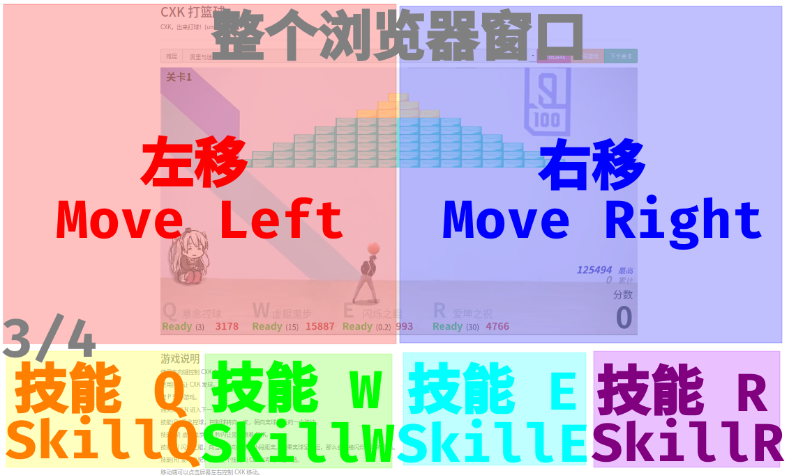

# CXK Play BasketBall

This Project's name is "CXK Play BasketBall" Game，The original Project：[h5-game-blockBreaker](https://github.com/yangyunhe369/h5-game-blockBreaker) | [demo](https://sycstudio.com/cxk-ball/)

If you like this game, please give us a star, thanks!

## Game Screenshots


The game has many speed levels to choose.

From EXTREME-EASY to I WANNA, there will be a level fit you.

The mode which speed>=8, Please ikuns don't try it lightly, Otherwise you might go crazy. (XD


[Click me if the gif failed to show](https://s2.ax1x.com/2019/06/10/VyU3bq.gif)

> Translate:
>
> *Top*
>
> Difficulty: Ori and the Blind Forest-like, Speed 10
>
> *Top Left*
>
> Level: X
>
> *Top Right*
>
> Combo: X
>
> *Middle Right*
>
> Perfomance: XX.XXXX
>
> Ball Catch Count: XX
>
> *Bottom*
>
> Q: Ball Mind-controlling, CD 3 sec, Cost 3178
>
> W: Kun's Shuffle, CD 15 sec, Cost 15887
>
> E: Blink Master, CD 0.2 sec, Cost 993
>
> R: Ikuns' Bless, CD 30 sec, Cost 4766
>
> Hi-Score: 125494 (start)
>
> Sum of Score: 156697 (final)
>
> Now Score: XXXX

Wish you have a good game!

## How to experience

You can play it online on the temporary [demo](https://sycstudio.com/cxk-ball/).

And also you can git clone this project to local.

Original Project:

```bash
git clone https://github.com/kasuganosoras/cxk-ball
```

This Project:

```bash
git clone https://github.com/iotang/cxk-ball
```

Browse your Homepage or use Browser opens `index.html` to play.

## Common problems

If encounter any problems, please try to refresh. If it can't solve problems, Please Press Button F12 to open the browser console view whether or not to report errors.

If so, you can try to solve it yourself or take a screenshot through the Issues feedback, please provide information about the browser and the device, please follow the Issues specification.

> **Q: How to cast skills?**



> **Q: Does this game infringe on the portrait rights of others**

[Please see this note](about.md)

> **Q: The map is displayed incorrectly or very strangely**

Maybe Network Problem, try refreshing, or check the browser console for resource loading error messages.

> **Q: I do not respond by pressing the left and right arrow keys**

Please use KEY A and KEY D

> **Q: I feel a little bit lag when I play this game**

The performance of the device is too low, it is recommended to use a computer to get the best experience, and it is recommended to use modern browsers such as Firefox and Chrome.

> **Q: I can't hear the sound**

No music provided now. :(

## Future plans

I will try (but not necessarily) the following functions

- [ ] Increase archiving
- [ ] Add more levels
- [ ] Increase multiplayer connectivity
- [ ] Allow players to create maps themselves
- [ ] Multi-person online custom server function

## License

This project uses the [MIT](LICENSE) license agreement to open its source code, and anyone can modify, distribute, re-create, etc., subject to the agreement.
