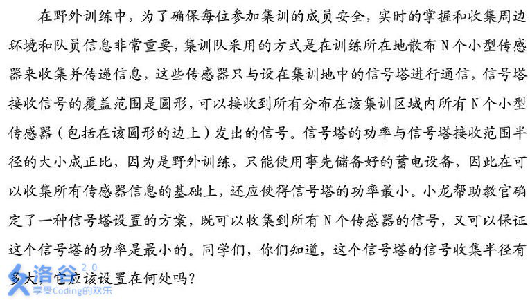

# [AHOI2012]信号塔
[BZOJ2823 Luogu2533]



比较玄学的算法，考虑随机增量。

```cpp
#include<iostream>
#include<cstdio>
#include<cstdlib>
#include<cstring>
#include<algorithm>
#include<cmath>
using namespace std;

#define ll long long
#define ld double
#define mem(Arr,x) memset(Arr,x,sizeof(Arr))

const int maxN=1010000;
const ld eps=1e-6;
const int inf=2147483647;

class Point
{
public:
	ld x,y;
};

int n;
Point P[maxN];

ld Dist(Point A,Point B);
ld GetR(Point A,Point B,Point C,Point &O);

int main(){
	scanf("%d",&n);
	for (int i=1;i<=n;i++) scanf("%lf%lf",&P[i].x,&P[i].y);
	random_shuffle(&P[1],&P[n+1]);
	Point O=P[1];ld r=0;
	for (int i=2;i<=n;i++)
		if (Dist(O,P[i])>r+eps){
			O=P[i];r=0;
			for (int j=1;j<i;j++)
				if (Dist(O,P[j])>r+eps){
					O=((Point){(P[i].x+P[j].x)/2.0,(P[i].y+P[j].y)/2.0});
					r=Dist(O,P[j]);
					for (int k=1;k<j;k++)
						if (Dist(O,P[k])>r+eps)
							r=GetR(P[i],P[j],P[k],O);
				}
		}
	printf("%.2lf %.2lf %.2lf\n",O.x,O.y,r);
	return 0;
}

ld Dist(Point A,Point B){
	return sqrt((A.x-B.x)*(A.x-B.x)+(A.y-B.y)*(A.y-B.y));
}

ld GetR(Point A,Point B,Point C,Point &O){
	ld a=2.0*(A.x-B.x),b=2.0*(A.y-B.y),c=A.x*A.x-B.x*B.x+A.y*A.y-B.y*B.y;
	ld d=2.0*(B.x-C.x),e=2.0*(B.y-C.y),f=B.x*B.x-C.x*C.x+B.y*B.y-C.y*C.y;
	e=e*a/d;f=f*a/d;d=a;
	ld y=(c-f)/(b-e),x=(c-b*y)/a;
	O.x=x;O.y=y;
	return Dist(A,O);
}
```