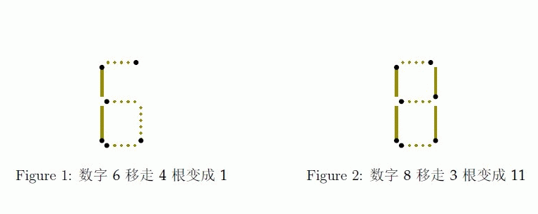
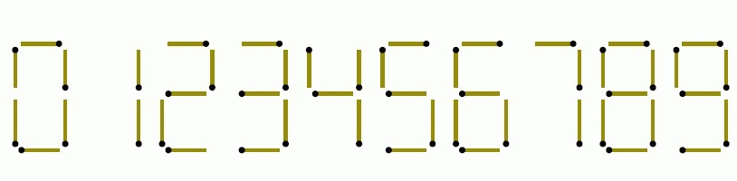

# [SCOI2013]火柴棍数字
[BZOJ3324 Luogu3283]

Fish是一条生活在海里的鱼，有一天他很无聊，于是他去捡了人类扔进海里的垃圾，打算用这些来玩些什么。  
他从捡回来的垃圾堆里找到了不少火柴棍，便把这些火柴棍拼成了一个长度为n 的十进制数，每个数字的拼法如下图所示  
注意：每个数字占据的宽度和摆放方式是固定的，故以下情况均不合法。  





拼完之后他好累，感觉再也不会拼了。   
他对拼出来的数大小不满意，希望通过移动一些火柴棍的位置来把这个数变得尽量大。由于太累，他只能最多移动k 根火柴棍。而且由于数字的最低位放在墙边，他不能在该数的低位后面添加数字，但他可以在该数的前面添加数字。  
你能帮他算出他移动火柴棍之后的数最大能是多大吗？  
注意：火柴棍对于Fish 来说是很贵重的物品，所以不允许折断或丢弃火柴棍。  
注意：火柴头的方向不影响数字的辨识，例如下面几种情况都是数字1

首先考虑肯定是位数越多越好。设 F[i][j][0/1] 表示 i 位，多余或缺少的火柴数为 j ，第 i 位是否为 0 的最小移动的火柴数。最大 i 使得 F[i][j][0/1]<=m 就是合法的位数。得到位数后，再贪心地从高位向低位填数。

```cpp
#include<cstdio>
#include<algorithm>
#include<cstring>
#include<cstdlib>
using namespace std;

#define ll long long
#define mem(Arr,x) memset(Arr,x,sizeof(Arr))
#define RG register
#define IL inline

const int maxN=3510;
const int N=3500;
const int Key[10]={119,36,93,109,46,107,123,37,127,111};
const int inf=2147483647;

int n,m;
char Input[maxN];
short F[3505/2][7010][2];

IL void GetMin(RG short &x,RG int y);

int main(){
	RG int i,j,k,x,usesum,movecnt,sum=0,len;
	int move[11][10],delta[11][10];mem(move,0);mem(delta,0);
	for (i=0;i<=9;++i)
		for (j=0;j<=9;++j)
			for (k=0;k<=6;++k){
				if ( !(Key[i]&(1<<k)) && (Key[j]&(1<<k)) ) ++move[i][j],++delta[i][j];
				if ( (Key[i]&(1<<k)) && !(Key[j]&(1<<k)) ) --delta[i][j];
			}
	for (i=0;i<=9;++i) for (j=0;j<=6;++j) if (Key[i]&(1<<j)) ++move[10][i],++delta[10][i];
	scanf("%s",Input+1);scanf("%d",&m);n=strlen(Input+1);
	reverse(&Input[1],&Input[n+1]);for (i=1;i<=n;++i) Input[i]-='0',sum+=move[10][Input[i]];
	len=sum/2;
	for (i=n+1;i<=len;++i) Input[i]=10;
	for (i=0;i<=len;++i) for (j=-m;j<=m;++j) for (k=0;k<=1;++k) F[i][j+N][k]=m+1;
	F[0][N][0]=0;
	for (i=0;i<len;++i)
		for (j=-m;j<=m;++j)
			for (k=0;k<=1;++k)
				if (F[i][j+N][k]<=m)
					for (x=0;x<=9;++x)
						GetMin(F[i+1][j+delta[Input[i+1]][x]+N][x==0],F[i][j+N][k]+move[Input[i+1]][x]);
	while (F[len][N][0]>m) --len;
	for (i=0;i<=len;++i) for (j=-m;j<=m;++j) GetMin(F[i][N+j][0],F[i][N+j][1]);
	for (i=len,usesum=0,movecnt=0;i>=1;--i)
		for (j=9;j>=0;--j){
			usesum+=delta[Input[i]][j];movecnt+=move[Input[i]][j];
			if (F[i-1][N-usesum][0]<=m-movecnt){
				printf("%d",j);
				break;
			}
			usesum-=delta[Input[i]][j];movecnt-=move[Input[i]][j];
		}
	return 0;
}

IL void GetMin(short &x,int y){
	if (x>y) x=y;return;
}
```