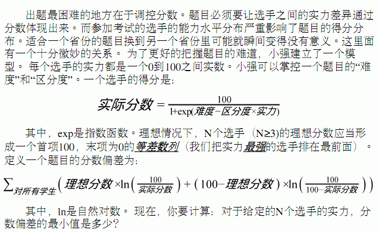

# [BJOI2013]分数
[BZOJ3330]



题目中提示了答案是个单峰函数，那么不妨三分套三分区分度和实力。

```cpp
#include<iostream>
#include<cstdio>
#include<cstdlib>
#include<cstring>
#include<algorithm>
#include<cmath>
using namespace std;

#define ll long long
#define ld long double
#define mem(Arr,x) memset(Arr,x,sizeof(Arr))

const int maxN=25;
const ld eps=1e-15;
const int inf=2147483647;

int n,P;
ld fs[maxN];

ld calc(ld nd);
ld sum(ld nd,ld qf);
void outpinteg(ll key);

int main(){
	scanf("%d%d",&n,&P);
	for (int i=1;i<=n;i++) scanf("%LF",&fs[i]);
	ld nl=0,nr=15;
	while (nl+eps<nr){
		ld d=(nr-nl)/3.0;
		ld l=nl+d,r=nr-d;
		if (calc(l)<calc(r)) nr=r;
		else nl=l;
	}
	ld ans=calc(nl);
	ll a=(ll)ans;ans-=a;
	outpinteg(a);if (P!=0) printf(".");
	while (P>0) ans*=10,printf("%lld",(ll)ans),ans-=(ll)ans,--P;
	printf("\n");
	return 0;
}

ld calc(ld nd){
	ld ql=0,qr=1;
	while (ql+eps<qr){
		ld d=(qr-ql)/3.0;
		ld l=ql+d,r=qr-d;
		if (sum(nd,l)<sum(nd,r)) qr=r;
		else ql=l;
	}
	return sum(nd,ql);
}

ld sum(ld nd,ld qf){
	ld ret=0,d=100.0/(n-1),wt=100;
	for (int i=1;i<=n;i++){
		ld real=100.0/(1+exp(nd-qf*fs[i]));
		if (real<eps) ret+=(100.0-wt)*log(100.0/(100.0-real));
		else if (fabs(real-100)<eps) ret+=wt*log(100.0/real);
		else ret+=wt*log(100.0/real)+(100.0-wt)*log(100.0/(100.0-real));
		wt-=d;
	}
	return ret;
}

void outpinteg(ll key){
	if (key==0) return;
	outpinteg(key/10);
	if (P==0) printf("0");
	else printf("%lld",key%10),P--;
	return;
}
```