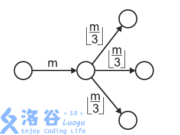

# [POI2014]MRO-Ant colony
[BZOJ3872 Luogu3576]

The ants are scavenging an abandoned ant hill in search of food.  
The ant hill has nnn chambers and n−1n-1n−1 corridors connecting them.  
We know that each chamber can be reached via a unique path from every other chamber.  
In other words, the chambers and the corridors form a tree.  
There is an entrance to the ant hill in every chamber with only one corridor leading into (or out of) it.  
At each entry, there are ggg groups of m1,m2,⋯,mgm_1,m_2,\cdots,m_gm1​,m2​,⋯,mg​ ants respectively.  
These groups will enter the ant hill one after another, each successive group entering once there are no ants inside.  
Inside the hill, the ants explore it in the following way:  
    Upon entering a chamber with ddd outgoing corridors yet unexplored by the group,the group divides into ddd groups of equal size. Each newly created group follows one of the d corridors.If d=0d=0d=0, then the group exits the ant hill.  
    If the ants cannot divide into equal groups, then the stronger ants eat the weaker until a perfect division is possible.Note that such a division is always possible since eventually the number of ants drops down to zero.Nothing can stop the ants from allowing divisibility - in particular, an ant can eat itself, and the last one remaining will do so if the group is smaller than ddd.  
The following figure depicts mmm ants upon entering a chamber with three outgoing unexplored corridors, dividing themselves into three (equal) groups of ⌊m/3⌋\left \lfloor m/3 \right \rfloor⌊m/3⌋ ants each.



A hungry anteater dug into one of the corridors and can now eat all the ants passing through it.  
However, just like the ants, the anteater is very picky when it comes to numbers.  
It will devour a passing group if and only if it consists of exactly kkk ants.  
We want to know how many ants the anteater will eat.  
给一棵树，对于每个叶子节点，都有g群蚂蚁要从外面进来，每群蚂蚁在行进过程中只要碰到岔路，就将平均地分成岔路口数-1那么多份，然后平均地走向剩下的那些岔路口，余下的蚂蚁自动消失，树上有一个关键边，假如有一群蚂蚁通过了这条边且数量恰好为k，这k只蚂蚁就被吃掉，问一共有多少只蚂蚁被吃掉

可以发现，每一个点的合法蚂蚁数量是一个区间，预处理出来，然后将蚂蚁群排序，二分得到上下界，累计答案。

```cpp
#include<iostream>
#include<cstdio>
#include<cstdlib>
#include<cstring>
#include<algorithm>
using namespace std;

#define ll long long
#define mem(Arr,x) memset(Arr,x,sizeof(Arr))
#define RG register
#define IL inline

const int maxN=1010000;
const int maxM=maxN<<1;
const int inf=2147483647;

int n,g,K;
int Seq[maxN];
int edgecnt=0,Head[maxN],Next[maxM],V[maxM],Dg[maxN];
int L[maxN],R[maxN];

IL int Input();
IL void Add_Edge(RG int u,RG int v);
void dfs(RG int u,RG int fa);
IL void Mark(RG int u,RG int l,RG int r);

int main(){
	RG  int i,s,t,u,v,op,ed,l,r,mid;
	mem(Head,-1);
	n=Input();g=Input();K=Input();//scanf("%d%d%d",&n,&g,&K);
	for (i=1;i<=g;++i) Seq[i]=Input();//scanf("%d",&Seq[i]);
	sort(&Seq[1],&Seq[g+1]);
	for (i=1;i<n;++i){
		u=Input();v=Input();//scanf("%d%d",&u,&v);
		if (i==1) s=u,t=v;++Dg[u];++Dg[v];
		Add_Edge(u,v);Add_Edge(v,u);
	}
	Mark(s,K,K);
	Mark(t,K,K);
	dfs(s,t);dfs(t,s);

	ll Ans=0;
	for (i=1;i<=n;++i)
		if (Dg[i]==1){
			if ((L[i]==-1)||(Seq[g]<L[i])||((R[i]!=-1)&&(Seq[1]>R[i]))) continue;
			op=ed=0;
			l=1;r=g;
			if (L[i]<=Seq[1]) op=1;
			else do{
				mid=(l+r)>>1;
				if (Seq[mid]>=L[i]) op=mid,r=mid-1;
				else l=mid+1;
			}
			while (l<=r);
			l=1;r=g;
			if (R[i]>=Seq[g]) ed=g;
			else if (R[i]==-1) ed=g;
			else do{
				mid=(l+r)>>1;
				if (Seq[mid]<=R[i]) ed=mid,l=mid+1;
				else r=mid-1;
			}
			while (l<=r);

			Ans=Ans+(ed-op+1);
		}
	printf("%lld\n",1ll*Ans*K);return 0;
}

IL int Input(){
	RG int x=0;RG char ch=getchar();
	while ((ch>'9')||(ch<'0')) ch=getchar();
	while ((ch>='0')&&(ch<='9')) x=x*10+ch-48,ch=getchar();
	return x;
}

IL void Add_Edge(RG int u,RG int v){
	Next[++edgecnt]=Head[u];Head[u]=edgecnt;V[edgecnt]=v;
	return;
}

void dfs(RG int u,RG int fa){
	for (RG int i=Head[u];i!=-1;i=Next[i])
		if (V[i]!=fa){
			Mark(V[i],L[u],R[u]);dfs(V[i],u);
		}
	return;
}

IL void Mark(RG int u,RG int l,RG int r){
	if (Dg[u]==1) L[u]=l,R[u]=r;
	else{
		RG int d=Dg[u]-1;
		if (l==-1) {L[u]=R[u]=-1;return;}
		else if (1ll*l*d>Seq[g]) {L[u]=R[u]=-1;return;}
		else L[u]=1ll*l*d;
		
		if (r==-1) R[u]=-1;
		else if (1ll*r*d+d-1>Seq[g]) R[u]=-1;
		else R[u]=1ll*r*d+d-1;
	}
	return;
}
```