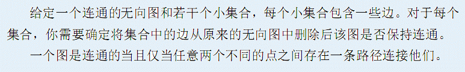

# [AHOI2013]连通图
[BZOJ3237]



把询问离线下来，然后$CDQ$分治。维护一个支持撤销的并查集，处理左边的时候，把右边不在左边被删除的边加入，递归处理左边。然后回来撤销后，把左边不在右边被删除的边加入，再递归处理右边。

```cpp
#include<iostream>
#include<cstdio>
#include<cstdlib>
#include<cstring>
#include<algorithm>
#include<vector>
using namespace std;

#define ll long long
#define mem(Arr,x) memset(Arr,x,sizeof(Arr))

const int maxN=101000<<1;
const int maxM=201000<<1;
const int maxQ=101000<<1;
const int inf=2147483647;

class Edge
{
public:
	int u,v;
};

int n,m,Q;
int tim=1,Tim[maxN];
Edge E[maxM];
int UFS[maxN];
int top=0,St1[maxN*10],St2[maxN*10];
vector<int> Qn[maxQ];
int Ans[maxN];

void Divide(int l,int r);
int Find(int x);
void Union(int u,int v);
void Undo();

int main(){
	scanf("%d%d",&n,&m);
	for (int i=1;i<=n;i++) UFS[i]=i;
	for (int i=1;i<=m;i++) scanf("%d%d",&E[i].u,&E[i].v);
	scanf("%d",&Q);
	for (int i=1;i<=Q;i++){
		int c;scanf("%d",&c);
		for (int j=1;j<=c;j++){
			int id;scanf("%d",&id);
			Tim[id]=tim;Qn[i].push_back(id);
		}
	}

	for (int i=1;i<=m;i++)
		if (Tim[i]!=tim) Union(E[i].u,E[i].v);

	Divide(1,Q);

	for (int i=1;i<=Q;i++)
		if (Ans[i]) printf("Connected\n");
		else printf("Disconnected\n");

	return 0;
}

void Divide(int l,int r){
	int bottom=top;
	tim++;
	if (l==r){
		bool flag=1;
		for (int sz=Qn[l].size(),i=0;i<sz;i++)
			if (Find(E[Qn[l][i]].u)!=Find(E[Qn[l][i]].v)){
				flag=0;break;
			}
		Ans[l]=flag;return;
	}

	tim++;int mid=(l+r)>>1;
	for (int i=l;i<=mid;i++) for (int sz=Qn[i].size(),j=0;j<sz;j++) Tim[Qn[i][j]]=tim;
	for (int i=mid+1;i<=r;i++) for (int sz=Qn[i].size(),j=0;j<sz;j++) if (Tim[Qn[i][j]]!=tim) Union(E[Qn[i][j]].u,E[Qn[i][j]].v);

	Divide(l,mid);
	while (top!=bottom) Undo();
	tim++;
	for (int i=mid+1;i<=r;i++) for (int sz=Qn[i].size(),j=0;j<sz;j++) Tim[Qn[i][j]]=tim;
	for (int i=l;i<=mid;i++) for (int sz=Qn[i].size(),j=0;j<sz;j++) if (Tim[Qn[i][j]]!=tim) Union(E[Qn[i][j]].u,E[Qn[i][j]].v);

	Divide(mid+1,r);
	while (top!=bottom) Undo();
	return;
}

int Find(int x){
	if (UFS[x]==x) return x;
	top++;St1[top]=x;St2[top]=UFS[x];
	return UFS[x]=Find(UFS[x]);
}

void Union(int u,int v){
	if (Find(u)!=Find(v)){
		u=Find(u);v=Find(v);
		top++;St1[top]=u;St2[top]=UFS[u];
		UFS[u]=v;
	}
	return;
}

void Undo(){
	int u=St1[top],fa=St2[top];top--;
	UFS[u]=fa;return;
}
```