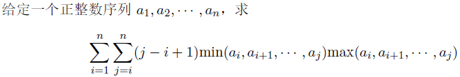

# [COCI2015]Norma
[BZOJ3745 SPOJ NORMA2]



分治，计算经过中间点的区间的贡献。从中间向左边枚举左端点 p ，同时维护从 p 到 mid 的最大值 mx 和最小值 mn，并且可以维护 mxr 和 mnr 表示 mid 到右边小于等于 mx 的最右的数和大于等于 mn 的最右的数。那么对于右边的贡献可以分三个部分来计算，令 rps=min(mnr,mxr) rmp=max(mnr,mxr)，第一部分是 [mid+1,rps] ，这一部分的最小值就是 mn 和 mx ，$mn \times mx \sum _ {i=mid+1} ^ {rps}(i-p+1)$ ，后面就是等差数列求和。第二部分是 [rps+1,rmp] ，这一部分有两种情况，一种是 mxr=rps ，此时右端点早 [rps+1,rmp] 的区间贡献最小值一定是 mn ，而最大值为 Mx[i] ，$mn \sum _ {i=rps+1} ^ {rmp} (i-p+1) Mx[i]$ ，拆开后发现维护 Mx[i] 和  Mx[i]i 的前缀和即可；对于 mnr=rps 的类似，维护 Mn[i] 和 Mn[i]i 的前缀和。第三部分是 [rmp+1,r] 这一部分的区间的最大值和最小值都分别是右半部分对应的最大值和最小值， $\sum _ {i=rmp+1} ^ r (i-p+1)Mn[i]Mx[i]$ ，维护 Mn[i]Mx[i] 和 Mn[i]Mx[i]i 的前缀和。

```cpp
#include<iostream>
#include<cstdio>
#include<cstdlib>
#include<cstring>
#include<algorithm>
using namespace std;

#define ll long long
#define mem(Arr,x) memset(Arr,x,sizeof(Arr))

const int maxN=501000;
const int Mod=1000000000;
const int inf=2147483647;

int n;
ll Ans=0;
int Seq[maxN],Sum[maxN];
int Tq[maxN],T[maxN],Mnq[maxN],Mn[maxN],Mxq[maxN],Mx[maxN];

void Solve(int l,int r);

int main(){
	for (int i=1;i<maxN;i++) Sum[i]=(Sum[i-1]+i)%Mod;
	scanf("%d",&n);
	for (int i=1;i<=n;i++) scanf("%d",&Seq[i]);

	Solve(1,n);

	printf("%lld\n",Ans);

	return 0;
}

void Solve(int l,int r){
	if (l>r) return;
	if (l==r){
		Ans=(Ans+1ll*Seq[l]*Seq[l]%Mod)%Mod;
		return;
	}
	int mid=(l+r)>>1;
	int mn=inf,mx=0;
	Tq[mid]=T[mid]=Mn[mid]=Mx[mid]=Mnq[mid]=Mxq[mid]=0;
	for (int i=mid+1;i<=r;i++){
		mn=min(mn,Seq[i]);mx=max(mx,Seq[i]);
		Tq[i]=1ll*mn*mx%Mod*i%Mod;T[i]=1ll*mx*mn%Mod;
		Mnq[i]=1ll*mn*i%Mod;Mn[i]=mn;
		Mxq[i]=1ll*mx*i%Mod;Mx[i]=mx;
	}

	for (int i=r-1;i>=mid+1;i--) Tq[i]=(Tq[i]+Tq[i+1])%Mod,T[i]=(T[i]+T[i+1])%Mod;
	for (int i=mid+1;i<=r;i++) Mnq[i]=(Mnq[i]+Mnq[i-1])%Mod,Mn[i]=(Mn[i]+Mn[i-1])%Mod,Mxq[i]=(Mxq[i-1]+Mxq[i])%Mod,Mx[i]=(Mx[i]+Mx[i-1])%Mod;

	mn=inf;mx=0;
	int mxr=mid,mnr=mid;
	int lastans=Ans;
	for (int p=mid;p>=l;p--){
		mn=min(mn,Seq[p]);mx=max(mx,Seq[p]);
		while ((mxr<r)&&(Seq[mxr+1]<=mx)) mxr++;
		while ((mnr<r)&&(Seq[mnr+1]>=mn)) mnr++;
		int rps=min(mxr,mnr),rmp=max(mxr,mnr);
		Ans=(Ans+1ll*mn*mx%Mod*(Sum[rps-p+1]-Sum[mid-p+1]+Mod)%Mod)%Mod;
		if (rmp<r) Ans=((Ans+Tq[rmp+1])%Mod-1ll*T[rmp+1]*(p-1)%Mod+Mod)%Mod;
		if (mxr!=mnr){
			if (rps==mnr) Ans=(Ans+1ll*mx*(Mnq[mxr]-Mnq[rps]+Mod-1ll*(Mn[mxr]-Mn[rps])*(p-1)%Mod+Mod)%Mod)%Mod;
			else Ans=(Ans+1ll*mn*(Mxq[mnr]-Mxq[rps]+Mod-1ll*(Mx[mnr]-Mx[rps])*(p-1)%Mod+Mod)%Mod)%Mod;
		}
	}

	Solve(l,mid);Solve(mid+1,r);return;
}
```