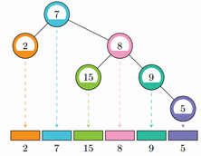

# [NWERC2017]Factor-Free Tree
[BZOJ5200]

一棵Factor-Free Tree是指一棵有根二叉树，每个点包含一个正整数权值，且每个点的权值都与其所有祖先的权值互质。二叉树中序遍历是指按照左子树-根-右子树的顺序递归遍历二叉树，将每个点的权值依次写下来得到的序列。给定一个序列a_1,a_2,...,a_n，请判断它是不是可能是某棵Factor-Free Tree的中序遍历序列，如果是的话请给出例子。



有题可知，对于当前区间，能成为当前区间根的一定是与当前区间所有数都互质的数，并且可以知道，如果区间内存在若干个这样的数，任意一个都是可行的。  
问题转化为快速求出区间内与所有数互质的数。预处理 L[i],R[i] 表示与第 i 个数互质的、包含第 i 个数的极大区间，这个可以通过预处理得到，通过一些小技巧可以做到 O(nlogn) 。

```cpp
#include<cstdio>
#include<cstdlib>
#include<cstring>
#include<algorithm>
using namespace std;

const int maxN=1010000;
const int Num=10000100;

int n,mx,I[maxN];
bool ntp[Num];
int pcnt,P[Num/10],lst[Num],Low[Num];
int L[maxN],R[maxN],Fa[maxN];

void Init(int limit);
bool Divide(int l,int r,int fa);

int main(){
	scanf("%d",&n);
	for (int i=1;i<=n;i++) scanf("%d",&I[i]),mx=max(mx,I[i]);
	Init(mx);
	for (int i=1;i<=n;i++){
		int x=I[i];L[i]=1;
		while (x!=1){
			int low=Low[x];L[i]=max(lst[low]+1,L[i]);lst[low]=i;
			while (x%low==0) x/=low;
		}
	}
	for (int i=1;i<=mx;i++) lst[i]=n+1;
	for (int i=n;i>=1;i--){
		int x=I[i];R[i]=n;
		while (x!=1){
			int low=Low[x];R[i]=min(lst[low]-1,R[i]);lst[low]=i;
			while (x%low==0) x/=low;
		}
	}
	if (Divide(1,n,0)) for (int i=1;i<=n;i++) printf("%d ",Fa[i]);
	else printf("impossible\n");
	return 0;
}
void Init(int limit){
	ntp[1]=1;
	for (int i=2;i<=limit;i++){
		if (ntp[i]==0) P[++pcnt]=i,Low[i]=i;
		for (int j=1;j<=pcnt&&1ll*i*P[j]<=limit;j++){
			ntp[i*P[j]]=1;Low[i*P[j]]=P[j];
			if (i%P[j]==0) break;
		}
	}
	return;
}
bool Divide(int l,int r,int fa){
	int nl=l,nr=r;if (l>r) return 1;
	while (nl<=nr){
		if (L[nl]<=l&&R[nl]>=r){
			Fa[nl]=fa;return Divide(l,nl-1,nl)&&Divide(nl+1,r,nl);
		}
		if (L[nr]<=l&&R[nr]>=r){
			Fa[nr]=fa;return Divide(l,nr-1,nr)&&Divide(nr+1,r,nr);
		}
		++nl;--nr;
	}
	return 0;
}
```