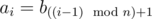
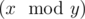

# Maxim and Increasing Subsequence
[CF261D]

Maxim loves sequences, especially those that strictly increase. He is wondering, what is the length of the longest increasing subsequence of the given sequence a?  
Sequence a is given as follows:  
the length of the sequence equals n × t;   
(1 ≤ i ≤ n × t), where operation    means taking the remainder after dividing number x by number y.   
Sequence s1,  s2,  ...,  sr of length r is a subsequence of sequence a1,  a2,  ...,  an, if there is such increasing sequence of indexes i1, i2, ..., ir (1  ≤  i1  <  i2  < ...   <  ir  ≤  n), that aij  =  sj. In other words, the subsequence can be obtained from the sequence by crossing out some elements.  
Sequence s1,  s2,  ...,  sr is increasing, if the following inequality holds: s1 < s2 <  ... <  sr.  
Maxim have k variants of the sequence a. Help Maxim to determine for each sequence the length of the longest increasing subsequence.

给出一个长度为 n 的序列，把这个序列复制 T 次，求最长上升子序列。

首先可以知道，T 可以取得 min(T,MxB) ，因为更大的 T 是没有意义的，这样一来 T 就降低到了最多 2 * 10^7 级别，但这样还不够。考虑暴力更新，把序列的值一个一个加入。对于值 x ，用 f[x-1] 去更新所有的 x..mxB 的值。由于 F 是个单调不降的序列，所以当不能更新的时候直接退出。这样才能保证复杂度。每一次运算是 O(1) 的，而每一个 F 的最大值就是 mxB ，故总运算次数是 n * mxB，可以接受。

```cpp
#include<iostream>
#include<cstdio>
#include<cstdlib>
#include<cstring>
#include<algorithm>
using namespace std;

#define ll long long
#define mem(Arr,x) memset(Arr,x,sizeof(Arr))

const int maxN=505000;
const int inf=2147483647;

int n,T,Mx;
int Seq[maxN];
int F[maxN];

int main(){
	int Case;scanf("%d",&Case);
	scanf("%d%d%d",&n,&Mx,&T);T=min(T,Mx);T=T*n;
	while (Case--){
		for (int i=1;i<=n;i++) scanf("%d",&Seq[i]);
		mem(F,0);
		for (int i=1;i<=T;i++){
			int k=Seq[(i-1)%n+1];
			for (int j=k;(j<=Mx)&&(F[j]<F[k-1]+1);j++)
				F[j]=F[k-1]+1;
		}
		int Ans=0;
		for (int i=1;i<=Mx;i++) Ans=max(Ans,F[i]);
		printf("%d\n",Ans);
	}

	return 0;
}
```