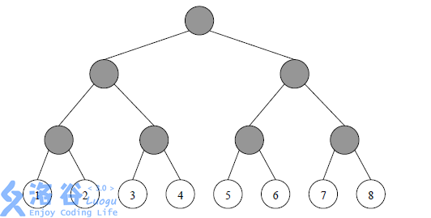
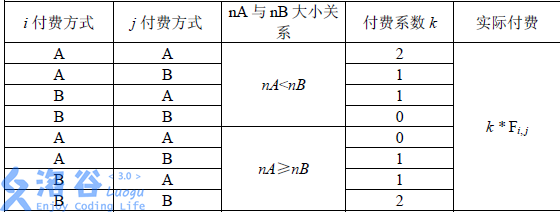

# [NOI2006]网络收费
[BZOJ1495 Luogu4297]

网络已经成为当今世界不可或缺的一部分。每天都有数以亿计的人使用网络进行学习、科研、娱乐等活动。然而，不可忽视的一点就是网络本身有着庞大的运行费用。所以，向使用网络的人进行适当的收费是必须的，也是合理的。  
MY 市NS 中学就有着这样一个教育网络。网络中的用户一共有$2^N$个，编号依次为1, 2, 3, …, $2^N$。这些用户之间是用路由点和网线组成的。用户、路由点与网线共同构成一个满二叉树结构。树中的每一个叶子结点都是一个用户，每一个非叶子结点（灰色）都是一个路由点，而每一条边都是一条网线（见下图，用户结点中的数字为其编号）。  


MY 网络公司的网络收费方式比较奇特，称为“ 配对收费 ”。即对于每两个用户$i, j (1≤i &lt; j ≤2^N )$ 进行收费。由于用户可以自行选择两种付费方式A、B中的一种，所以网络公司向学校收取的费用与每一位用户的付费方式有关。该费用等于每两位不同用户配对产生费用之和。  
为了描述方便，首先定义这棵网络树上的一些概念：  
祖先：根结点没有祖先，非根结点的祖先包括它的父亲以及它的父亲的祖先；  
管辖叶结点：叶结点本身不管辖任何叶结点，非叶结点管辖它的左儿子所管辖的叶结点与它的右儿子所管辖的叶结点；  
距离：在树上连接两个点之间的用边最少的路径所含的边数。  

对于任两个用户$i, j (1≤i&lt;j≤2^N )$，首先在树上找到与它们距离最近的公共祖先：路由点$P$，然后观察$P$ 所管辖的叶结点（即用户）中选择付费方式A 与B的人数，分别记为$n_A$ 与$n_B$，接着按照网络管理条例第X 章第Y 条第Z 款进行收费（如下表），其中$F_{i,j}$ 为$i$ 和$j$ 之间的流量，且为已知量。



由于最终所付费用与付费方式有关，所以NS 中学的用户希望能够自行改变自己的付费方式以减少总付费。然而，由于网络公司已经将每个用户注册时所选择的付费方式记录在案，所以对于用户$i$，如果他/她想改变付费方式（由A 改为B 或由B 改为A），就必须支付$C _ i$ 元给网络公司以修改档案（修改付费方式记录）。  
现在的问题是，给定每个用户注册时所选择的付费方式以及$C _ i$，试求这些用户应该如何选择自己的付费方式以使得NS 中学支付给网络公司的总费用最少（更改付费方式费用+配对收费的费用）。

如果直接计算贡献需要知道每一个点的状态，不好统计。观察贡献的计算方式，当 nA 较多时收费 B ，反之收费 A 。同时发现，当一个叶子上面所有点的 nA 和 nB 的大小关系确定的时候，其收费是确定的，又因为树高不会超过 n ，所以可以直接枚举前面每一层的 nA 与 nB 的大小关系，这样以来，用提前与处理好的 Cost[i][j] 表示叶子 j 在 i 处与别的点的贡献，即与 j 的 lca 为 i 的 F 之和。设 F[i][j] 表示在 i 子树内，选择 j 个以 A 方式付费时的最小代价，从左右子树转移过来就好。注意当枚举的为 nA<nB 的时候要求 A 不能超过一半，反之一定要大于等于一半。转移的时候控制一下。

```cpp
#include<iostream>
#include<cstdio>
#include<cstdlib>
#include<cstring>
#include<algorithm>
using namespace std;

#define ll long long
#define mem(Arr,x) memset(Arr,x,sizeof(Arr))
#define lson (now<<1)
#define rson (lson|1)

const int maxN=11;
const int maxM=1<<maxN;
const int inf=1000000000;

int n;
int Two[maxN],O[maxM],C[maxM];
int Cost[maxM][maxM],F[maxM][maxM];
int St[maxM];

void Solve(int now,int depth);

int main(){
	Two[0]=1;for (int i=1;i<maxN;i++) Two[i]=Two[i-1]<<1;
	scanf("%d",&n);
	for (int i=1;i<=Two[n];i++) scanf("%d",&O[Two[n]-1+i]);
	for (int i=1;i<=Two[n];i++) scanf("%d",&C[Two[n]-1+i]);
	for (int i=1;i<=Two[n];i++)
		for (int j=i+1;j<=Two[n];j++){
			int key;scanf("%d",&key);
			int x=i+Two[n]-1,y=j+Two[n]-1,xx=x,yy=y;
			while (xx!=yy) xx>>=1,yy>>=1;
			Cost[xx][x]+=key;Cost[yy][y]+=key;
		}

	Solve(1,n);

	int Ans=inf;
	for (int i=0;i<=Two[n];i++) Ans=min(Ans,F[1][i]);

	printf("%d\n",Ans);return 0;
}

void Solve(int now,int depth){
	if (depth==0){
		F[now][O[now]^1]=0;F[now][O[now]]=C[now];
		for (int i=now>>1;i!=0;i>>=1) F[now][St[i]]+=Cost[i][now];
	}
	else{
		for (int i=0;i<=Two[n];i++) F[now][i]=inf;
		St[now]=0;Solve(lson,depth-1);Solve(rson,depth-1);
		for (int i=0;i<=Two[depth-1];i++)
			for (int j=0;j<=Two[depth-1];j++)
				if (i+j>=Two[depth-1]) F[now][i+j]=min(F[now][i+j],F[lson][i]+F[rson][j]);
		St[now]=1;Solve(lson,depth-1);Solve(rson,depth-1);
		for (int i=0;i<=Two[depth-1];i++)
			for (int j=0;j<=Two[depth-1];j++)
				if (i+j<Two[depth-1]) F[now][i+j]=min(F[now][i+j],F[lson][i]+F[rson][j]);
	}
	return;
}
```