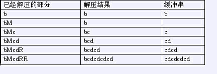

# [SCOI2007]压缩
[BZOJ1068 Luogu2470]

　给一个由小写字母组成的字符串，我们可以用一种简单的方法来压缩其中的重复信息。压缩后的字符串除了小写字母外还可以（但不必）包含大写字母R与M，其中M标记重复串的开始，R重复从上一个M（如果当前位置左边没有M，则从串的开始算起）开始的解压结果（称为缓冲串）。 bcdcdcdcd可以压缩为bMcdRR，下面是解压缩的过程  


此题加密的特殊之处在于，每一个 R  匹配离它最近的 M ，那么在设计状态的时候就要考虑到，如果重复，要求中间是不能有 M  的。设 F[i][j][0/1] 表示 [i..j] 区间内，是否中间包括至少一个 M 的最短长度。默认在每一个区间的最前面有一个 M 并且这个 M　暂时不占空间。  
有三种转移。F[i][j][0]=F[i][k][0]+r-k，因为要求中间不能有 M 所以后面均不能参与压缩；F[i][j][1]=F[i][k][0/1]+1+F[k+1][r][0/1]，相当于是枚举中间加上的那个 M 的位置；当 [i..j] 能够由前一半复制一遍得到是，还有转移 F[i][j][0]=F[i][mid][0]+1。

```cpp
#include<iostream>
#include<cstdio>
#include<cstdlib>
#include<cstring>
#include<algorithm>
using namespace std;

#define ll long long
#define mem(Arr,x) memset(Arr,x,sizeof(Arr))

const int maxN=55;
const int inf=2147483647;

int n;
char str[maxN];
int F[2][maxN][maxN];

bool check(int l,int r);

int main(){
	scanf("%s",str+1);n=strlen(str+1);
	for (int len=1;len<=n;len++)
		for (int l=1;l+len-1<=n;l++){
			int r=l+len-1;
			if (len==1){
				F[0][l][r]=1;F[1][l][r]=n+n;
				continue;
			}
			F[0][l][r]=F[1][l][r]=r-l+1;
			for (int k=l;k<r;k++) F[0][l][r]=min(F[0][l][r],F[0][l][k]+(r-k));
			for (int k=l;k<r;k++) F[1][l][r]=min(F[1][l][r],min(F[0][l][k],F[1][l][k])+1+min(F[0][k+1][r],F[1][k+1][r]));
			if ( ((r-l+1)%2==0) && (check(l,r)) ) F[0][l][r]=min(F[0][l][r],F[0][l][(l+r)/2]+1);
		}

	printf("%d\n",min(F[0][1][n],F[1][1][n]));

	return 0;
}

bool check(int l,int r){
	int mid=((l+r)>>1)+1;
	for (int i=1;l+i-1<mid;i++)
		if (str[l+i-1]!=str[mid+i-1]) return 0;
	return 1;
}
```