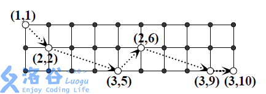

# [SHOI2013]超级跳马
[BZOJ4417 Luogu3990]

现有一个n 行m 列的棋盘，一只马欲从棋盘的左上角跳到右下角。每一步它向右跳奇数列，且跳到本行或相邻行。跳越期间，马不能离开棋盘。例如，当n = 3, m = 10 时，下图是一种可行的跳法



试求跳法种数mod 30011。

注意到 n 的范围并不大，那么可以一列一列转移。矩阵快速幂优化。

```cpp
#include<iostream>
#include<cstdio>
#include<cstdlib>
#include<cstring>
#include<algorithm>
using namespace std;

#define ll long long
#define mem(Arr,x) memset(Arr,x,sizeof(Arr))
#define RG register

const int maxN=51;
const int maxM=155;
const int Mod=30011;
const int inf=2147473647;

int n,m,N;
int Mt[maxM][maxM];
int Ans[maxM],Bp[maxM][maxM];

void Mul1();
void Mul2();

int main(){
	scanf("%d%d",&n,&m);m--;N=n+n+n;
	Ans[0]=1;
	for (int i=0;i<n;i++){
		for (int j=max(0,i-1);j<=min(n-1,i+1);j++) Mt[j][i]=1;
		Mt[i+n+n][i]=1;
	}
	for (int i=0;i<n;i++){
		for (int j=max(0,i-1);j<=min(n-1,i+1);j++) Mt[j][i+n]=1;
		Mt[i+n+n][i+n]=1;
	}
	for (int i=0;i<n;i++) Mt[i+n][i+n+n]=1;
	while (m){
		if (m&1) Mul1();
		Mul2();m>>=1;
	}
	printf("%d\n",Ans[n-1]);return 0;
}

void Mul1(){
	RG int i,j,k;
	for (i=0;i<N;++i) Bp[0][i]=Ans[i],Ans[i]=0;
	for (j=0;j<N;++j)
		for (k=0;k<N;++k)
			Ans[j]=(Ans[j]+1ll*Bp[0][k]*Mt[k][j]%Mod)%Mod;
	return;
}

void Mul2(){
	RG int i,j,k;
	for (i=0;i<N;++i) for (j=0;j<N;++j) Bp[i][j]=Mt[i][j],Mt[i][j]=0;
	for (i=0;i<N;++i)
		for (j=0;j<N;++j)
			for (k=0;k<N;++k)
				Mt[i][j]=(Mt[i][j]+1ll*Bp[i][k]*Bp[k][j]%Mod)%Mod;
	return;
}
```