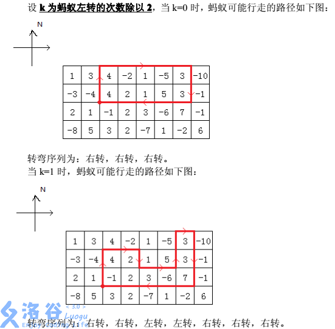

# [ZJOI2013]蚂蚁寻路
[BZOJ3111 Luogu3335]
在一个 n * m 的棋盘上，每个格子有一个权值，初始时，在某个格子的顶点处一只面朝北的蚂蚁，我们只知道它的行走路线是如何转弯，却不知道每次转弯前走了多长。  
蚂蚁转弯是有一定特点的，即它的转弯序列一定是如下的形式：右转，右转，左转，左转，右转，右转…左转，左转，右转，右转，右转。即两次右转和两次左转交替出现的形式，最后两次右转（最后两次一定是右转）后再多加一次右转。我们还知道，蚂蚁不会在同一个位置连续旋转两次，并且蚂蚁行走的路径除了起点以外，不会到达同一个点多次，它最后一定是回到起点然后结束自己的行程，而且蚂蚁只会在棋盘格子的顶点处转弯。



现在已知棋盘大小、每个格子的权值以及左转次数/2 的值，问蚂蚁走出的路径围出的封闭图形，权值之和最大可能是多少。

相当于是要求类似长城一样的矩形块，把它分解成 2K+1 个竖着的块。那么枚举下边界的范围，设 F[k][i][j] 表示当前做到 (i,j) 是第 k 个块。转移的时候讨论一下从左边怎么转移过来，前后缀优化转移。需要特殊注意一下边界。

```cpp
#include<iostream>
#include<cstdio>
#include<cstdlib>
#include<cstring>
#include<algorithm>
using namespace std;

#define ll long long
#define mem(Arr,x) memset(Arr,x,sizeof(Arr))

const int maxN=110;
const int maxK=25;
const int inf=1000000000;

int n,m,K;
int Mp[maxN][maxN],S[maxN][maxN];
int F[maxK][maxN][maxN],up[maxK][maxN][maxN],down[maxK][maxN][maxN];

int main(){
	scanf("%d%d%d",&n,&m,&K);K=K+K+1;
	for (int i=1;i<=n;i++) for (int j=1;j<=m;j++) scanf("%d",&Mp[i][j]);

	int Ans=-inf;
	for (int i=n;i>=1;i--){
		for (int j=0;j<=i+1;j++) for (int k=0;k<=m+1;k++) for (int l=0;l<=K;l++) F[l][j][k]=-inf;
		for (int j=1;j<=m;j++) S[i][j]=Mp[i][j];
		for (int j=i-1;j>=1;j--) for (int k=1;k<=m;k++) S[j][k]=S[j+1][k]+Mp[j][k];

		F[1][i][1]=Mp[i][1];
		for (int j=2;j<=m;j++) F[1][i][j]=max(F[1][i][j-1]+Mp[i][j],Mp[i][j]);
		for (int j=i-1;j>=1;j--) F[1][j][1]=F[1][j+1][1]+Mp[j][1];
		for (int l=1;l<=K;l++){
			up[l][i][1]=F[l][i][1];
			for (int j=i-1;j>=1;j--) up[l][j][1]=max(up[l][j+1][1],F[l][j][1]);
		}
		for (int l=1;l<=K;l++){
			down[l][1][1]=F[l][1][1];
			for (int j=2;j<=i;j++) down[l][j][1]=max(down[l][j-1][1],F[l][j][1]);
		}
		for (int j=2;j<=m;j++){
			for (int k=i;k>=1;k--)
				for (int l=1;l<=K;l++){
					if ((l==1)&&(k!=i)) F[l][k][j]=max(F[l][k][j],S[k][j]);
					F[l][k][j]=max(F[l][k][j],F[l][k][j-1]+S[k][j]);
					if ((l&1)&&(l>1)&&(k!=i)) F[l][k][j]=max(F[l][k][j],up[l-1][k+1][j-1]+S[k][j]);
					if (((l&1)==0)&&(k!=1)) F[l][k][j]=max(F[l][k][j],down[l-1][k-1][j-1]+S[k][j]);
				}
			for (int l=1;l<=K;l++) up[l][i][j]=F[l][i][j],down[l][1][j]=F[l][1][j];
			for (int k=i-1;k>=1;k--) for (int l=1;l<=K;l++) up[l][k][j]=max(up[l][k+1][j],F[l][k][j]);
			for (int k=2;k<=i;k++) for (int l=1;l<=K;l++) down[l][k][j]=max(down[l][k-1][j],F[l][k][j]);
		}
		for (int j=1;j<=i;j++) for (int k=1;k<=m;k++) Ans=max(Ans,F[K][j][k]);
	}
	printf("%d\n",Ans);return 0;
}
```