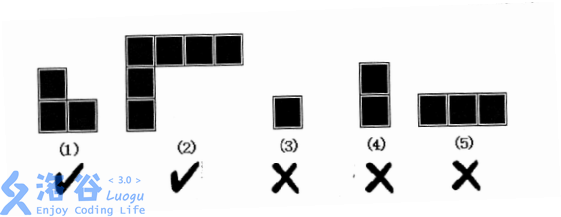

# [SCOI2011]地板
[BZOJ2331 Luogu3272]

lxhgww的小名叫”小L“，这是因为他总是很喜欢L型的东西。小L家的客厅是一个R*C的矩形，现在他想用L型的地板来铺满整个客厅，客厅里有些位置有柱子，不能铺地板。现在小L想知道，用L型的地板铺满整个客厅有多少种不同的方案？需要注意的是，如下图所示，L型地板的两端长度可以任意变化，但不能长度为0。

铺设完成后，客厅里面所有没有柱子的地方都必须铺上地板，但同一个地方不能被铺多次。

考虑插头 DP 。首先把列变成小的那一维。每一个状态有 m 个竖插头，1 个横插头。设 0/1/2 分别表示 没有插头、有一个未转弯的插头和有一个已经转弯的插头，对于当前格子的情况讨论一下，总共有六种合法情况，分别讨论转移。  
学到了一种比较方便的插头 DP 写法，就是直接用 K 进制来处理，其中从低向高分别代表从左到右的插头状态，而第 0 位则代表那个唯一的横向插头的状态。

```cpp
#include<iostream>
#include<cstdio>
#include<cstdlib>
#include<cstring>
#include<algorithm>
using namespace std;

#define ll long long
#define mem(Arr,x) memset(Arr,x,sizeof(Arr))

const int maxN=12;
const int maxMap=110;
const int Mod=20110520;
const int inf=2147483647;

int R,C;
char Input[maxMap],M[maxMap][maxMap];
int F[2][250000];
int Tre[maxN];

void Plus(int &x,int y);

int main(){
	Tre[0]=1;for (int i=1;i<maxN;i++) Tre[i]=Tre[i-1]*3;
	scanf("%d%d",&R,&C);
	for (int i=1;i<=R;i++){
		scanf("%s",Input+1);
		if (R>=C) for (int j=1;j<=C;j++) M[i][j]=(Input[j]=='_');
		if (R<C) for (int j=1;j<=C;j++) M[j][i]=(Input[j]=='_');
	}
	if (R<C) swap(R,C);

	F[0][0]=1;
	int now=0;
	for (int x=1;x<=R;x++)
		for (int y=1;y<=C;y++){
			now^=1;mem(F[now],0);
			for (int k=0;k<Tre[C+1];k++)
				if (F[now^1][k]) {
					int p=k%3,q=k/Tre[y]%3,val=F[now^1][k],kk=k-p-q*Tre[y];
					if (M[x][y]==0){
						if ((p==0)&&(q==0)) Plus(F[now][k],val);
						continue;
					}
					if ((y==1)&&(p)) continue;
					if ((p==0)&&(q==0)){
						Plus(F[now][kk+2+2*Tre[y]],val);
						Plus(F[now][kk+1],val);
						Plus(F[now][kk+Tre[y]],val);
					}
					if ((p==0)&&(q==1)){
						Plus(F[now][kk+Tre[y]],val);
						Plus(F[now][kk+2],val);
					}
					if ((p==1)&&(q==0)){
						Plus(F[now][kk+2*Tre[y]],val);
						Plus(F[now][kk+1],val);
					}
					if ((p==1)&&(q==1)) Plus(F[now][kk],val);
					if ((p==0)&&(q==2)){
						Plus(F[now][kk],val);
						Plus(F[now][kk+2*Tre[y]],val);
					}
					if ((p==2)&&(q==0)){
						Plus(F[now][kk],val);
						Plus(F[now][kk+2],val);
					}
				}
		}
	printf("%d\n",F[now][0]);return 0;
}

void Plus(int &x,int y){
	x=(x+y)%Mod;return;
}
```