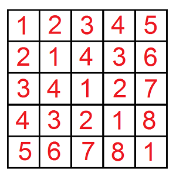

# Find a car
[CF809C]

After a wonderful evening in the restaurant the time to go home came. Leha as a true gentlemen suggested Noora to give her a lift. Certainly the girl agreed with pleasure. Suddenly one problem appeared: Leha cannot find his car on a huge parking near the restaurant. So he decided to turn to the watchman for help.  
Formally the parking can be represented as a matrix 109 × 109. There is exactly one car in every cell of the matrix. All cars have their own machine numbers represented as a positive integer. Let's index the columns of the matrix by integers from 1 to 109 from left to right and the rows by integers from 1 to 109 from top to bottom. By coincidence it turned out, that for every cell (x, y) the number of the car, which stands in this cell, is equal to the minimum positive integer, which can't be found in the cells (i, y) and (x, j), 1 ≤ i < x, 1 ≤ j < y.



Leha wants to ask the watchman q requests, which can help him to find his car. Every request is represented as five integers x1, y1, x2, y2, k. The watchman have to consider all cells (x, y) of the matrix, such that x1 ≤ x ≤ x2 and y1 ≤ y ≤ y2, and if the number of the car in cell (x, y) does not exceed k, increase the answer to the request by the number of the car in cell (x, y). For each request Leha asks the watchman to tell him the resulting sum. Due to the fact that the sum can turn out to be quite large, hacker asks to calculate it modulo 109 + 7.  
However the requests seem to be impracticable for the watchman. Help the watchman to answer all Leha's requests.

第 i 行第 j 列的数是 $(i-1) xor (j-1)+1$ ，这个可以用 nim 和证出来。剩下的就是一个数位 DP 问题了，设 F[i][a][b][c] 表示 DP 到第 i 位，是否大于等于 n,m,K ，讨论转移。

```cpp
#include<cstdio>
#include<cstdlib>
#include<cstring>
#include<algorithm>
#include<iostream>
using namespace std;

const int maxN=32;
const int Mod=1e9+7;

int F[maxN][2][2][2];
int G[maxN][2][2][2];
int pw[maxN];
int Calc(int n,int m,int K);
void Plus(int &x,int y);
int main(){
    pw[0]=1;for (int i=1;i<maxN;i++) pw[i]=2ll*pw[i-1]%Mod;
    int Q;scanf("%d",&Q);
    while (Q--){
        int x1,y1,x2,y2,K;scanf("%d%d%d%d%d",&x1,&y1,&x2,&y2,&K);
        --x1;--y1;--x2;--y2;
        int c=Calc(x2,y2,K);
        c=(c-Calc(x1-1,y2,K)+Mod)%Mod;
        c=(c-Calc(x2,y1-1,K)+Mod)%Mod;
        c=(c+Calc(x1-1,y1-1,K))%Mod;
        printf("%d\n",c);
    }
    return 0;
}
void Plus(int &x,int y){
    x+=y;if (x>=Mod) x-=Mod;return;
}
int Calc(int n,int m,int K){
    if (n<0||m<0) return 0;
    memset(F,0,sizeof(F));memset(G,0,sizeof(G));++n;++m;
    for (int a=0;a<=1;a++)
        for (int b=0;b<=1;b++){
            int c=a^b;
            Plus(F[0][a>=(n&1)][b>=(m&1)][c>=(K&1)],1);
            Plus(G[0][a>=(n&1)][b>=(m&1)][c>=(K&1)],1*c);
        }
    for (int i=0;i+1<maxN;i++){
        int bn=(n>>(i+1))&1,bm=(m>>(i+1))&1,bk=(K>>(i+1))&1;
        for (int a=0;a<=1;a++)
            for (int b=0;b<=1;b++)
                for (int c=0;c<=1;c++)
                    for (int fn=0;fn<=1;fn++)
                        for (int fm=0;fm<=1;fm++){
                            int fk=fn^fm;
                            int ta=(a==0&&fn>bn)||(a==1&&fn>=bn);
                            int tb=(b==0&&fm>bm)||(b==1&&fm>=bm);
                            int tc=(c==0&&fk>bk)||(c==1&&fk>=bk);
                            Plus(F[i+1][ta][tb][tc],F[i][a][b][c]);
                            Plus(G[i+1][ta][tb][tc],(G[i][a][b][c]+1ll*F[i][a][b][c]*pw[i+1]*fk%Mod)%Mod);
                        }
    }
    return (F[maxN-1][0][0][0]+G[maxN-1][0][0][0])%Mod;
}
```