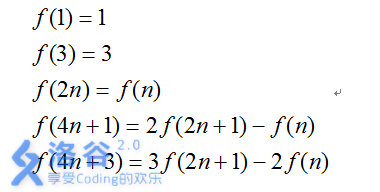

# [HNOI2002]Kathy函数
[BZOJ1223 Luogu2235]

Tiger非常喜欢数学，所以他参加了学校组织的数学课外兴趣小组。在兴趣小组的学习当中，老师向Tiger介绍了Kathy函数，Kathy函数是这样定义的：

Tiger对Kathy函数产生了浓厚的兴趣，他通过研究发现有很多的数n都满足 。  
对于一个给定的数m，他希望你求出所有的满足 f(n)=n 的自然数n的个数。

首先证明，满足 f(n)=n 的数当且仅当 n 的二进制表示为一个回文串，证明如下。  
对于 f(2n)=f(n)