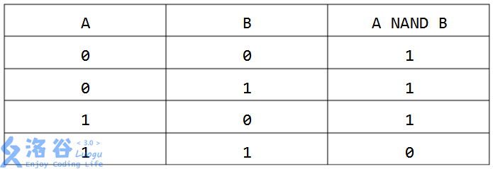

# [HNOI2012]与非
[BZOJ2728 Luogu3220]

NAND（与非）是一种二元逻辑运算，其运算结果为真当且仅当两个输入的布尔值不全为真。NAND运算的真值表如下（1表示真，  0表示假）:  

两个非负整数的NAND是指将它们表示成二进制数，再在对应的二进制位进行NAND运算。由于两个二进制数的长度可能不等，因此一般约定一个最高位K，使得两个数的二进制表示都不 超过K位，不足K位的在高位补零。给定N个非负整数A1,A2......AN和约定位数K，利用NAND运算与括号，每个数可以使用任意次，请你求出范围[L,R]内可以被计算出的数有多少个。

首先，通过 NAND 是可以凑出 OR AND 和 NOT 这三种操作的，那么也就是说，实际上可以使用任何一种位运算符。但同时注意到的是，如果有两位在所有数中都是相同的，这两位在结果中也必须是相同的。这样可以把 K 个位分解成若干类似连通块的部分，每个连通块中的值必须同时取 1 或 0。如果有 k 个连通块，那么最多能组合出 $2^k$ 个数。  
现在考虑加上上限，类似数位 DP 里的方法，把每个连通块放到它所包含的最高位上，从高位往低位考虑。注意到二进制的性质，如果当前连通块能够满足，那么比当前连通块小的也一定满足，那么直接加上后面的贡献，然后删去整个当前连通块，划归到数位 DP 中，相当于一直在走危险态，而安全态已经在每次满足的时候算完了。

```cpp
#include<iostream>
#include<cstdio>
#include<cstdlib>
#include<cstring>
#include<algorithm>
using namespace std;

#define ll long long
#define mem(Arr,x) memset(Arr,x,sizeof(Arr))

const int maxN=1010;
const int inf=2147483647;

ll n,K,L,R;
ll A[maxN],BS[maxN];
bool vis[maxN];

ll Calc(ll limit);

int main(){
	scanf("%lld%lld%lld%lld",&n,&K,&L,&R);
	for (int i=1;i<=n;i++) scanf("%lld",&A[i]);

	for (int i=K-1;i>=0;i--)
		if (vis[i]==0){
			BS[i]=(1ll<<K)-1;
			for (int j=1;j<=n;j++)
				if (A[j]&(1ll<<i)) BS[i]&=A[j];
				else BS[i]&=(~A[j]);
			for (int j=i;j>=0;j--)
				if (BS[i]&(1ll<<j)) vis[j]=1;
		}

	printf("%lld\n",Calc(R)-Calc(L-1));
	return 0;
}

ll Calc(ll limit){
	if (limit<0) return 0;
	ll ret=0,sum=0;
	for (int i=0;i<K;i++) sum+=(BS[i]!=0);
	for (int i=K-1;i>=0;i--)
		if (BS[i]){
			--sum;
			if (limit>=BS[i]){
				ret|=(1ll<<sum);
				limit-=BS[i];
			}
		}
	return ret+1;
}
```