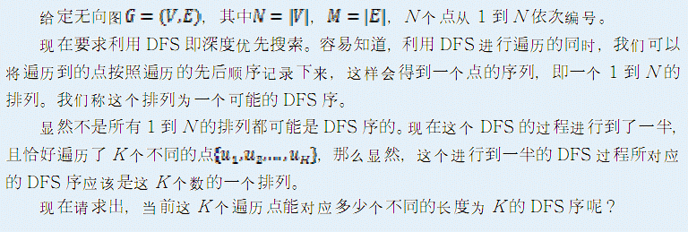

# [JSOI2011]序的计数
[BZOJ2576]



首先把 K 个点单独拿出来，并全部连向一个虚拟节点  K+1 ，这样强制  K+1 为第一个走的点就可以得到所有的 dfs 序了。设 F[i][S] 表示当前在 i ，经过的点集为 S 的 dfs 序数。由于 dfs 转移的时候，进入一棵子树，如果需要回溯的话一定是从这棵子树里转移出来了，那么提前预处理 G[i][S] 表示当前在 i ，经过的点集为 S ，接下来要经过的点的集合是哪些。转移的时候，进入子树就直接从 G 得到转移的系数。需要注意的是，当某棵子树内存在连向不在 K 个点中的边时，不能再向外转移，因为此时是不能回溯的。

```cpp
#include<iostream>
#include<cstdio>
#include<cstdlib>
#include<cstring>
#include<algorithm>
using namespace std;

#define ll long long
#define mem(Arr,x) memset(Arr,x,sizeof(Arr))
#define RG register

const int maxN=110;
const int maxK=19;
const int inf=2147483647;

int n,m,K;
int Id[maxN],Seq[maxN];
bool Mat[maxN][maxN],Link[maxK+5][maxK+5];
ll F[(1<<maxK)+10][maxK+1];
int G[(1<<maxK)+10][maxK+1];

int dfs(RG int u,RG int S);
ll dp(RG int u,RG int S);

int main(){
	int i,u,v,j;
	scanf("%d%d%d",&n,&m,&K);++K;
	for (i=1;i<=m;++i){
		scanf("%d%d",&u,&v);
		Mat[u][v]=Mat[v][u]=1;
	}
	for (i=1;i<=n;++i) Id[i]=K;
	for (i=0;i<K-1;++i){
		scanf("%d",&Seq[i]);
		Id[Seq[i]]=i;Link[i][K-1]=Link[K-1][i]=1;
	}
	for (i=0;i<=K;++i)
		for (j=1;j<=n;++j)
			Link[i][Id[j]]|=Mat[Seq[i]][j];
	mem(G,-1);mem(F,-1);
	for (i=0;i<(1<<K);++i) for (j=0;j<K;++j) if (i>>j&1) dfs(j,i);
	printf("%lld\n",dp(K-1,1<<(K-1)));return 0;
}

int dfs(RG int u,RG int S){
	if (~G[S][u]) return G[S][u];
	RG int ret=1<<u;
	for (RG int i=0;i<K;++i)
		if (Link[u][i]&&!(S>>i&1))
			ret|=dfs(i,S|(1<<i));
	return G[S][u]=ret;
}

ll dp(RG int u,RG int S){
	if (~F[S][u]) return F[S][u];
	if (G[S][u]==1<<u){
		return S==(1<<K)-1||!Link[u][K];
	}
	RG ll ret=0;
	for (RG int i=0;i<K;++i)
		if (Link[u][i]&&!(S>>i&1))
			ret+=dp(i,S| 1<<i )*dp(u,S|G[S|1<<i][i]);
	return F[S][u]=ret;
}
```