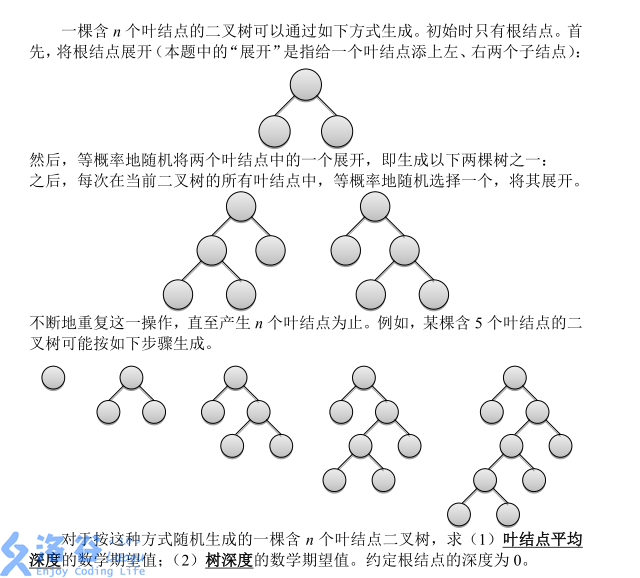

# [SHOI2012]随机树
[BZOJ2830 Luogu3830]



对于第一问，设 F[i] 表示有 i 个叶子节点时的叶节点平均深度，则 F[i]=((F[i-1] * (i-2)+(F[i-1]+1)*2)/i ，意义是， i-1 个叶节点选择一个扩展就可以得到 i 个叶子节点了，那么就有 i-2 个叶节点保持原来有 i-1 个叶节点时的深度，新增的两个点深度均为 F[i-1]+1 ，再除以 i 就是平均深度。实际实现的时候可以只用一个变量。  
对于第二问，设 P(x) 表示树深度为 x 的概率，那么 $Ans=\sum _ {x=1} ^ n P(x)x$ ，那么若设 F(x) 表示树深度大于等于 x 的概率，就有 $Ans=\sum _ {x=1} ^ n F(x)$ ，这样就转化为求深度大于等于 d 的概率。设 F[i][d] 表示有 i 个叶子的时候，深度大于等于 d 的概率，则枚举 i 划分成两个子树然后合并，即 F[i][d]=F[j][d-1]+F[i-j][d-1] ，注意到这样算的是左子树深度大于等于 d-1 的概率加上右子树深度大于等于 d-1 的概率，两者并不是能直接相加的，左右子树深度均大于 d-1 的概率算了两次，需要减去。  
注意细节，根节点深度为 0 。

```cpp
#include<iostream>
#include<cstdio>
#include<cstdlib>
#include<cstring>
#include<algorithm>
using namespace std;

#define ld long double
#define mem(Arr,x) memset(Arr,x,sizeof(Arr))

const int maxN=110;
const int inf=2147483647;

int n;
ld F[maxN][maxN];

int main(){
	int Q;scanf("%d%d",&Q,&n);
	if (Q==1){
		ld Ans=0;
		for (int i=1;i<n;i++) Ans=Ans+(2.0)/(ld)(i+1);
		printf("%.6LF\n",Ans);
	}
	else{
		for (int i=1;i<=n;i++) F[i][0]=1;
		for (int i=2;i<=n;i++)
			for (int d=1;d<i;d++){
				for (int j=1;j<i;j++)
					F[i][d]+=F[j][d-1]+F[i-j][d-1]-F[j][d-1]*F[i-j][d-1];
				F[i][d]/=(ld)(i-1);
			}
		ld Ans=0;
		for (int i=1;i<n;i++) Ans+=F[n][i];
		printf("%.6LF\n",Ans);
	}

	return 0;
}
```