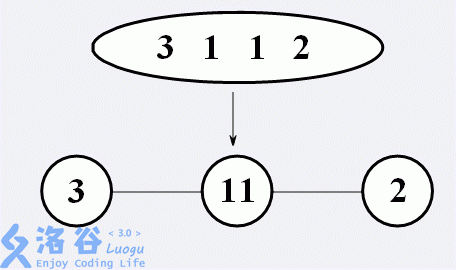
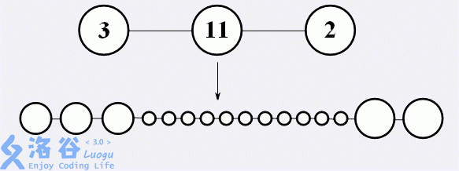
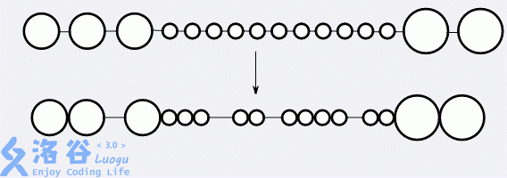

# [ZJOI2011]细胞
[BZOJ2323 Luogu4541]

2222年，人类在银河系外的某颗星球上发现了生命，并且携带了一个细胞回到了地球。经过反复研究，人类已经完全掌握了这类细胞的发展规律：  
这种细胞最初的形态是“长条形”，一端是头，一端是尾，中间是躯干。细胞内部含有一列密码（你可以认为它是这种细胞的DNA）。密码是一个长度为n的数字串，且仅含有1~9这9种数字，沿着细胞的躯干从头到尾排列着。  
首先，细胞会经历一次分裂。细胞将沿躯干方向分裂成若干个球体，躯干将退化成丝状物，连接着相邻的球体。在分裂过程中，质量是均匀分布的。换句话说，若分裂成k个球体，每个球体的质量为原来的1/k。然而，密码的分布是不确定的。若分割成k个球体，密码会被切割成k段（每段长度至少为1），并按从头到尾的顺序分布在各个球体中。如图，为其中一种合法的一次分裂：

接下来，细胞会经历二次分裂。对于每个球体，其中会含有一小段密码（注意他是有序的），我们把它看作一个十进制的数T。这个球体会被分割成T个小球体，并排成一排，之间用躯干退化成的丝状物相连接，并且质量仍然是均匀分布的，每个小球体的质量都是原球体的1/T。至此，密码已经发挥了它的作用，便消失了。如图，为二次分裂：

最后，细胞会进行变异。相邻小球体之间的丝状物可能会退化掉，这两个小球体便会以相切的方式直接连接。显然，二次分裂后，除两端外的每个小球体都有两段丝状物与其连接（头尾两端的小球体只有一段丝状物与其相连）。对于每个小球体，必须至少退化一段与其相连的丝状物，否则这个结构不稳定，会继续变异。如图，为一种稳定的变异：

现在，我们想知道，对于一个给定密码的细胞，总共有多少种稳定的结构。两种结构被认为相同，当且仅当他们拥有相同个数的小球体，从头到尾每个小球体的质量相同，并且从头到尾每对相邻小球体之间的连接方式相同（都是通过丝状物相连或都是通过相切直接相连）。你只需要回答这个结果 mod 1000000007即可。

质量的限制实际上是没用的，因为不会有相同的情况发生。  
先考虑如果最后分出来 m 个小球，有多少种断链的方式。设 F[i][0/1] 表示前 i 条链，第 i 条链是否断开的方案数，则容易得到递推 F[i][0]=F[i-1][1],F[i][1]=F[i-1][0]+F[i-1][1] ，合并一下得到 F[i][1]=F[i-1][1]+F[i-2][1] ，最后需要的便是 F[n-1][1] 因为最后的一定要割，发现其实就是斐波那契数。  
如果设 Fab[1]=Fab[2]=1 ，则答案就为 F[m-2] ，因为两边的是一定要去掉的。  
但是，由于不知道 m ，而直接求 m 的话方案数过大，甚至无法用矩阵快速幂，所以考虑一位一位地进行，设 G[i] 表示从高位到低位的第 i 位，则枚举前面的一个 j-1 让 [j..i] 形成一个在第一次分裂中的完整的数，则 $G[i]=\sum G[j-1] \times Fab[num _ {j..i}]$，关键就在于 $Fab[num _ {j..i}]$ 怎么求，可以预处理一个十进制的斐波那契矩阵以方便快速幂，让 j 从 i 枚举到 1，这样实时维护 j..i 的值，每次移动 j 的时候相当于补充一个最高位，直接作快速幂。  
需要注意，由于矩阵乘法不具有交换律，所以要时刻注意矩阵的乘法顺序。  
为了方便最后不要求 n-2 ，可以把 G[0] 设置实际的 G[1] 的 -2 次方为 $[1,1] ^ {-2}$  即 $[1,0]$。

```cpp
#include<iostream>
#include<cstdio>
#include<cstdlib>
#include<cstring>
#include<algorithm>
using namespace std;

#define ll long long
#define mem(Arr,x) memset(Arr,x,sizeof(Arr))

const int maxN=1010;
const int Mod=1e9+7;
const int inf=2147483647;

class Iriya
{
public:
	int M[2][2];
	Iriya & operator = (Iriya I){
		M[0][0]=I.M[0][0];M[0][1]=I.M[0][1];M[1][0]=I.M[1][0];M[1][1]=I.M[1][1];
		return *this;
	}
};

int n;
char Input[maxN];
Iriya F[maxN],Ten[maxN];

Iriya operator + (Iriya A,Iriya B);
Iriya operator * (Iriya A,Iriya B);
Iriya operator ^ (Iriya A,int cnt);
ostream & operator << (ostream &os,Iriya I);

int main(){
	scanf("%d",&n);scanf("%s",Input+1);
	Ten[0].M[0][0]=0;Ten[0].M[0][1]=Ten[0].M[1][0]=Ten[0].M[1][1]=1;
	for (int i=1;i<maxN;i++) Ten[i]=Ten[i-1]^10;

	F[0].M[0][0]=1;
	for (int i=1;i<=n;i++){
		Iriya now;now.M[0][0]=now.M[1][1]=1;now.M[0][1]=now.M[1][0]=0;
		for (int j=i;j>=1;j--){
			int x=Input[j]-'0';
			now=(Ten[i-j]^x)*now;
			F[i]=F[i]+F[j-1]*now;
		}
	}
	printf("%d\n",F[n].M[0][0]);return 0;
}

Iriya operator + (Iriya A,Iriya B){
	for (int i=0;i<2;i++) for (int j=0;j<2;j++) A.M[i][j]=(A.M[i][j]+B.M[i][j])%Mod;
	return A;
}

Iriya operator * (Iriya A,Iriya B){
	Iriya C;mem(C.M,0);
	for (int k=0;k<2;k++)
		for (int i=0;i<2;i++)
			for (int j=0;j<2;j++)
				C.M[i][j]=(C.M[i][j]+1ll*A.M[i][k]*B.M[k][j]%Mod)%Mod;
	return C;
}

Iriya operator ^ (Iriya A,int cnt){
	Iriya Ret;Ret.M[0][0]=Ret.M[1][1]=1;Ret.M[0][1]=Ret.M[1][0]=0;
	while (cnt){
		if (cnt&1) Ret=Ret*A;
		A=A*A;cnt>>=1;
	}
	return Ret;
}

ostream & operator << (ostream & os,Iriya I){
	os<<I.M[0][0]<<" "<<I.M[0][1]<<endl<<I.M[1][0]<<" "<<I.M[1][1]<<endl;
	return os;
}
```