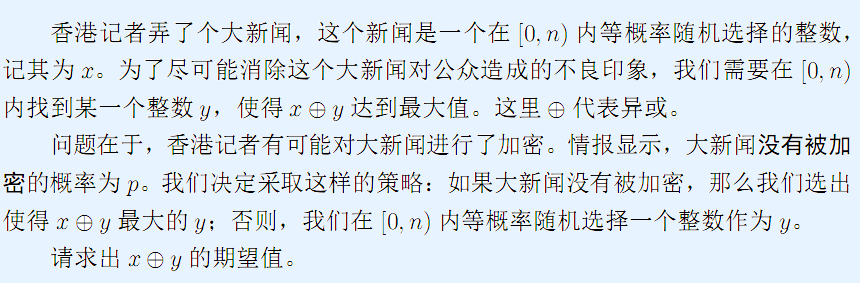

# 大新闻
[BZOJ3652 Luogu3898]

  

二合一的题目，两个部分都是考虑每一位的贡献。  
对于加密的部分，实际上就是求$[0,n)$范围内任意两个数的的异或和。那么考虑每一位是$0$还是$1$，若$n-1$的这一位是$1$，则它可以把前面的和后面的综合起来求总的出现次数；是$0$的也一样。  
然后对于不加密的，由于一定要取最大值，所以先假设全部填$1$。从高位向下枚举，如果碰到$1$，说明下面的都是可以为$1$的，去掉一半的数；否则，说明有一半的数在这一位上异或出来的值不能是$1$，减去这一部分的贡献。

```cpp
#include<iostream>
#include<cstdio>
#include<cstdlib>
#include<cstring>
#include<algorithm>
using namespace std;

#define ll long long
#define ld long double
#define mem(Arr,x) memset(Arr,x,sizeof(Arr))

const int maxN=70;
const int inf=2147483647;

ll n;
ld p;
ll Num[maxN],bit,Bin[maxN];

ld Do1();
ld Do2();

int main()
{
	scanf("%lld%LF",&n,&p);n--;
	ll tmp=n;
	while (tmp) Num[bit++]=tmp&1,tmp>>=1;
	bit--;
	Bin[0]=1;for (int i=1;i<=bit+2;i++) Bin[i]=Bin[i-1]<<1;
	
	ld Ans=Do1()*p/(n+1)+Do2()*(1.0-p)/(n+1)/(n+1);
	printf("%.6LF\n",Ans);
	return 0;
}

ld Do1()//未加密
{
	ld Ret=(ld)1.0*(ld)(n+1)*(ld)(Bin[bit+1]-1);
	ll cnt=Bin[bit+1];
	for (int i=bit;i>=0;i--)
		if (Num[i]) cnt>>=1;
		else Ret-=(ld)(cnt>>1)*(ld)(Bin[i]);
	return Ret;
}

ld Do2()//加密
{
	ld Ret=0;
	ll up=0;
	for (int i=bit;i>=0;i--)
	{
		ld p1=(ld)up*(ld)Bin[i];
		if (Num[i]) p1=p1+(ld)(n&(Bin[i]-1))+1;
		ld p2=(ld)(n-p1+1);
		Ret=Ret+(ld)p1*p2*2.0*(ld)Bin[i];
		up=(up<<1)+Num[i];
	}
	return Ret;
}
```