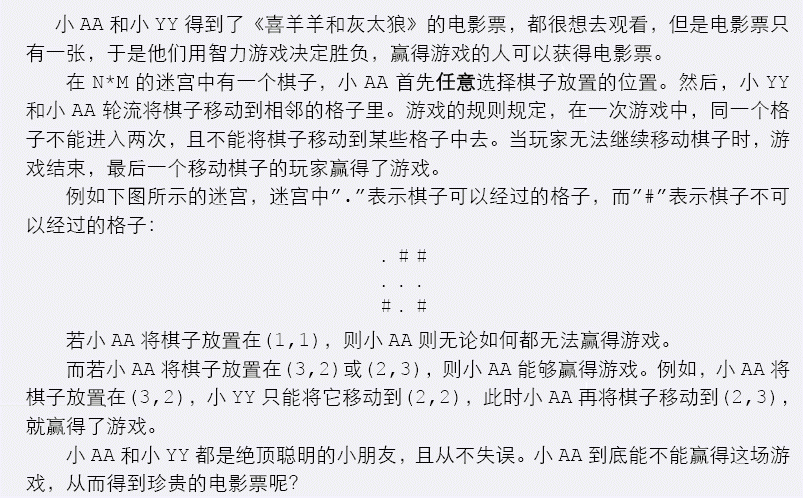

# [JSOI2009]游戏
[BZOJ1443 Luogu4055]




将网格黑白染色，假设初始位置是白色的格子，那么每一次一定是在黑白格子中移动。那么将这个二分图作最大匹配，从一个格子出发如果有必胜策略，当且仅当存在一种二分图最大匹配的方案使得这个格子没有匹配。

```cpp
#include<iostream>
#include<cstdio>
#include<cstdlib>
#include<cstring>
#include<algorithm>
using namespace std;

#define ll long long
#define mem(Arr,x) memset(Arr,x,sizeof(Arr))

const int maxMap=110;
const int maxN=maxMap*maxMap;
const int maxM=maxN*8;
const int inf=2147483647;

int n,m;
char Input[maxMap];
int idcnt,Id[maxMap][maxMap];
int Match[maxN];
int edgecnt=0,Head[maxN],Next[maxM],V[maxM];
bool vis[maxN];
int Ans[maxN];

void Add_Edge(int u,int v);
bool Hungary(int u);
bool dfs(int u);

int main(){
	edgecnt=0;mem(Head,-1);
	scanf("%d%d",&n,&m);
	for (int i=1;i<=n;i++){
		scanf("%s",Input+1);
		for (int j=1;j<=m;j++) if (Input[j]=='.') Id[i][j]=++idcnt;
	}
	for (int i=1;i<=n;i++)
		for (int j=1;j<=m;j++)
			if ( ((i+j)%2==0) && (Id[i][j]) ){
				if (Id[i-1][j]) Add_Edge(Id[i-1][j],Id[i][j]);
				if (Id[i][j-1]) Add_Edge(Id[i][j-1],Id[i][j]);
				if (Id[i+1][j]) Add_Edge(Id[i+1][j],Id[i][j]);
				if (Id[i][j+1]) Add_Edge(Id[i][j+1],Id[i][j]);
			}

	mem(Match,-1);
	int tot=0;
	for (int i=1;i<=idcnt;i++)
		if (Match[i]==-1){
			mem(vis,0);
			if (Hungary(i)) tot+=2;
		}

	//for (int i=1;i<=idcnt;i++) cout<<Match[i]<<" ";cout<<endl;

	int cnt=0;
	for (int i=1;i<=idcnt;i++)
		if (Match[i]==-1) Ans[++cnt]=i;
		else{
			mem(vis,0);vis[i]=1;
			if (dfs(Match[i])) Ans[++cnt]=i;
		}

	if (cnt==0) printf("LOSE\n");
	else{
		printf("WIN\n");
		for (int i=1,k=1;i<=n;i++)
			for (int j=1;j<=m;j++)
				if ((Id[i][j]!=0)&&(Id[i][j]==Ans[k])){
					printf("%d %d\n",i,j);k++;
				}
	}
	return 0;
}

void Add_Edge(int u,int v){
	Next[++edgecnt]=Head[u];Head[u]=edgecnt;V[edgecnt]=v;
	Next[++edgecnt]=Head[v];Head[v]=edgecnt;V[edgecnt]=u;
	return;
}

bool Hungary(int u){
	vis[u]=1;
	for (int i=Head[u];i!=-1;i=Next[i])
		if (vis[V[i]]==0){
			vis[V[i]]=1;
			if ((Match[V[i]]==-1)||(Hungary(Match[V[i]]))){
				Match[V[i]]=u;Match[u]=V[i];return 1;
			}
		}
	return 0;
}

bool dfs(int u){
	vis[u]=1;
	for (int i=Head[u];i!=-1;i=Next[i])
		if (vis[V[i]]==0){
			vis[V[i]]=1;
			if ((Match[V[i]]==-1)||(dfs(Match[V[i]]))) return 1;
		}
	return 0;
}
```