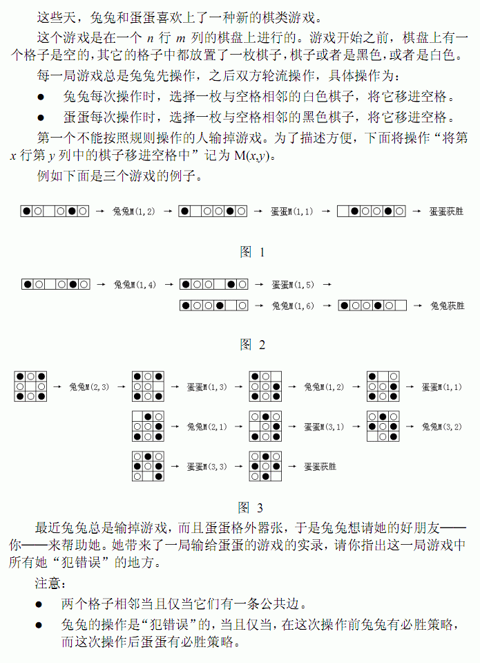

# [NOI2011]兔兔与蛋蛋游戏
[BZOJ2437 Luogu1971]



可以看作是将空格子不断地在棋盘中移动，并且，将棋盘黑白染色后，只有白棋子在与空格子颜色不同的、黑棋子在与空格子颜色相同的那些棋子才是可以移动的，也就是说一个棋子只能移动一次。  
那么将可以移动的棋子挑出来组成一个二分图，现在变成在这个二分图上移动棋子，不能重复经过一个棋子，不能操作者输。由博弈论的相关知识可以知道，只有当先手所在的格子为最大匹配的必须点时，先手才有必胜策略，因为此时先手可以把棋子按照最大匹配的顺序依次走，后手一定是从一个匹配的后一个走到一个新的匹配的前一个，所以先手总能走而后手不行；反之，后手可以找到一种方案使得以他开始一个新的匹配，使得先手变成匹配的后一个。  
至于连续移动的问题，由于经过的格子不能再经过了，所以直接把经过的格子删除掉。

```cpp
#include<iostream>
#include<cstdio>
#include<cstdlib>
#include<cstring>
#include<algorithm>
using namespace std;

#define ll long long
#define mem(Arr,x) memset(Arr,x,sizeof(Arr))

const int maxMap=45;
const int maxN=maxMap*maxMap;
const int maxM=maxN*8;
const int inf=2147483647;

int n,m,sx,sy,K;
char Input[maxMap][maxMap];
int idcnt=0,Id[maxMap][maxMap];
int edgecnt=0,Head[maxN],Next[maxM],V[maxM];
int Match[maxN];
int tim,vis[maxN];
bool fob[maxN],win[maxN];

void Add_Edge(int u,int v);
bool Hungary(int u);

int main(){
	mem(Head,-1);
	scanf("%d%d",&n,&m);
	for (int i=1;i<=n;i++){
		scanf("%s",Input[i]+1);
		for (int j=1;j<=m;j++) if (Input[i][j]=='.') sx=i,sy=j;
	}

	for (int i=1;i<=n;i++)
		for (int j=1;j<=m;j++)
			if ((Input[i][j]=='X')&&((i+j)%2==(sx+sy)%2)) Id[i][j]=++idcnt;
			else if ((Input[i][j]=='O')&&((i+j)%2!=(sx+sy)%2)) Id[i][j]=++idcnt;
			else if (Input[i][j]=='.') Id[i][j]=++idcnt;

	for (int i=1;i<=n;i++)
		for (int j=1;j<=m;j++)
			if ( ((i+j)%2==0) && (Id[i][j]) ){
				if (Id[i][j+1]) Add_Edge(Id[i][j],Id[i][j+1]);
				if (Id[i][j-1]) Add_Edge(Id[i][j],Id[i][j-1]);
				if (Id[i+1][j]) Add_Edge(Id[i][j],Id[i+1][j]);
				if (Id[i-1][j]) Add_Edge(Id[i][j],Id[i-1][j]);
			}

	mem(Match,-1);
	for (int i=1;i<=idcnt;i++)
		if (Match[i]==-1){
			mem(vis,0);Hungary(i);
		}

	scanf("%d",&K);K<<=1;
	for (int i=1;i<=K;i++){
		fob[Id[sx][sy]]=1;
		if (Match[Id[sx][sy]]!=-1){
			mem(vis,0);int n2=Match[Id[sx][sy]];Match[Id[sx][sy]]=Match[n2]=-1;
			if (!Hungary(n2)) win[i]=1;
		}
		scanf("%d%d",&sx,&sy);
	}

	int cnt=0;
	for (int i=1;i<=K;i+=2) if ((win[i])&&(win[i+1])) cnt++;
	printf("%d\n",cnt);
	for (int i=1;i<=K;i+=2) if ((win[i])&&(win[i+1])) printf("%d\n",(i>>1)+1);
	return 0;
}

void Add_Edge(int u,int v){
	Next[++edgecnt]=Head[u];Head[u]=edgecnt;V[edgecnt]=v;
	Next[++edgecnt]=Head[v];Head[v]=edgecnt;V[edgecnt]=u;
	return;
}

bool Hungary(int u){
	if (fob[u]) return 0;
	vis[u]=1;
	for (int i=Head[u];i!=-1;i=Next[i])
		if ((vis[V[i]]==0)&&(fob[V[i]]==0)){
			vis[V[i]]=1;
			if ((Match[V[i]]==-1)||(Hungary(Match[V[i]]))){
				Match[V[i]]=u;Match[u]=V[i];return 1;
			}
		}
	return 0;
}
```