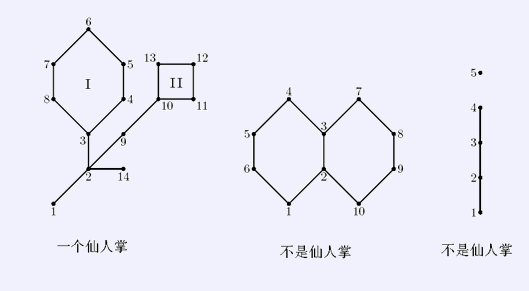

# [SHOI2008]cactus仙人掌图
[BZOJ1023 Luogu4244]

如果某个无向连通图的任意一条边至多只出现在一条简单回路（simple cycle）里，我们就称这张图为仙人掌图（cactus）。所谓简单回路就是指在图上不重复经过任何一个顶点的回路。  


举例来说，上面的第一个例子是一张仙人图，而第二个不是——注意到它有三条简单回路：（4，3，2，1，6，5，4）、（7，8，9，10，2，3，7）以及（4，3，7，8，9，10，2，1，6，5，4），而（2，3）同时出现在前两个的简单回路里。另外，第三张图也不是仙人图，因为它并不是连通图。显然，仙人图上的每条边，或者是这张仙人图的桥（bridge），或者在且仅在一个简单回路里，两者必居其一。定义在图上两点之间的距离为这两点之间最短路径的距离。定义一个图的直径为这张图相距最远的两个点的距离。现在我们假定仙人图的每条边的权值都是1，你的任务是求出给定的仙人图的直径。

如果是树的话，记录当前点之前向下延伸最长的链长，与当前儿子组合答案取最大值，再更新当前最长链长。对于有环的情况，把环取出来，首先还是考虑枚举环上的点组合答案，设枚举的点为$u,v$，则答案为$F[u]+F[v]+dis(u,v) [u < v]$，其中$dis(u,v)=min(v-u,u+n-v)$，容易发现这个是单调的，把序列复制一倍放到后面，每次保证转移的区间长度不超过原来的一半。然后再来更新$u$，即$F[u]=\max(F[u],F[v]+dis(u,v)$。

```cpp
#include<iostream>
#include<cstdio>
#include<cstdlib>
#include<cstring>
#include<algorithm>
using namespace std;

#define ll long long
#define mem(Arr,x) memset(Arr,x,sizeof(Arr))

const int maxN=50100*2;
const int maxM=1010000;
const int inf=2147483647;

int n,m;
int edgecnt=-1,Head[maxN],Next[maxM],V[maxM];
int Ans=0;
int dfncnt,dfn[maxN],low[maxN],FaW[maxN];
int Seq[maxN];
int F[maxN],G[maxN];
int Q[maxN];

void Add_Edge(int u,int v);
void tarjan(int u,int fa);
void RingDp(int tp,int bt);

int main()
{
	mem(Head,-1);
	scanf("%d%d",&n,&m);
	for (int i=1;i<=m;i++)
	{
		int K;scanf("%d",&K);
		int u;scanf("%d",&u);K--;
		while (K--){
			int v;scanf("%d",&v);
			Add_Edge(u,v);u=v;
		}
	}    

	tarjan(1,edgecnt+2);

	printf("%d\n",Ans);
	return 0;
}

void Add_Edge(int u,int v){
	Next[++edgecnt]=Head[u];Head[u]=edgecnt;V[edgecnt]=v;
	Next[++edgecnt]=Head[v];Head[v]=edgecnt;V[edgecnt]=u;
	return;
}

void tarjan(int u,int faw)
{
	dfn[u]=low[u]=++dfncnt;F[u]=0;FaW[u]=faw;
	for (int i=Head[u];i!=-1;i=Next[i])
		if ((i!=faw)&&((i^1)!=faw))
		{
			int v=V[i];
			if (dfn[v]==0){
				tarjan(v,i);low[u]=min(low[u],low[v]);
				if (low[v]>dfn[u]){
					Ans=max(Ans,F[u]+F[v]+1);
					F[u]=max(F[u],F[v]+1);
				}
			}
			else low[u]=min(low[u],dfn[v]);
		}
	for (int i=Head[u];i!=-1;i=Next[i])
		if ((i!=faw)&&((i^1)!=faw)&&(dfn[V[i]]>dfn[u])&&(FaW[V[i]]!=i)&&((FaW[V[i]]^1)!=i))
			RingDp(u,V[i]);
	Ans=max(Ans,F[u]);
	return;
}

void RingDp(int tp,int bt)
{
	int ncnt=0;
	for (int now=bt;now!=tp;now=V[FaW[now]^1]) Seq[++ncnt]=now;
	Seq[++ncnt]=tp;

	for (int i=ncnt+1;i<=ncnt+ncnt;i++) Seq[i]=Seq[i-ncnt];

	int len=ncnt/2;
	int l=1,r=1;Q[1]=1;
	for (int i=2;i<=ncnt+ncnt;i++)
	{
		while ((l<=r)&&(Q[l]+len<i)) l++;
		if (l<=r){

			Ans=max(Ans,F[Seq[Q[l]]]+F[Seq[i]]+i-Q[l]);
		}
		while ((l<=r)&&(F[Seq[Q[r]]]+i-Q[r]<=F[Seq[i]])) r--;
		Q[++r]=i;
	}

	for (int i=1;i<ncnt;i++){
		F[tp]=max(F[tp],F[Seq[i]]+min(i,ncnt-i));
	}
	return;
}
```