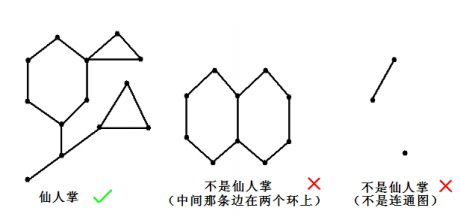

# [ZJOI2017]仙人掌
[BZOJ4784 Luogu3687]

如果一个无自环无重边无向连通图的任意一条边最多属于一个简单环，我们就称之为仙人掌。所谓简单环即不经过重复的结点的环。



现在九条可怜手上有一张无自环无重边的无向连通图，但是她觉得这张图中的边数太少了，所以她想要在图上连上一些新的边。同时为了方便的存储这张无向图，图中的边数又不能太多。经过权衡，她想要加边后得到的图为一棵仙人掌。不难发现合法的加边方案有很多，可怜想要知道总共有多少不同的加边方案。两个加边方案是不同的当且仅当一个方案中存在一条另一个方案中没有的边。

首先通过判断一条边被几个环覆盖可以判断出是否原图满足仙人掌的性质，这个可以用$dfs$+差分解决。然后去掉所有的环，因为它们不可能作为答案，剩下就是树的情况了。  
设$F[i]$表示子树$i$的答案，那么应该就是它的所有儿子的答案乘以儿子之间的互相连边的系数。由于这个系数只与儿子的个数有关，所以可以考虑预处理出来。设$G[i]$表示前$i$个儿子的答案，那么有递推式$G[i]=G[i-1]+(i-1)G[i-2]$。其意义为，如果第$i$个不与原来的任何一个连边，那么方案就是$G[i-1]$，否则它会与之前的某一个点连边，并且要求原来的那个点不能与其它点有连边，也就是$G[i-2]$，有$i-1$种选择，那么就是$(i-1)G[i-2]$。  
那么如果不是树的根的话，相当于是儿子个数+自己进行转移，否则就直接是儿子个数来转移，因为不能再向上连边了。

```cpp
#include<iostream>
#include<cstdio>
#include<cstring>
#include<cstdlib>
#include<algorithm>
using namespace std;

#define ll long long
#define mem(Arr,x) memset(Arr,x,sizeof(Arr))

const int maxN=505000;
const int maxM=1010000*3;
const int Mod=998244353;
const int inf=2147483647;

int n,m;
int edgecnt=-1,Head[maxN],Next[maxM],V[maxM];
int dfncnt,dfn[maxN],low[maxN],top,St[maxM],NodeW[maxN];
bool ink[maxN],vis[maxN],Fob[maxM];
int F[maxN],G[maxN];

void Add_Edge(int u,int v);
void dfs_check(int u,int fa);
void tarjan(int u,int fa);
void dfs_dp(int u,int fa);

int main()
{
	int TTT;scanf("%d",&TTT);
	G[0]=G[1]=1;for (int i=2;i<maxN;i++) G[i]=(G[i-1]+1ll*G[i-2]*(i-1)%Mod)%Mod;
	
	while (TTT--)
	{
		edgecnt=-1;
		scanf("%d%d",&n,&m);
		for (int i=1;i<=n;i++) NodeW[i]=0,ink[i]=vis[i]=0,Head[i]=-1;
		for (int i=1;i<=m;i++)
		{
			int u,v;scanf("%d%d",&u,&v);
			Add_Edge(u,v);
		}

		dfs_check(1,1);

		bool flag=1;
		for (int i=1;i<=n;i++)
			if (NodeW[i]>=2){
				flag=0;break;
			}
		if (flag==0){
			printf("0\n");continue;
		}

		dfncnt=0;top=0;for (int i=1;i<=n;i++) ink[i]=dfn[i]=0;
		tarjan(1,0);

		for (int i=1;i<=n;i++) vis[i]=0;
		int Ans=1;
		for (int i=1;i<=n;i++)
			if (vis[i]==0){
				dfs_dp(i,i);
				Ans=1ll*Ans*F[i]%Mod;
			}
		printf("%d\n",Ans);
	}
	return 0;
}

void Add_Edge(int u,int v){
	Next[++edgecnt]=Head[u];Head[u]=edgecnt;V[edgecnt]=v;Fob[edgecnt]=0;
	Next[++edgecnt]=Head[v];Head[v]=edgecnt;V[edgecnt]=u;Fob[edgecnt]=0;
	return;
}

void dfs_check(int u,int fa){
	vis[u]=ink[u]=1;
	for (int i=Head[u];i!=-1;i=Next[i])
		if (V[i]!=fa)
		{
			if (vis[V[i]]==0){
				dfs_check(V[i],u);NodeW[u]+=NodeW[V[i]];
			}
			else if (ink[V[i]]) NodeW[u]++,NodeW[V[i]]--;
		}
	ink[u]=0;return;
}

void tarjan(int u,int fa)
{
	dfn[u]=low[u]=++dfncnt;ink[u]=1;
	for (int i=Head[u];i!=-1;i=Next[i])
		if (V[i]!=fa)
		{
			int v=V[i];
			if (dfn[v]==0){
				St[++top]=i;
				tarjan(v,u);
				low[u]=min(low[u],low[v]);
				if (low[v]==dfn[u])
				{
					int w;
					do
					{
						w=St[top--];
						Fob[w]=Fob[w^1]=1;
					}
					while (w!=i);
				}
			}
			else if (ink[V[i]]) low[u]=min(low[u],dfn[V[i]]),St[++top]=i;
		}
	ink[u]=0;
	if ((low[u]==dfn[u])&&(top)) top--;
	return;
}

void dfs_dp(int u,int fa)
{
	F[u]=1;int son=0;vis[u]=1;
	for (int i=Head[u];i!=-1;i=Next[i])
		if ((V[i]!=fa)&&(Fob[i]==0))
		{
			dfs_dp(V[i],u);son++;
			F[u]=1ll*F[u]*F[V[i]]%Mod;
		}
	if (u!=fa) F[u]=1ll*F[u]*G[son+1]%Mod;
	else F[u]=1ll*F[u]*G[son]%Mod;
}

```