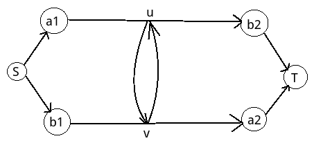

# [CQOI2014]危桥
[BZOJ3504 Luogu3163]

Alice和Bob居住在一个由N座岛屿组成的国家，岛屿被编号为0到N-1。某些岛屿之间有桥相连，桥上的道路是双向的，但一次只能供一人通行。其中一些桥由于年久失修成为危桥，最多只能通行两次。Alice希望在岛屿al和a2之间往返an次（从al到a2再从a2到al算一次往返）。同时，Bob希望在岛屿bl和b2之间往返bn次。这个过程中，所有危桥最多通行两次，其余的桥可以无限次通行。请问Alice和Bob能完成他们的愿望吗？

首先的想法就是直接源点连 S1,S2 ，汇点连 T1,T2 然后跑网络流判断是否合法。  
但是这样有一个问题，即可能出现 S1->T2,S2->T1 的情况。  
怎么办呢？假设有一条边是这样的  


不难发现，如果 a1-u-b2 的流变成 a1-u-v-a2 就合法了，b1 同理。那么问题就在于是否能找出这样的桥。  
解决办法就是把 b1 与 b2 交换，即交换其中一对点的源汇，再跑网络流判断是否合法。

```cpp
#include<cstdio>
#include<cstdlib>
#include<cstring>
#include<algorithm>
#include<iostream>
using namespace std;

#define mem(Arr,x) memset(Arr,x,sizeof(Arr))

const int maxN=70;
const int maxM=maxN*maxN*4;
const int inf=1000000000;

class Edge{
public:
    int v,flow;
};

int n,a1,a2,b1,b2,at,bt,S,T;
char Mp[maxN][maxN];
int edgecnt=-1,Head[maxN],Next[maxM];
Edge E[maxM];
int Q[maxN],Dph[maxN],cur[maxN];

void Add_Edge(int u,int v,int flow);
int Dinic();
bool Bfs();
int dfs(int u,int flow);

int main(){
    while (scanf("%d%d%d%d%d%d%d",&n,&a1,&a2,&at,&b1,&b2,&bt)!=EOF){
	++a1;++a2;++b1;++b2;
	for (int i=1;i<=n;i++) scanf("%s",Mp[i]+1);

	edgecnt=-1;mem(Head,-1);
	for (int i=1;i<=n;i++)
	    for (int j=1;j<i;j++)
		if (Mp[i][j]=='O') Add_Edge(i,j,1);
		else if (Mp[i][j]=='N') Add_Edge(i,j,inf);
	S=n+1;T=n+2;
	Add_Edge(S,a1,at);Add_Edge(S,b1,bt);Add_Edge(a2,T,at);Add_Edge(b2,T,bt);
	if (Dinic()!=at+bt){
	    printf("No\n");continue;
	}

	swap(b1,b2);
	edgecnt=-1;mem(Head,-1);
	for (int i=1;i<=n;i++)
	    for (int j=1;j<i;j++)
		if (Mp[i][j]=='O') Add_Edge(i,j,1);
		else if (Mp[i][j]=='N') Add_Edge(i,j,inf);
	S=n+1;T=n+2;
	Add_Edge(S,a1,at);Add_Edge(S,b1,bt);Add_Edge(a2,T,at);Add_Edge(b2,T,bt);
	if (Dinic()!=at+bt){
	    printf("No\n");continue;
	}
	printf("Yes\n");
    }
    return 0;
}

void Add_Edge(int u,int v,int flow){
    Next[++edgecnt]=Head[u];Head[u]=edgecnt;E[edgecnt]=((Edge){v,flow});
    Next[++edgecnt]=Head[v];Head[v]=edgecnt;E[edgecnt]=((Edge){u,flow});
    return;
}
int Dinic(){
    int ret=0;
    while (Bfs()){
	for (int i=1;i<=T;i++) cur[i]=Head[i];
	while (int di=dfs(S,inf)) ret+=di;
    }
    return ret;
}
bool Bfs(){
    mem(Dph,-1);Dph[S]=1;int ql=0,qr=1;Q[1]=S;
    while (ql<qr) for (int u=Q[++ql],i=Head[u];i!=-1;i=Next[i]) if ((Dph[E[i].v]==-1)&&(E[i].flow)) Dph[Q[++qr]=E[i].v]=Dph[u]+1;
    return Dph[T]!=-1;
}
int dfs(int u,int flow){
    if (u==T) return flow;
    for (int i=cur[u];i!=-1;i=Next[i])
	if ((E[i].flow)&&(Dph[E[i].v]==Dph[u]+1)){
	    int di=dfs(E[i].v,min(flow,E[i].flow));
	    if (di){
		E[i].flow-=di;E[i^1].flow+=di;return di;
	    }
	}
    return 0;
}
```