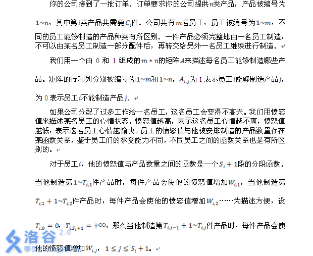

# [SDOI2011]工作安排
[BZOJ2245 Luogu2488]



直接费用流建模。

```cpp
#include<iostream>
#include<cstdio>
#include<cstdlib>
#include<cstring>
#include<algorithm>
#include<queue>
using namespace std;

#define ll long long
#define mem(Arr,x) memset(Arr,x,sizeof(Arr))

const int maxN=700;
const int maxM=8010000;
const int inf=2147483647;

class Edge
{
public:
	int v,flow,w;
};

int m,n,S,T;
int edgecnt=-1,Head[maxN],Next[maxM];
int Tim[maxN],Flow[maxN],Path[maxN],Dist[maxN];
Edge E[maxM];
bool inq[maxN];
queue<int> Q;

void Add_Edge(int u,int v,int flow,int w);
bool Spfa();

int main(){
	mem(Head,-1);
	scanf("%d%d",&m,&n);
	S=m+n+1;T=S+1;
	for (int i=1;i<=n;i++){
		int c;scanf("%d",&c);
		Add_Edge(S,i,c,0);
	}
	for (int i=1;i<=m;i++)
		for (int j=1;j<=n;j++){
			int b;scanf("%d",&b);
			if (b) Add_Edge(j,i+n,inf,0);
		}
	for (int i=1;i<=m;i++){
		int s;scanf("%d",&s);
		for (int j=1;j<=s;j++) scanf("%d",&Tim[j]);Tim[s+1]=inf;
		for (int j=0;j<=s;j++){
			int c;scanf("%d",&c);
			Add_Edge(i+n,T,Tim[j+1]-Tim[j],c);
		}
	}

	ll Ans=0;
	while (Spfa()){
		Ans=Ans+1ll*Dist[T]*Flow[T];
		int now=T;
		while (now!=S){
			E[Path[now]].flow-=Flow[T];
			E[Path[now]^1].flow+=Flow[T];
			now=E[Path[now]^1].v;
		}
	}
	printf("%lld\n",Ans);return 0;
}

void Add_Edge(int u,int v,int flow,int w){
	Next[++edgecnt]=Head[u];Head[u]=edgecnt;E[edgecnt]=((Edge){v,flow,w});
	Next[++edgecnt]=Head[v];Head[v]=edgecnt;E[edgecnt]=((Edge){u,0,-w});
	return;
}

bool Spfa(){
	mem(inq,0);
	for (int i=1;i<=T;i++) Dist[i]=inf,inq[i]=0;
	while (!Q.empty()) Q.pop();
	Dist[S]=0;Flow[S]=inf;Q.push(S);inq[S]=1;
	do{
		int u=Q.front();Q.pop();
		for (int i=Head[u];i!=-1;i=Next[i])
			if ((E[i].flow)&&(Dist[E[i].v]>Dist[u]+E[i].w)){
				Dist[E[i].v]=Dist[u]+E[i].w;Flow[E[i].v]=min(Flow[u],E[i].flow);Path[E[i].v]=i;
				if (inq[E[i].v]==0){
					Q.push(E[i].v);inq[E[i].v]=1;
				}
			}
		inq[u]=0;
	}
	while (!Q.empty());
	return Dist[T]!=inf;
}
```