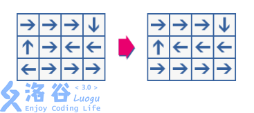

# [TJOI2013]循环格
[BZOJ3171 Luogu3965]

一个循环格就是一个矩阵,其中所有元素为箭头,指向相邻四个格子。每个元素有一个坐标(行,列),其中左上角元素坐标为(0,0)。给定一个起始位(r,c),你可以沿着箭头方向在格子间行走。即:如果(r,c)是一个左箭头，那么走到(r,c-1);如果是一个右箭头,走到(r,c+1);如果是上箭头,走到(r-1,c);如果是下箭头,走到(r+1,c)。每一行和每一列都是循环的,即如果走出边界,你会出现在另一侧。比如在一个5*5的循环格里,从(3,0)向左走会出现在(3,4)。  
一个完美的循环格是这样定义的:对于任意一个起始位置,你都可以沿着箭头最终回到起始位置。如果一个循环格不满足完美,你可以随意修改任意一个元素的箭头直到完美。例如下图,左边不是一个完美的循环格,因为只有从(1,1),(1,2),(2,0),(2,3)出发才会回到起始位置。通过修改其中两个箭头,可以得到右图,一个完美的循环格。


给定一个循环格,你需要计算最少需要修改多少个元素使其完美。

循环的条件为每一个点有且仅有一个入度一个出度，那么把每一个点拆成两个点，入和出，在相邻的两个点之间连边，如果原来的方向就是这里，则代价为$0$，否则代价为$1$，再连接源汇点，求最小费用最大流。

```cpp
#include<iostream>
#include<cstdio>
#include<cstdlib>
#include<cstring>
#include<algorithm>
#include<queue>
using namespace std;

#define ll long long
#define mem(Arr,x) memset(Arr,x,sizeof(Arr))

const int maxMap=20;
const int maxN=maxMap*maxMap*2;
const int maxM=maxN*40;
const int F1[]={0,-1,0,1,0};
const int F2[]={0,0,1,0,-1};
const int inf=2147483647;

class Edge
{
public:
	int u,v,flow,w;
};

int R,C;
int Fc[maxMap][maxMap],Id[maxMap][maxMap];
char str[maxMap];
int S,T;
int edgecnt=-1,Head[maxN],Next[maxM];
Edge E[maxM];
int Dist[maxN],Flow[maxN],Path[maxN];
queue<int> Q;
bool inq[maxN];

void Add_Edge(int u,int v,int flow,int w);
bool spfa();

int main()
{
	mem(Head,-1);
	scanf("%d%d",&R,&C);
	for (int i=1;i<=R;i++)
	{
		scanf("%s",str+1);
		for (int j=1;j<=C;j++)
		{
			if (str[j]=='U') Fc[i][j]=1;
			if (str[j]=='R') Fc[i][j]=2;
			if (str[j]=='D') Fc[i][j]=3;
			if (str[j]=='L') Fc[i][j]=4;
		}
	}
	for (int idcnt=0,i=1;i<=R;i++) for (int j=1;j<=C;j++) Id[i][j]=++idcnt;
	for (int i=1;i<=R;i++) Fc[i][0]=Fc[i][C],Fc[i][C+1]=Fc[i][1],Id[i][0]=Id[i][C],Id[i][C+1]=Id[i][1];
	for (int i=1;i<=C;i++) Fc[0][i]=Fc[R][i],Fc[R+1][i]=Fc[1][i],Id[0][i]=Id[R][i],Id[R+1][i]=Id[1][i];

	/*
	for (int i=0;i<=R+1;i++)
	{
		for (int j=0;j<=C+1;j++)
			cout<<Fc[i][j]<<" ";
		cout<<endl;
	}
	cout<<endl;
	for (int i=0;i<=R+1;i++)
	{
		for (int j=0;j<=C+1;j++)
			cout<<Id[i][j]<<" ";
		cout<<endl;
	}
	//*/

	S=R*C*2+1;T=R*C*2+2;
	for (int i=1;i<=R;i++)
		for (int j=1;j<=C;j++)
			for (int f=1;f<=4;f++)
				if (f==Fc[i][j]) Add_Edge(Id[i][j],Id[i+F1[f]][j+F2[f]]+R*C,1,0);
				else Add_Edge(Id[i][j],Id[i+F1[f]][j+F2[f]]+R*C,1,1);

	for (int i=1;i<=R;i++) for (int j=1;j<=C;j++) Add_Edge(S,Id[i][j],1,0),Add_Edge(Id[i][j]+R*C,T,1,0);

	int Ans=0,flow=0;
	while (spfa())
	{
		Ans+=Flow[T]*Dist[T];
		flow+=Flow[T];
		int now=T;
		while (now!=S)
		{
			E[Path[now]].flow-=Flow[T];E[Path[now]^1].flow+=Flow[T];
			now=E[Path[now]].u;
		}
	}

	//cout<<flow<<endl;

	printf("%d\n",Ans);
	return 0;
}

void Add_Edge(int u,int v,int flow,int w)
{
	Next[++edgecnt]=Head[u];Head[u]=edgecnt;E[edgecnt]=((Edge){u,v,flow,w});
	Next[++edgecnt]=Head[v];Head[v]=edgecnt;E[edgecnt]=((Edge){v,u,0,-w});
	return;
}

bool spfa()
{
	while (!Q.empty()) Q.pop();for (int i=1;i<=T;i++) Dist[i]=inf;mem(inq,0);
	Dist[S]=0;Q.push(S);inq[S]=1;Flow[S]=inf;
	do
	{
		int u=Q.front();Q.pop();
		for (int i=Head[u];i!=-1;i=Next[i])
			if ((E[i].flow>0)&&(Dist[E[i].v]>Dist[u]+E[i].w))
			{
				Dist[E[i].v]=Dist[u]+E[i].w;Path[E[i].v]=i;Flow[E[i].v]=min(Flow[u],E[i].flow);
				if (inq[E[i].v]==0){
					inq[E[i].v]=1;Q.push(E[i].v);
				}
			}
		inq[u]=0;
	}
	while (!Q.empty());
	return Dist[T]!=inf;
}
```