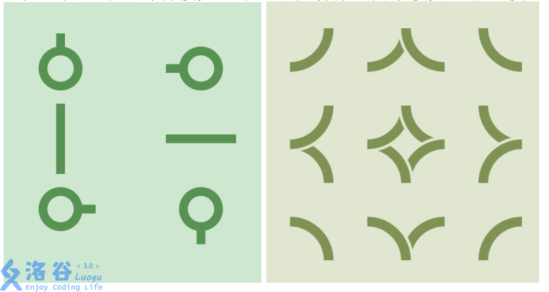

# 无限之环
[BZOJ5120 Luogu4003]

曾经有一款流行的游戏，叫做 Infinity Loop，先来简单的介绍一下这个游戏：  
游戏在一个 n ∗ m 的网格状棋盘上进行，其中有些小方格中会有水管，水管可能在  
格某些方向的边界的中点有接口，所有水管的粗细都相同，所以如果两个相邻方格的  
共边界的中点都有接头，那么可以看作这两个接头互相连接。水管有以下 15 种形状：
  
游戏开始时，棋盘中水管可能存在漏水的地方。  
形式化地：如果存在某个接头，没有和其它接头相连接，那么它就是一个漏水的地方。  
玩家可以进行一种操作：选定一个含有非.直.线.型.水管的方格，将其中的水管绕方格中心顺时针或逆时针旋转 90 度。  
直线型水管是指左图里中间一行的两种水管。  
现给出一个初始局面，请问最少进行多少次操作可以使棋盘上不存在漏水的地方。

把一个格子拆成五个，分别表示原来的和四条边，分情况讨论连边。

```cpp
#include<iostream>
#include<cstdio>
#include<cstdlib>
#include<cstring>
#include<algorithm>
#include<queue>
using namespace std;

#define ll long long
#define mem(Arr,x) memset(Arr,x,sizeof(Arr))

const int maxMap=2010;
const int maxN=maxMap*5;
const int maxM=maxN*10;
const int inf=2147483647;

class Edge
{
public:
	int u,v,flow,w;
};

int n,m,Ans;
int S,T;
int Id[maxMap][maxMap][5];
int Map[maxMap][maxMap];
int edgecnt=-1,Head[maxN],Next[maxM];
Edge E[maxM];
int Dist[maxN],cur[maxN];
queue<int> Q;
bool inq[maxN];

void Add_Edge(int u,int v,int flow,int w);
bool spfa();
int dfs(int u,int flow);

int main()
{
	mem(Head,-1);
	scanf("%d%d",&n,&m);
	for (int i=1,idcnt=0;i<=n;i++) for (int j=1;j<=m;j++) for (int f=0;f<=4;f++) Id[i][j][f]=++idcnt;
	S=n*m*5+1;T=S+1;
	for (int i=1;i<=n;i++) for (int j=1;j<=m;j++) scanf("%d",&Map[i][j]);
	int sum=0;
	for (int i=1;i<=n;i++)
		for (int j=1;j<=m;j++)
		{
			//cout<<"now:("<<i<<","<<j<<")"<<endl;
			int key=Map[i][j];//scanf("%d",&key);
			int cnt=0;
			for (int k=0;k<4;k++) if ((key&(1<<k))!=0) cnt++;
			sum+=cnt;
			if (cnt==0) continue;
			if ((i+j)&1)
			{
				Add_Edge(S,Id[i][j][4],cnt,0);
				if (i!=1) Add_Edge(Id[i][j][0],Id[i-1][j][2],1,0);
				if (j!=1) Add_Edge(Id[i][j][3],Id[i][j-1][1],1,0);
				for (int k=0;k<4;k++) if ((key&(1<<k))!=0) Add_Edge(Id[i][j][4],Id[i][j][k],1,0);
				if (cnt==1)
				{
					int p;for (p=0;p<4;p++) if ((key&(1<<p))!=0) break;
					Add_Edge(Id[i][j][p],Id[i][j][(p+1)%4],1,1);
					Add_Edge(Id[i][j][p],Id[i][j][(p+2)%4],1,2);
					Add_Edge(Id[i][j][p],Id[i][j][(p+3)%4],1,1);
				}
				if (cnt==2)
				{
					if ((key==5)||(key==10)) continue;
					int p;for (p=0;p<4;p++) if ( ((key&(1<<p))!=0) && ((key&(1<<((p+1)%4)))!=0) ) break;
					Add_Edge(Id[i][j][p],Id[i][j][(p+2)%4],1,1);
					Add_Edge(Id[i][j][(p+1)%4],Id[i][j][(p+3)%4],1,1);
				}
				if (cnt==3)
				{
					int p;for (p=0;p<4;p++) if ((key&(1<<p))==0) break;
					Add_Edge(Id[i][j][(p+1)%4],Id[i][j][p],1,1);
					Add_Edge(Id[i][j][(p+2)%4],Id[i][j][p],1,2);
					Add_Edge(Id[i][j][(p+3)%4],Id[i][j][p],1,1);
				}
			}
			else
			{
				Add_Edge(Id[i][j][4],T,cnt,0);
				if (i!=1) Add_Edge(Id[i-1][j][2],Id[i][j][0],1,0);
				if (j!=1) Add_Edge(Id[i][j-1][1],Id[i][j][3],1,0);
				for (int k=0;k<4;k++) if ((key&(1<<k))!=0) Add_Edge(Id[i][j][k],Id[i][j][4],1,0);
				if (cnt==1)
				{
					int p;for (p=0;p<4;p++) if ((key&(1<<p))!=0) break;
					Add_Edge(Id[i][j][(p+1)%4],Id[i][j][p],1,1);
					Add_Edge(Id[i][j][(p+2)%4],Id[i][j][p],1,2);
					Add_Edge(Id[i][j][(p+3)%4],Id[i][j][p],1,1);
				}
				if (cnt==2)
				{
					if ((key==5)||(key==10)) continue;
					int p;for (p=0;p<4;p++) if ( ((key&(1<<p))!=0) && ((key&(1<<((p+1)%4)))!=0) ) break;
					Add_Edge(Id[i][j][(p+2)%4],Id[i][j][p],1,1);
					Add_Edge(Id[i][j][(p+3)%4],Id[i][j][(p+1)%4],1,1);
				}
				if (cnt==3)
				{
					int p;for (p=0;p<4;p++) if ((key&(1<<p))==0) break;
					Add_Edge(Id[i][j][p],Id[i][j][(p+1)%4],1,1);
					Add_Edge(Id[i][j][p],Id[i][j][(p+2)%4],1,2);
					Add_Edge(Id[i][j][p],Id[i][j][(p+3)%4],1,1);
				}
			}
		}
	//cout<<sum<<endl;
	Ans=0;
	int mxflow=0;
	while (spfa())
	{
		for (int i=1;i<=T;i++) cur[i]=Head[i];
		while (int di=dfs(S,inf)) mxflow+=di;
	}
	//cout<<"mxflow:"<<mxflow<<endl;
	if (mxflow*2!=sum) printf("-1\n");
	else printf("%d\n",Ans);
	return 0;
}

void Add_Edge(int u,int v,int flow,int w)
{
	//cout<<"Add:"<<u<<" "<<v<<" "<<flow<<" "<<w<<endl;
	Next[++edgecnt]=Head[u];Head[u]=edgecnt;E[edgecnt]=((Edge){u,v,flow,w});
	Next[++edgecnt]=Head[v];Head[v]=edgecnt;E[edgecnt]=((Edge){v,u,0,-w});
	return;
}

bool spfa()
{
	while (!Q.empty()) Q.pop();mem(inq,0);
	for (int i=1;i<=T;i++) Dist[i]=inf;Dist[S]=0;
	Q.push(S);inq[S]=1;
	do
	{
		int u=Q.front();Q.pop();
		for (int i=Head[u];i!=-1;i=Next[i])
			if ((E[i].flow>0)&&(Dist[E[i].v]>Dist[u]+E[i].w))
			{
				Dist[E[i].v]=Dist[u]+E[i].w;
				if (inq[E[i].v]==0){
					inq[E[i].v]=1;Q.push(E[i].v);
				}
			}
		inq[u]=0;
	}
	while (!Q.empty());
	return Dist[T]!=inf;
}

int dfs(int u,int flow)
{
	if (u==T) return flow;
	inq[u]=1;
	for (int i=Head[u];i!=-1;i=Next[i])
		if ((E[i].flow>0)&&(inq[E[i].v]==0)&&(Dist[E[i].v]==Dist[u]+E[i].w))
		{
			int di=dfs(E[i].v,min(flow,E[i].flow));
			if (di){
				E[i].flow-=di;E[i^1].flow+=di;Ans+=di*E[i].w;
				return di;
			}
		}
	return 0;
}
```