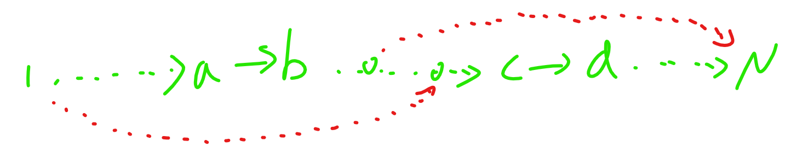

# 网络流
[2018.6.12 flow]

菜鸡企鹅豆豆正在学习网络流,他正在看一道经典题目:   
给出一个 N 个点 M 条边的有向图,每条边有一个权值 C i ,现在你需要删掉一些边,使得不存在一条从 1 点到 N 点的路径,并且使得删掉的边的权值之和最小。  
你一眼秒掉了这个模板题——直接跑个 1 到 N 的网络流不就完了嘛!  
脑洞奇特的豆豆又问了你一个问题:  
如果对于原图 1 到 N 的任意合法路径(可以进过同一个点多次,同一条边多次),都需要保证有且仅有一条边被删掉,那该怎么做呢?即不存在一条可以经过被删除边多次的 1到 N 的路径,也不存在一条不经过被删除边的 1 到 N 的路径。   
你自此陷入了沉思。

比较有趣的建模。  
首先把不会出现在$1-n$路径上的边先删掉，因为它们一定不会有贡献。然后考虑如何保证一条路径上的边只会割掉一条，直接把反向弧的流量设为$inf$就好，一张图说明如下  
  
至于环的处理，由于设置了$inf$的反向边，所以环上的边是一定不会被割掉的。

```cpp
#include<iostream>
#include<cstdio>
#include<cstdlib>
#include<cstring>
#include<algorithm>
using namespace std;

#define ll long long
#define mem(Arr,x) memset(Arr,x,sizeof(Arr))
#define NAME "flow"

const int maxN=1010;
const int maxM=2010<<1;
const int inf=2147483647;
const ll INF=1e16;

int n,m;
int edgecnt=0,H1[maxN],H2[maxN],Next[maxM<<1],V[maxM<<1];
int From[maxM],To[maxM],W[maxM],NodeW[maxN];

void Add_Edge(int *h,int u,int v);
void dfs(int *h,int u,int key);

namespace Flow
{
	class Edge
	{
	public:
		int v;
		ll flow;
	};

	int S,T;
	int edgecnt=0,Head[maxN],Next[maxM],V[maxM];
	Edge E[maxM];
	int Q[maxN],Depth[maxN],cur[maxN];

	void Init();
	void Add_Edge(int u,int v,int flow);
	ll MxFlow();
	bool Bfs();
	ll dfs(int u,ll flow);
}

int main()
{
	freopen(NAME".in","r",stdin);freopen(NAME".out","w",stdout);
	int TTT;scanf("%d",&TTT);
	while (TTT--)
	{
		edgecnt=0;mem(H1,-1);mem(H2,-1);mem(NodeW,0);Flow::Init();
		scanf("%d%d",&n,&m);
		for (int i=1;i<=m;i++)
		{
			scanf("%d%d%d",&From[i],&To[i],&W[i]);
			Add_Edge(H1,From[i],To[i]);Add_Edge(H2,To[i],From[i]);
		}
		/*
		for (int i=1;i<=n;i++)
			for (int j=H1[i];j!=-1;j=Next[j])
				cout<<i<<" -> "<<V[j]<<endl;
		cout<<endl;
		for (int i=1;i<=n;i++)
			for (int j=H2[i];j!=-1;j=Next[j])
				cout<<i<<" -> "<<V[j]<<endl;
		//*/
		dfs(H1,1,1<<0);//cout<<endl;
		dfs(H2,n,1<<1);

		//for (int i=1;i<=n;i++) cout<<NodeW[i]<<" ";

		for (int i=1;i<=m;i++)
			if ((NodeW[From[i]]==3)&&(NodeW[To[i]]==3))
				Flow::Add_Edge(From[i],To[i],W[i]);
		Flow::S=1;Flow::T=n;
		ll Ans=Flow::MxFlow();
		if (Ans>=INF) printf("-1\n");
		else printf("%lld\n",Ans);
	}
	return 0;
}

void Add_Edge(int *h,int u,int v)
{
	edgecnt++;Next[edgecnt]=h[u];h[u]=edgecnt;V[edgecnt]=v;
	return;
}

void dfs(int *h,int u,int key)
{
	NodeW[u]|=key;
	//cout<<u<<endl;
	for (int i=h[u];i!=-1;i=Next[i])
		if ((NodeW[V[i]]&key)==0)
			dfs(h,V[i],key);
	return;
}

namespace Flow
{
	void Init()
	{
		edgecnt=-1;mem(Head,-1);
		return;
	}

	void Add_Edge(int u,int v,int flow)
	{
		edgecnt++;Next[edgecnt]=Head[u];Head[u]=edgecnt;E[edgecnt]=((Edge){v,flow});
		edgecnt++;Next[edgecnt]=Head[v];Head[v]=edgecnt;E[edgecnt]=((Edge){u,INF});
		return;
	}

	ll MxFlow()
	{
		ll Ret=0;
		while (Bfs())
		{
			for (int i=1;i<=T;i++) cur[i]=Head[i];
			while (ll di=dfs(S,INF)) Ret+=di;
		}
		return Ret;
	}

	bool Bfs()
	{
		mem(Depth,-1);
		int h=1,t=0;Q[1]=S;Depth[S]=1;
		do
			for (int u=Q[++t],i=Head[u];i!=-1;i=Next[i])
				if ((E[i].flow>0)&&(Depth[E[i].v]==-1))
					Depth[Q[++h]=E[i].v]=Depth[u]+1;
		while (t!=h);
		return Depth[T]!=-1;
	}

	ll dfs(int u,ll flow)
	{
		if (u==T) return flow;
		for (int &i=cur[u];i!=-1;i=Next[i])
			if ((E[i].flow>0)&&(Depth[E[i].v]==Depth[u]+1))
			{
				ll di=dfs(E[i].v,min(flow,E[i].flow));
				if (di)
				{
					E[i].flow-=di;E[i^1].flow+=di;
					return di;
				}
			}
		return 0;
	}
}
```