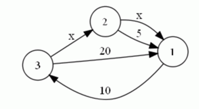

# [COCI2013]hiperprostor
[BZOJ3482]

在遥远的未来，行星之间的食品运输将依靠单向的贸易路线。每条路径直接连接两个行星，且其运输时间是已知的
。贸易商协会打算利用一项最近发现的新技术——超空间旅行，以增加一些新的航线。通过超空间旅行的航线也是
单向的。由于该项技术仍处于试验阶段，超空间旅行的时间目前是未知的，但它不取决于行星之间的距离，所以每
个超空间旅行的路线将花费等量的时间。下图是三个相互联通的行星及其运输时间的例子。行星使用正整数标号，
超空间旅行时间记为“x”（图片对应第输入样例）：过境的时间以天计，并且始终是一个正整数。贸易商协会希
望对引进新航线的后果进行分析：对于某两个行星A和B，他们想知道对于任意的x，从A到B的最短路径的总中转时
间的所有可能的值。例如，在上述情况中，从星球2到星球1的最短路径所需时间可以取值5（如果x≥5），4，3，2
，或1天（如果x<5）



首先跑一边最短路得到 Dist[i][j] 表示到 i 经过 j 条超空间旅行的边的最短时间，注意到第二维的大小不会超过 n 。那么，对于终点 T 来说，相当于是有若干一次函数取 min 后的并，用一个单调栈维护这个分段函数，然后每段每段等差数列求和。

```cpp
#include<iostream>
#include<cstdio>
#include<cstdlib>
#include<cstring>
#include<algorithm>
#include<queue>
using namespace std;

#define ll long long
#define ld long double
#define mem(Arr,x) memset(Arr,x,sizeof(Arr))

const int maxN=510;
const int maxM=10100;
const int inf=2147483647;

int n,m;
int edgecnt=0,Head[maxN],Next[maxM],V[maxM];
ll Dist[maxN][maxN],W[maxM];
bool inq[maxN][maxN];
queue<pair<int,int> > Qu;
pair<ll,ll> St1[maxN],St2[maxN];

void Add_Edge(int u,int v,int w);
ll Cross(ll k1,ll b1,ll k2,ll x2);

int main(){
	mem(Head,-1);int xcnt=0;
	scanf("%d%d",&n,&m);
	for (int i=1;i<=m;i++){
		int u,v;scanf("%d%d",&u,&v);
		char Input[10];scanf(" %s",Input);
		if (Input[0]=='x') Add_Edge(u,v,-1),++xcnt;
		else{
			int key=0,l=strlen(Input);for (int i=0;i<l;i++) key=key*10+Input[i]-'0';
			Add_Edge(u,v,key);
		}
	}
	xcnt=min(xcnt,n);
	int Case;scanf("%d",&Case);
	while (Case--){
		int S,T;scanf("%d%d",&S,&T);mem(Dist,63);mem(inq,0);
		Dist[S][0]=0;inq[S][0]=1;Qu.push(make_pair(S,0));
		do{
			int u=Qu.front().first,d=Qu.front().second;Qu.pop();
			for (int i=Head[u];i!=-1;i=Next[i])
				if (W[i]==-1){
					if ((d<xcnt)&&(Dist[V[i]][d+1]>Dist[u][d])){
						Dist[V[i]][d+1]=Dist[u][d];
						if (inq[V[i]][d+1]==0){
							Qu.push(make_pair(V[i],d+1));inq[V[i]][d+1]=1;
						}
					}
				}
				else{
					if (Dist[V[i]][d]>Dist[u][d]+W[i]){
						Dist[V[i]][d]=Dist[u][d]+W[i];
						if (inq[V[i]][d]==0){
							Qu.push(make_pair(V[i],d));inq[V[i]][d]=1;
						}
					}
				}
			inq[u][d]=0;
		}
		while (!Qu.empty());

		int mx=n;
		while ((mx>=0)&&(Dist[T][mx]==Dist[0][0])) --mx;
		if (mx==-1) {printf("0 0\n");continue;}
		if (Dist[T][0]==Dist[0][0]) {printf("inf\n");continue;}
		int top=1;St1[1]=make_pair(mx,Dist[T][mx]);St2[1]=make_pair(1,mx+Dist[T][mx]);
		for (int i=mx-1;i>=0;i--)
			if (Dist[T][i]!=Dist[0][0]){
				while ((top)&&(Cross(St1[top].first,St1[top].second,i,Dist[T][i])<=St2[top].first)) --top;
				St1[++top]=make_pair(i,Dist[T][i]);
				if (top==1) St2[top]=make_pair(1,i+Dist[T][i]);
				else{
					ll x=Cross(St1[top-1].first,St1[top-1].second,i,Dist[T][i]);
					St2[top]=make_pair(x,i*x+Dist[T][i]);
				}
			}
		ll cnt=1,sum=St2[top].second;
		for (int i=1;i<top;i++){
			ll k=St2[i+1].first-St2[i].first,lt=St2[i].second+(k-1)*St1[i].first;
			cnt+=k;sum+=(St2[i].second+lt)*k/2ll;
		}
		printf("%lld %lld\n",cnt,sum);
	}
	return 0;
}

void Add_Edge(int u,int v,int w){
	Next[++edgecnt]=Head[u];Head[u]=edgecnt;V[edgecnt]=v;W[edgecnt]=w;
	return;
}

ll Cross(ll k1,ll b1,ll k2,ll b2){
	return (b2-b1)/(k1-k2)+((b2-b1)%(k1-k2)!=0);
}
```