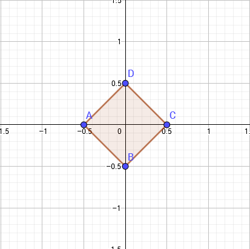
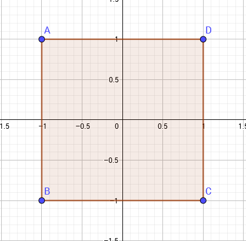

# dist
简单记录一下各种距离

## 欧几里得距离
多维空间中两点的直线距离  
$$\sqrt{(x1-x2)^2+(y1-y2)^2+……+(k1-k2)^2}$$

## 曼哈顿距离
两点横纵坐标差的绝对值之和
$$|x1-x2|+|y1-y2|$$

## 切比雪夫距离
坐标差中的较大值
$$max(|x1-x2|,|y1-y2|)$$

## 切比雪夫距离与曼哈顿距离的转化
考虑在二维平面上，与原点曼哈顿距离为$1$的点  
  
那么，与原点切比雪夫距离为$1$的点为  
  
可以发现，第二个图相当于把第一个图旋转$45°$再放大一倍。  
所以曼哈顿距离中的点$(x,y)$转化到切比雪夫中就是$(\frac{x+y}{2},\frac{x-y}{2})$