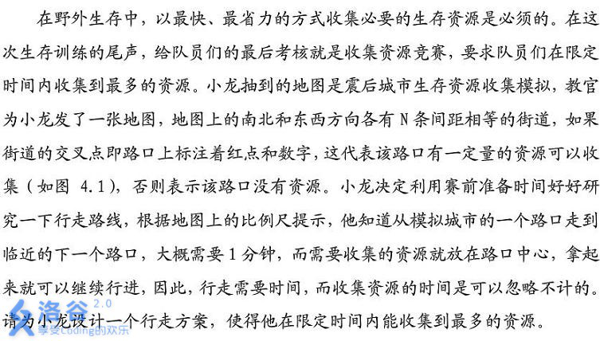

# [AHOI2012]收集资源
[BZOJ2825 Luogu2535]



搜索。对于任意两个点连边，但如果有其它的点在这两个点组成的矩形内，那不如先到这个点更优，则不连。

```cpp
#include<iostream>
#include<cstdio>
#include<cstdlib>
#include<cstring>
#include<algorithm>
using namespace std;

#define ll long long
#define mem(Arr,x) memset(Arr,x,sizeof(Arr))

const int maxN=210;
const int inf=2147483647;

int n,m,T,Ans=0;
int X[maxN],Y[maxN],V[maxN];
int G[maxN][maxN];
bool vis[maxN];

void dfs(int u,int t,int w);

int main(){
	scanf("%d%d%d",&n,&m,&T);
	for (int i=1;i<=m;i++) scanf("%d%d%d",&X[i],&Y[i],&V[i]);
	for (int i=0;i<=m;i++)
		for (int j=i+1;j<=m;j++){
			bool flag=1;
			int mnx=min(X[i],X[j]),mxx=max(X[i],X[j]),mny=min(Y[i],Y[j]),mxy=max(Y[i],Y[j]);
			for (int k=1;k<=n;k++)
				if ((k!=i)&&(k!=j))
					if ((X[k]>=mnx)&&(X[k]<=mxx)&&(Y[k]>=mny)&&(Y[k]<=mxy)){
						flag=0;break;
					}
			if (flag==0) continue;
			G[i][j]=G[j][i]=abs(X[i]-X[j])+abs(Y[i]-Y[j]);
		}
	dfs(0,0,0);
	printf("%d\n",Ans);return 0;
}

void dfs(int u,int t,int w){
	Ans=max(Ans,w);
	for (int i=1;i<=m;i++)
		if ((G[u][i])&&(vis[i]==0)&&(t+G[u][i]<=T)){
			vis[i]=1;dfs(i,t+G[u][i],w+V[i]);vis[i]=0;
		}
	return;
}
```