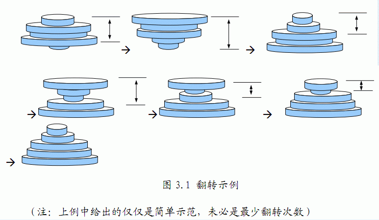

# [AHOI2012]铁盘整理
[BZOJ2824 Luogu2534]

在训练中，一些臂力训练器材是少不了的，小龙在练习的时候发现举重器械上的铁盘放置的非常混乱，并没有按照从轻到重的顺序摆放，这样非常不利于循序渐进的锻炼。他打算利用一个非常省力气的办法来整理这些铁盘，即每次都拿起最上面的若干个圆盘并利用器械的力量上下翻转，这样翻转若干次以后，铁盘将会按照从小到大的顺序排列好。那么你能不能帮小龙确定，最少翻转几次就可以使铁盘按从小到大排序呢？  
例如：下面的铁盘经过如图2.1所示的以下几个步骤的翻转后变为从小到大排列。


迭代加深搜索。离散化后，可以发现每一次交换，最多会减少一对原来相邻的相差大于 1 ，那么用这个作为估价函数。

```cpp
#include<iostream>
#include<cstdio>
#include<cstring>
#include<algorithm>
using namespace std;

#define ll long long
#define mem(Arr,x) memset(Arr,x,sizeof(Arr))

const int maxN=55;
const int inf=2147483647;

int n;
int W[maxN],tot=0;
pair<int,int> Sorter[maxN];

bool dfs(int d);

int main(){
	scanf("%d",&n);
	for (int i=1;i<=n;i++) scanf("%d",&Sorter[i].first),Sorter[i].second=i;
	sort(&Sorter[1],&Sorter[n+1]);
	for (int i=1;i<=n;i++) W[Sorter[i].second]=i;
	for (int i=1;i<n;i++) tot+=(abs(W[i]-W[i+1])>1);
	for (int i=0;;i++)
		if (dfs(i)){
			printf("%d\n",i);break;
		}
	return 0;
}

bool dfs(int d){
	if (tot+(W[n]!=n)>d) return 0;
	if ((tot==0)&&(W[1]==1)) return 1;
	for (int i=n;i>=1;i--)
		if ((i==n)||(abs(W[i]-W[i+1])>1)){
			if (i!=n) tot-=(abs(W[i]-W[i+1])>1);
			for (int p=1,q=i;p<q;p++,q--) swap(W[p],W[q]);
			if (i!=n) tot+=(abs(W[i]-W[i+1])>1);
			if (dfs(d-1)) return 1;
			if (i!=n) tot-=(abs(W[i]-W[i+1])>1);
			for (int p=1,q=i;p<q;p++,q--) swap(W[p],W[q]);
			if (i!=n) tot+=(abs(W[i]-W[i+1])>1);
		}
	return 0;
}
```