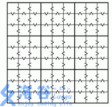

# [CQOI2013]新数独
[BZOJ3109 Luogu4573]

下面是一个没有数字，只有大小关系（没错，那些尖角都是“大于符号”）！的数独：



除了大小关系外（注意相邻格子不能相同），还需要满足通常的数独规则：  
每个格子都是$1$~$9$的数字  
每行都是$1$~$9$的排列  
每列都是$1$~$9$的排列  
每个 $3*3$ 的子矩阵（上图中用粗线隔开，一共有$3*3$个这样的子矩阵）都是$1$~$9$的排列
为了美观，每个$3*3$子矩阵的所有12对相邻格子的大小关系都将给出。

直接搜索。

```cpp
#include<iostream>
#include<cstdio>
#include<cstdlib>
#include<cstring>
#include<algorithm>
using namespace std;

#define ll long long
#define mem(Arr,x) memset(Arr,x,sizeof(Arr))

const int Belong[10][10]={ {0,0,0,0,0,0,0,0,0,0},
						  {0,1,1,1,2,2,2,3,3,3},
						  {0,1,1,1,2,2,2,3,3,3},
						  {0,1,1,1,2,2,2,3,3,3},
						  {0,4,4,4,5,5,5,6,6,6},
						  {0,4,4,4,5,5,5,6,6,6},
						  {0,4,4,4,5,5,5,6,6,6},
						  {0,7,7,7,8,8,8,9,9,9},
						  {0,7,7,7,8,8,8,9,9,9},
						  {0,7,7,7,8,8,8,9,9,9} };
const int inf=2147483647;

int X[10][10],Y[10][10],B[10][10];
int cmpx[10][10],cmpy[10][10];
int Mp[10][10];

int Input();
void GetX(int id);
void dfs(int x,int y);

int main(){
	for (int i=1;i<=3;i++){
		GetX(i*3-2);
		for (int j=1;j<=9;j++) cmpy[i*3-1][j]=Input();
		GetX(i*3-1);
		for (int j=1;j<=9;j++) cmpy[i*3][j]=Input();
		GetX(i*3);
	}
	dfs(1,1);
	return 0;
}

int Input(){
	char ch;scanf(" %c",&ch);
	return (ch=='<')||(ch=='^');
}

void GetX(int id){
	cmpx[id][2]=Input();cmpx[id][3]=Input();
	cmpx[id][5]=Input();cmpx[id][6]=Input();
	cmpx[id][8]=Input();cmpx[id][9]=Input();
	return;
}

void dfs(int x,int y){
	if (y==10) ++x,y=1;
	if (x==10){
		for (int i=1;i<=9;i++){
			for (int j=1;j<=9;j++)
				printf("%d ",Mp[i][j]);
			printf("\n");
		}
		exit(0);
	}
	for (int i=1;i<=9;i++){
		if ((X[x][i])||(Y[y][i])||(B[Belong[x][y]][i])) continue;
		Mp[x][y]=i;
		if (Belong[x-1][y]==Belong[x][y]){
			if ((cmpy[x][y]==1)&&(Mp[x-1][y]>Mp[x][y])) continue;
			if ((cmpy[x][y]==0)&&(Mp[x-1][y]<Mp[x][y])) continue;
		}
		if (Belong[x][y-1]==Belong[x][y]){
			if ((cmpx[x][y]==1)&&(Mp[x][y-1]>Mp[x][y])) continue;
			if ((cmpx[x][y]==0)&&(Mp[x][y-1]<Mp[x][y])) continue;
		}
		X[x][i]=Y[y][i]=B[Belong[x][y]][i]=1;Mp[x][y]=i;
		dfs(x,y+1);
		X[x][i]=Y[y][i]=B[Belong[x][y]][i]=0;
	}
	return;
}
```
