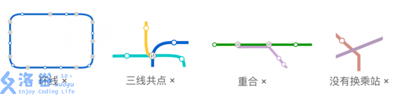

# 小 Y 和地铁
[Luogu4005 LOJ2323]

小 Y 是一个爱好旅行的 OIer。一天，她来到了一个新的城市。由于不熟悉那里的交通系统，她选择了坐地铁。  
她发现每条地铁线路可以看成平面上的一条曲线，不同线路的交点处一定会设有  
换乘站 。通过调查得知，没有线路是环线，也没有线路与自身相交。任意两条不同的线路只会在若干个点上相交，没有重合的部分，且没有三线共点的情况。即，如图所示的情况都是不存在的：



小 Y 坐着地铁 0 号线，路上依次经过了 n 个换乘站。她记下了每个换乘站可以换乘的线路编号，发现每条线路与她所乘坐的线路最多只有 2 个换乘站。现在小 Y 想知道，除掉她经过的换乘站以外，这个城市里最少有几个换乘站。只有你告诉她正确的答案，她才会答应下次带你去玩呢。

枚举讨论每一种线段的摆放方式，一共有 $8$ 种，合并后发现本质不同的只有 $4$ 种。按照左端点排序，只考虑左边对右边的影响，发现还可以分成两类，即向上摆和向下摆两类，每类中取最优值。发现贡献的计算只跟前面的线段中右端点在当前右边的有关，并且以右端点在当前右端点左边和右边分成两类，由于实际上的线段数量只有 $22$ ，那么可以提前预处理出来可能有交的线段的集合，与当前选择冲突的取交，再取与补集的较小值。

```cpp
#include<iostream>
#include<cstdio>
#include<cstdlib>
#include<cstring>
#include<algorithm>
using namespace std;

#define ll long long
#define mem(Arr,x) memset(Arr,x,sizeof(Arr))

const int maxN=50;
const int maxCnt=4194304+10;
const int inf=2147483647;

class Range
{
public:
	int l,r;
};

int n,Seq[maxN],rcnt;
Range Re[maxN];
int Ans,Cnt[maxCnt],Tot[maxN],S[maxN],lst[maxN];

bool cmp(Range A,Range B);
void dfs(int now,int s,int cnt);

int main(){
	for (int i=0;i<maxCnt;i++) Cnt[i]=Cnt[i>>1]+(i&1);
	int TTT;scanf("%d",&TTT);
	while (TTT--){
		scanf("%d",&n);rcnt=0;mem(lst,0);mem(Tot,0);mem(S,0);
		for (int i=1;i<=n;i++) scanf("%d",&Seq[i]);
		if (n<=6){
			printf("0\n");continue;
		}
		for (int i=1;i<=n;i++)
			if (lst[Seq[i]]==0) lst[Seq[i]]=i;
			else Re[rcnt++]=((Range){lst[Seq[i]],i});
		sort(&Re[0],&Re[rcnt],cmp);

		if (rcnt==0){
			printf("0\n");continue;
		}

		for (int i=0;i<rcnt;i++)
			for (int j=0;j<i;j++)
				if (Re[j].r>Re[i].l){
					Tot[i]++;
					if (Re[j].r<Re[i].r) S[i]|=(1<<j);
				}
		Ans=inf;
		dfs(0,0,0);

		printf("%d\n",Ans);
	}

	return 0;
}

bool cmp(Range A,Range B){
	return A.l<B.l;
}

void dfs(int now,int s,int cnt){
	if (cnt>=Ans) return;
	if (now==rcnt){
		Ans=cnt;return;
	}
	int d=Cnt[s&S[now]];
	dfs(now+1,s|(1<<now),cnt+min(d,Tot[now]-d));
	d=Cnt[S[now]]-d;
	dfs(now+1,s,cnt+min(d,Tot[now]-d));
	return;
}
```