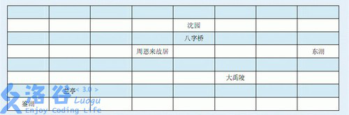
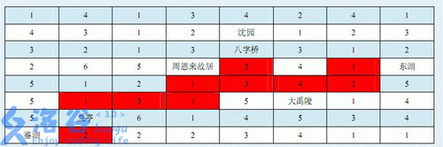

# [WC2008]游览计划
[BZOJ2595 Luogu4294]

从未来过绍兴的小D有幸参加了Winter Camp 2008，他被这座历史名城的秀丽风景所吸引，强烈要求游览绍兴及其周边的所有景点。  
主办者将绍兴划分为N行M列(N×M)个分块，如下图(8×8)：



景点含于方块内，且一个方块至多有一个景点。无景点的方块视为路。  
为了保证安全与便利，主办方依据路况和治安状况，在非景点的一些方块内安排不同数量的志愿者；在景点内聘请导游（导游不是志愿者）。在选择旅游方案时，保证任意两个景点之间，存在一条路径，在这条路径所经过的每一个方块都有志愿者或者该方块为景点。既能满足选手们游览的需要，又能够让志愿者的总数最少。  
例如，在上面的例子中，在每个没有景点的方块中填入一个数字，表示控制该方块最少需要的志愿者数目：



图中用深色标出的方块区域就是一种可行的志愿者安排方案，一共需要20名志愿者。由图可见，两个相邻的景点是直接（有景点内的路）连通的（如沈园和八字桥）。  
现在，希望你能够帮助主办方找到一种最好的安排方案。

设 F[i][j][S] 表示当前在 (i,j) ，已经连通的情况为 S 。转移有两种，一种是直接枚举子集进行转移，另一种是最短路增广。

```cpp
#include<iostream>
#include<cstdio>
#include<cstdlib>
#include<cstring>
#include<algorithm>
#include<queue>
using namespace std;

#define ll long long
#define mem(Arr,x) memset(Arr,x,sizeof(Arr))

const int maxN=11;
const int F1[4]={-1,0,1,0};
const int F2[4]={0,-1,0,1};
const int inf=2147483647;

int n,m,empty;
int Val[maxN][maxN];
int F[maxN][maxN][1<<maxN];
pair<int,int> From[maxN][maxN][1<<maxN];
int viscnt,vis[maxN][maxN];
priority_queue<pair<int,pair<int,int> > > H;

void mark(int x,int y,int S);

int main(){
	int ex,ey;
	mem(F,63);
	scanf("%d%d",&n,&m);
	for (int i=1;i<=n;i++)
		for (int j=1;j<=m;j++){
			scanf("%d",&Val[i][j]);
			if (Val[i][j]==0) F[i][j][1<<(empty++)]=0,ex=i,ey=j;
		}

	for (int S=0;S<(1<<empty);++S){
		for (int x=1;x<=n;x++)
			for (int y=1;y<=m;y++){
				for (int s=S;s;s=(s-1)&S)
					if (F[x][y][S]>F[x][y][s]+F[x][y][S^s]-Val[x][y]){
						F[x][y][S]=F[x][y][s]+F[x][y][S^s]-Val[x][y];
						From[x][y][S]=make_pair(4,s);
					}
				if (F[x][y][S]!=F[0][0][0]) H.push(make_pair(-F[x][y][S],make_pair(x,y)));
			}
		++viscnt;
		while (!H.empty()){
			int x=H.top().second.first,y=H.top().second.second;H.pop();
			if (vis[x][y]==viscnt) continue;vis[x][y]=viscnt;
			for (int f=0;f<4;f++){
				int xx=x+F1[f],yy=y+F2[f];
				if ((xx<=0)||(yy<=0)||(x>n)||(y>m)) continue;
				if (F[xx][yy][S]>F[x][y][S]+Val[xx][yy]){
					F[xx][yy][S]=F[x][y][S]+Val[xx][yy];From[xx][yy][S]=make_pair(f,S);
					H.push(make_pair(-F[xx][yy][S],make_pair(xx,yy)));
				}
			}
		}
	}
	++viscnt;
	mark(ex,ey,(1<<empty)-1);
	printf("%d\n",F[ex][ey][(1<<empty)-1]);
	for (int i=1;i<=n;i++){
		for (int j=1;j<=m;j++)
			if (Val[i][j]==0) printf("x");
			else if (vis[i][j]==viscnt) printf("o");
			else printf("_");
		printf("\n");
	}
	return 0;
}

void mark(int x,int y,int S){
	vis[x][y]=viscnt;
	if (From[x][y][S].second==0) return;
	int f=From[x][y][S].first;
	if (f<=3) mark(x-F1[f],y-F2[f],S);
	else{
		mark(x,y,From[x][y][S].second);
		mark(x,y,From[x][y][S].second^S);
	}
	return;
}
```