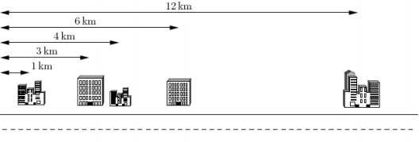

# [CTSC2007]数据备份
[BZOJ1150 Luogu3620]

你在一家 IT 公司为大型写字楼或办公楼(offices)的计算机数据做备份。然而数据备份的工作是枯燥乏味的，因此你想设计一个系统让不同的办公楼彼此之间互相备份，而你则坐在家中尽享计算机游戏的乐趣。  
已知办公楼都位于同一条街上。你决定给这些办公楼配对(两个一组)。每一对办公楼可以通过在这两个建筑物之间铺设网络电缆使得它们可以互相备份。  
然而，网络电缆的费用很高。当地电信公司仅能为你提供 K 条网络电缆，这意味着你仅能为 K 对办公楼(或总计 2K 个办公楼)安排备份。任一个办公楼都属于唯一的配对组(换句话说，这 2K 个办公楼一定是相异的)。  
此外，电信公司需按网络电缆的长度(公里数)收费。因而，你需要选择这 K对办公楼使得电缆的总长度尽可能短。换句话说，你需要选择这 K 对办公楼，使得每一对办公楼之间的距离之和(总距离)尽可能小。  
下面给出一个示例，假定你有 5 个客户，其办公楼都在一条街上，如下图所示。这 5 个办公楼分别位于距离大街起点 1km, 3km, 4km, 6km 和 12km 处。电信公司仅为你提供 K=2 条电缆。  



上例中最好的配对方案是将第 1 个和第 2 个办公楼相连，第 3 个和第 4 个办公楼相连。这样可按要求使用 K=2 条电缆。第 1 条电缆的长度是 3km―1km = 2km，第 2 条电缆的长度是 6km―4km = 2 km。这种配对方案需要总长 4km 的网络电缆，满足距离之和最小的要求。

可以发现，一定是取相邻的两个最优。那么如果是网络流的话，相当于是一个二分图最大权匹配。考虑用堆贪模拟网络流增广的过程，先把所有的距离丢到堆里面取，当取出一个的时候，把它和相邻的都从堆中删掉，然后加入一个新的点，权值为两边的减去中间的，如果这个点被取出来了，意味着反悔原来的某一次操作。用链表来支持序列的删除和前驱后继的查询。

```cpp
#include<iostream>
#include<cstdio>
#include<cstdlib>
#include<cstring>
#include<algorithm>
#include<queue>
using namespace std;

#define ll long long
#define mem(Arr,x) memset(Arr,x,sizeof(Arr))

const int maxN=101000;
const int inf=2147483647;
const ll INF=1e18;

class QueueData
{
public:
	ll key;int id;
};

int n,K;
int Dist[maxN],Next[maxN],Pre[maxN];
ll Val[maxN];
priority_queue<QueueData> Q,Del;

bool operator < (QueueData A,QueueData B);
bool operator == (QueueData A,QueueData B);
void Push(QueueData u);
void Delete(QueueData u);
QueueData Top();
void Pop();

int main(){
	scanf("%d%d",&n,&K);
	for (int i=1;i<=n;i++) scanf("%d",&Dist[i]);
	for (int i=1;i<n;i++) Val[i]=Dist[i+1]-Dist[i];
	Val[0]=INF;Val[n]=INF;
	for (int i=1;i<n;i++) Next[i]=i+1,Pre[i]=i-1;
	Next[0]=1;Pre[n]=n-1;Pre[0]=-1;Next[n]=-1;

	for (int i=0;i<=n;i++) Push((QueueData){Val[i],i});

	ll Ans=0;
	while (K--){
		QueueData u=Top();Pop();
		Ans=Ans+u.key;
		int pre=Pre[u.id],nxt=Next[u.id];
		Delete((QueueData){Val[pre],pre});Delete((QueueData){Val[nxt],nxt});
		Val[u.id]=Val[pre]+Val[nxt]-Val[u.id];
		Pre[u.id]=Pre[pre];Next[u.id]=Next[nxt];
		if (Pre[pre]!=-1) Next[Pre[pre]]=u.id;
		if (Next[nxt]!=-1) Pre[Next[nxt]]=u.id;
		Push((QueueData){Val[u.id],u.id});
	}

	printf("%lld\n",Ans);
	return 0;
}

bool operator < (QueueData A,QueueData B){
	if (A.key!=B.key) return A.key>B.key;
	else return A.id<B.id;
}

bool operator == (QueueData A,QueueData B){
	return ((A.key==B.key)&&(A.id==B.id));
}

void Push(QueueData u){
	Q.push(u);return;
}

void Delete(QueueData u){
	Del.push(u);return;
}

QueueData Top(){
	while ((!Q.empty())&&(!Del.empty())&&(Q.top()==Del.top())) Q.pop(),Del.pop();
	return Q.top();
}

void Pop(){
	while ((!Q.empty())&&(!Del.empty())&&(Q.top()==Del.top())) Q.pop(),Del.pop();
	Q.pop();return;
}
```