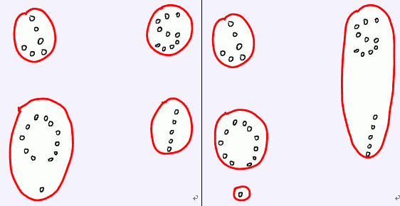

# [JSOI2010]部落划分
[BZOJ1821 Luogu4047]

聪聪研究发现，荒岛野人总是过着群居的生活，但是，并不是整个荒岛上的所有野人都属于同一个部落，野人们总是拉帮结派形成属于自己的部落，不同的部落之间则经常发生争斗。只是，这一切都成为谜团了——聪聪根本就不知道部落究竟是如何分布的。  
不过好消息是，聪聪得到了一份荒岛的地图。地图上标注了N个野人居住的地点（可以看作是平面上的坐标）。我们知道，同一个部落的野人总是生活在附近。我们把两个部落的距离，定义为部落中距离最近的那两个居住点的距离。聪聪还获得了一个有意义的信息——这些野人总共被分为了K个部落！这真是个好消息。聪聪希望从这些信息里挖掘出所有部落的详细信息。他正在尝试这样一种算法：  
对于任意一种部落划分的方法，都能够求出两个部落之间的距离，聪聪希望求出一种部落划分的方法，使靠得最近的两个部落尽可能远离。  
例如，下面的左图表示了一个好的划分，而右图则不是。请你编程帮助聪聪解决这个难题。 


贪心，直接最小生成树。

```cpp
#include<iostream>
#include<cstdio>
#include<cstdlib>
#include<cstring>
#include<algorithm>
#include<cmath>
using namespace std;

#define ll long long
#define ld long double
#define mem(Arr,x) memset(Arr,x,sizeof(Arr))

const int maxN=1010;
const int inf=2147483647;

class Edge
{
public:
	int u,v;
	ld d;
};

int n,K;
int X[maxN],Y[maxN],UFS[maxN];
Edge E[maxN*maxN];

bool cmp(Edge A,Edge B);
int Find(int x);

int main(){
	scanf("%d%d",&n,&K);
	for (int i=1;i<=n;i++) scanf("%d%d",&X[i],&Y[i]),UFS[i]=i;

	int ecnt=0;
	for (int i=1;i<=n;i++)
		for (int j=i+1;j<=n;j++)
			E[++ecnt]=((Edge){i,j,sqrt(1ll*(X[i]-X[j])*(X[i]-X[j])+1ll*(Y[i]-Y[j])*(Y[i]-Y[j]))});

	sort(&E[1],&E[ecnt+1],cmp);

	int cnt=n;
	for (int i=1;i<=ecnt;i++)
		if (Find(E[i].u)!=Find(E[i].v)){
			cnt--;UFS[Find(E[i].u)]=Find(E[i].v);
			if (cnt==K) break;
		}

	ld d=inf;
	for (int i=1;i<=ecnt;i++)
		if (Find(E[i].u)!=Find(E[i].v)) d=min(d,E[i].d);

	printf("%.2LF\n",d);

	return 0;
}

bool cmp(Edge A,Edge B){
	return A.d<B.d;
}

int Find(int x){
	if (UFS[x]!=x) UFS[x]=Find(UFS[x]);
	return UFS[x];
}
```