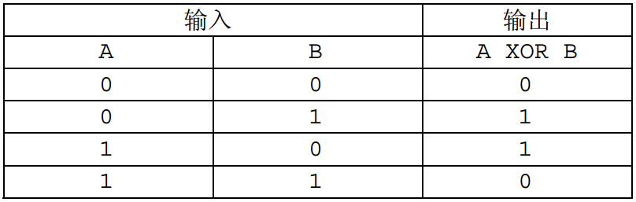
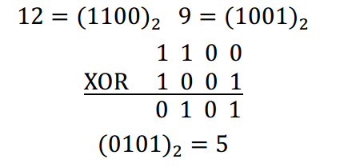

# [WC2011]最大XOR和路径
[BZOJ2115 Luogu4151]

XOR（异或）是一种二元逻辑运算，其运算结果当且仅当两个输入的布尔值不相等时才为真，否则为假。 XOR 运算的真值表如下（1 表示真， 0 表示假）：

而两个非负整数的 XOR 是指将它们表示成二进制数，再在对应的二进制位进行 XOR 运算。

譬如 121212 XOR 999 的计算过程如下：


故 $12$ XOR $9 = 5$。  
容易验证， XOR 运算满足交换律与结合律，故计算若干个数的 XOR 时，不同的计算顺序不会对运算结果造成影响。从而，可以定义 $K$ 个非负整数 $A _ 1$，$A _ 2$，……，$A _ {K-1}$，$A _ K$的 XOR 和为  
$A _ 1$ XOR $A _ 2$ XOR …… XOR $A _ {K-1}$ XOR $A _ K$  
考虑一个边权为非负整数的无向连通图，节点编号为 $1$ 到 $N$，试求出一条从 $1$ 号节点到 $N$ 号节点的路径，使得路径上经过的边的权值的 XOR 和最大。  
路径可以重复经过某些点或边，当一条边在路径中出现了多次时，其权值在计算 XOR 和时也要被计算相应多的次数，具体见样例。

可以知道，最后的答案应该是一条从 1 到 n 的路径加上若干的环。任意找出一条从 1 到 n 的路径和所有的环，然后把环放到线性基里面，求异或最大值。任意的合法路径都可以通过这种方式得到。

```cpp
#include<iostream>
#include<cstdio>
#include<cstdlib>
#include<cstring>
#include<algorithm>
using namespace std;

#define ll long long
#define mem(Arr,x) memset(Arr,x,sizeof(Arr))

const int maxN=50500;
const int maxM=101000<<1;
const int maxBit=64;
const int inf=2147483647;

int n,m;
int edgecnt=0,Head[maxN],Next[maxM],V[maxM];
ll Base[maxBit],W[maxM],NW[maxN];
bool vis[maxN];

void Add_Edge(int u,int v,ll w);
void dfs(int u);
void Insert(ll key);

int main(){
	mem(Head,-1);
	scanf("%d%d",&n,&m);
	for (int i=1;i<=m;i++){
		int u,v;ll w;scanf("%d%d%lld",&u,&v,&w);
		Add_Edge(u,v,w);Add_Edge(v,u,w);
	}
	dfs(1);
	ll Ans=NW[n];
	for (int i=maxBit-1;i>=0;i--)
		Ans=max(Ans,Ans^Base[i]);
	printf("%lld\n",Ans);return 0;
}

void Add_Edge(int u,int v,ll w){
	Next[++edgecnt]=Head[u];Head[u]=edgecnt;V[edgecnt]=v;W[edgecnt]=w;
	return;
}

void dfs(int u){
	vis[u]=1;
	for (int i=Head[u];i!=-1;i=Next[i])
		if (vis[V[i]]==0){
			NW[V[i]]=NW[u]^W[i];dfs(V[i]);
		}
		else Insert(NW[u]^NW[V[i]]^W[i]);
	return;
}

void Insert(ll key){
	for (int i=maxBit-1;i>=0;i--)
		if (key&(1ll<<i)){
			if (Base[i]==0){
				Base[i]=key;return;
			}
			key^=Base[i];
		}
	return;
}
```