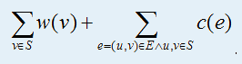

# 阿狸和桃子的游戏
[BZOJ2563]

阿狸和桃子正在玩一个游戏，游戏是在一个带权图G=(V, E)上进行的，设节点权值为w(v)，边权为c(e)。游戏规则是这样的：  
1. 阿狸和桃子轮流将图中的顶点染色，阿狸会将顶点染成红色，桃子会将顶点染成粉色。已经被染过色的点不能再染了，而且每一轮都必须给一个且仅一个顶点染色。  
2. 为了保证公平性，节点的个数N为偶数。  
3. 经过N/2轮游戏之后，两人都得到了一个顶点集合。对于顶点集合S，得分计算方式为  


由于阿狸石头剪子布输给了桃子，所以桃子先染色。两人都想要使自己的分数比对方多，且多得越多越好。如果两人都是采用最优策略的，求最终桃子的分数减去阿狸的分数。

由于是最后求桃子减去阿狸的分数，那么把每一条边的边权除以二后放到点上，如果一条边的两个点被同一个人选择，则这个贡献就会加上，否则就会互相抵消。  
为了避免分数问题，可以把点权乘以二，最后再除二。

```cpp
#include<iostream>
#include<cstdio>
#include<cstdlib>
#include<cstring>
#include<algorithm>
using namespace std;

#define ll long long
#define mem(Arr,x) memset(Arr,x,sizeof(Arr))

const int maxN=10100;
const int inf=2147483647;

int n,m;
ll W[maxN];

int main(){
	scanf("%d%d",&n,&m);
	for (int i=1;i<=n;i++) scanf("%lld",&W[i]),W[i]*=2ll;
	for (int i=1;i<=m;i++){
		int u,v;ll w;scanf("%d%d%lld",&u,&v,&w);
		W[u]+=w;W[v]+=w;
	}
	sort(&W[1],&W[n+1]);reverse(&W[1],&W[n+1]);
	ll Ans=0;
	for (int i=1,opt=1;i<=n;i++,opt*=-1) Ans=Ans+W[i]*opt;
	printf("%lld\n",Ans/2);
	return 0;
}
```