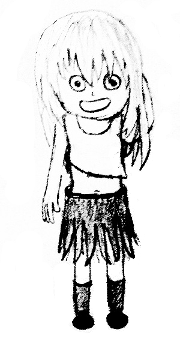

# Arpa’s letter-marked tree and Mehrdad’s Dokhtar-kosh paths
[CF741D]

Just in case somebody missed it: we have wonderful girls in Arpa’s land.  
Arpa has a rooted tree (connected acyclic graph) consisting of n vertices. The vertices are numbered 1 through n, the vertex 1 is the root. There is a letter written on each edge of this tree. Mehrdad is a fan of Dokhtar-kosh things. He call a string Dokhtar-kosh, if we can shuffle the characters in string such that it becomes palindrome.  

He asks Arpa, for each vertex v, what is the length of the longest simple path in subtree of v that form a Dokhtar-kosh string.

给出一棵边权带字符的树，现在求每一棵子树内，字符重拍后能够形成回文串的最长路径。

路径上的字符能够形成回文串，可以看作是对字符状压编号后最多只会有一个$1$。按顺序枚举子树，类似点分治的方式获得答案。由于不好维护，所以采用$dsu\ on\ tree$优化。

```cpp
#include<iostream>
#include<cstdio>
#include<cstdlib>
#include<cstring>
#include<algorithm>
using namespace std;

#define ll long long
#define mem(Arr,x) memset(Arr,x,sizeof(Arr))

const int maxN=505000;
const int maxBit=22;
const int inf=2147483647;

int n;
int edgecnt=0,Head[maxN],Next[maxN],V[maxN],Xor[maxN];
int Size[maxN],Hson[maxN];
int dfncnt,fst[maxN],lst[maxN],Id[maxN],Depth[maxN];
int F[1<<maxBit],Ans[maxN];

void Add_Edge(int u,int v);
void dfs1(int u);
void dfs2(int u,int hson);

int main()
{
	mem(Head,-1);
	scanf("%d",&n);
	for (int i=2;i<=n;i++)
	{
		int fa;char ch;scanf("%d %c",&fa,&ch);
		Add_Edge(fa,i);Xor[i]=(1<<(ch-'a'));
	}

	Depth[1]=1;

	dfs1(1);
	dfs2(1,1);

	for (int i=1;i<=n;i++) printf("%d ",Ans[i]);printf("\n");
	return 0;
}

void Add_Edge(int u,int v){
	Next[++edgecnt]=Head[u];Head[u]=edgecnt;V[edgecnt]=v;
	return;
}

void dfs1(int u)
{
	Size[u]=1;Hson[u]=0;Id[fst[u]=++dfncnt]=u;
	for (int i=Head[u];i!=-1;i=Next[i])
	{
		Depth[V[i]]=Depth[u]+1;Xor[V[i]]^=Xor[u];
		dfs1(V[i]);Size[u]+=Size[V[i]];
		if (Size[Hson[u]]<Size[V[i]]) Hson[u]=V[i];
	}
	lst[u]=dfncnt;
	return;
}

void dfs2(int u,int hson)
{
	for (int i=Head[u];i!=-1;i=Next[i])
		if (V[i]!=Hson[u]){
			dfs2(V[i],0);
			Ans[u]=max(Ans[u],Ans[V[i]]);
		}
	if (Hson[u]){
		dfs2(Hson[u],1);
		Ans[u]=max(Ans[u],Ans[Hson[u]]);
	}

	if (F[Xor[u]]) Ans[u]=max(Ans[u],F[Xor[u]]-Depth[u]);
	for (int i=0;i<=21;i++)
		if (F[Xor[u]^(1<<i)]) Ans[u]=max(Ans[u],F[Xor[u]^(1<<i)]-Depth[u]);
	F[Xor[u]]=max(F[Xor[u]],Depth[u]);

	for (int i=Head[u];i!=-1;i=Next[i])
		if (V[i]!=Hson[u])
		{
			int v=V[i];
			for (int j=fst[v];j<=lst[v];j++){
				if (F[Xor[Id[j]]]) Ans[u]=max(Ans[u],F[Xor[Id[j]]]+Depth[Id[j]]-2*Depth[u]);
				for (int k=0;k<=21;k++)
					if (F[Xor[Id[j]]^(1<<k)]) Ans[u]=max(Ans[u],F[Xor[Id[j]]^(1<<k)]+Depth[Id[j]]-2*Depth[u]);
			}
			for (int j=fst[v];j<=lst[v];j++)
				F[Xor[Id[j]]]=max(F[Xor[Id[j]]],Depth[Id[j]]);
		}
	if (hson==0) for (int i=fst[u];i<=lst[u];i++) F[Xor[Id[i]]]=0;
	return;
}
```