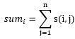

# 树上游戏
[Luogu2664]

lrb有一棵树，树的每个节点有个颜色。给一个长度为n的颜色序列，定义s(i,j) 为i 到j 的颜色数量。以及


现在他想让你求出所有的sum[i]

考虑点分治，计算经过分治重心的所有路径。考虑某一种颜色的贡献，如果它是当前子树上到重心路径上该种颜色的第一个，那么该分治重心的其它子树的所有点对于该点子树内的所有点都有该颜色的贡献。在这个的基础上进行计数，注意加减的处理。

```cpp
#include<cstdio>
#include<cstdlib>
#include<cstring>
#include<algorithm>
#include<iostream>
using namespace std;

#define ll long long
#define mem(Arr,x) memset(Arr,x,sizeof(Arr))

const int maxN=101000;
const int maxM=maxN<<1;
const int inf=2000000000;

class Array{
public:
    int tim,Tim[maxN],Key[maxN];
    void clear(){
		++tim;return;
    }
    void reset(int p){
		Tim[p]=0;return;
    }
    void use(int p){
		Tim[p]=tim;return;
    }
    bool check(int p){
		return Tim[p]==tim;
    }
    void plus(int p,int k){
		if (Tim[p]!=tim) Tim[p]=tim,Key[p]=0;
		Key[p]+=k;return;
    }
    int get(int p){
		return (Tim[p]==tim)?Key[p]:0;
    }
};

int n,Col[maxN];
int edgecnt=0,Head[maxN],Next[maxM],V[maxM];
int root,nowsize,Sz[maxN],Mx[maxN];
ll Ans[maxN],sum;
bool vis[maxN];
Array T,A;

void Add_Edge(int u,int v);
void dfs_root(int u,int fa);
void solve(int u);
void dfs_inc(int u,int fa);
void dfs_exc(int u,int fa);
void dfs_calc(int u,int fa,int sz,ll ans);

int main(){
    scanf("%d",&n);mem(Head,-1);
    for (int i=1;i<=n;i++) scanf("%d",&Col[i]);
    for (int i=1;i<n;i++){
		int u,v;scanf("%d%d",&u,&v);
		Add_Edge(u,v);Add_Edge(v,u);
    }
    Mx[root=0]=inf;nowsize=n;
    dfs_root(1,1);solve(root);
    for (int i=1;i<=n;i++) printf("%lld\n",Ans[i]);return 0;
}
void Add_Edge(int u,int v){
    Next[++edgecnt]=Head[u];Head[u]=edgecnt;V[edgecnt]=v;
    return;
}
void dfs_root(int u,int fa){
    Sz[u]=1;Mx[u]=0;
    for (int i=Head[u];i!=-1;i=Next[i])
		if ((vis[V[i]]==0)&&(V[i]!=fa)){
			dfs_root(V[i],u);Sz[u]+=Sz[V[i]];
			Mx[u]=max(Mx[u],Sz[V[i]]);
		}
    Mx[u]=max(Mx[u],nowsize-Sz[u]);
    if (Mx[u]<Mx[root]) root=u;return;
}
void solve(int u){
    vis[u]=1;int sumsize=1;
    for (int i=Head[u];i!=-1;i=Next[i])
		if (vis[V[i]]==0) dfs_root(V[i],u),sumsize+=Sz[V[i]];
    sum=0;A.clear();
    for (int i=Head[u];i!=-1;i=Next[i])
		if (vis[V[i]]==0) T.clear(),T.use(Col[u]),dfs_inc(V[i],u);
    Ans[u]+=sum+sumsize;
    for (int i=Head[u];i!=-1;i=Next[i])
		if (vis[V[i]]==0){
			T.clear();T.use(Col[u]);dfs_exc(V[i],u);
			A.plus(Col[u],sumsize-Sz[V[i]]);
			dfs_calc(V[i],u,sumsize-Sz[V[i]],sum+sumsize-Sz[V[i]]);
			A.plus(Col[u],Sz[V[i]]-sumsize);
			T.clear();T.use(Col[u]);dfs_inc(V[i],u);
		}
    for (int i=Head[u];i!=-1;i=Next[i])
		if (vis[V[i]]==0){
			root=0;nowsize=Sz[V[i]];
			dfs_root(V[i],V[i]);solve(root);
		}
    return;
}
void dfs_inc(int u,int fa){
    bool flag=0;
    if (T.check(Col[u])==0) A.plus(Col[u],Sz[u]),sum+=Sz[u],T.use(Col[u]),flag=1;
    for (int i=Head[u];i!=-1;i=Next[i])
		if ((vis[V[i]]==0)&&(V[i]!=fa)) dfs_inc(V[i],u);
    if (flag) T.reset(Col[u]);
    return;
}
void dfs_exc(int u,int fa){
    bool flag=0;
    if (T.check(Col[u])==0) A.plus(Col[u],-Sz[u]),sum-=Sz[u],T.use(Col[u]),flag=1;
    for (int i=Head[u];i!=-1;i=Next[i])
		if ((vis[V[i]]==0)&&(V[i]!=fa)) dfs_exc(V[i],u);
    if (flag) T.reset(Col[u]);
    return;
}
void dfs_calc(int u,int fa,int sz,ll ans){
    int key=A.get(Col[u]);
    ans=ans-key+sz;A.plus(Col[u],sz-key);
    Ans[u]+=ans;
    for (int i=Head[u];i!=-1;i=Next[i])
		if ((vis[V[i]]==0)&&(V[i]!=fa)) dfs_calc(V[i],u,sz,ans);
    A.plus(Col[u],key-sz);
    return;
}
```