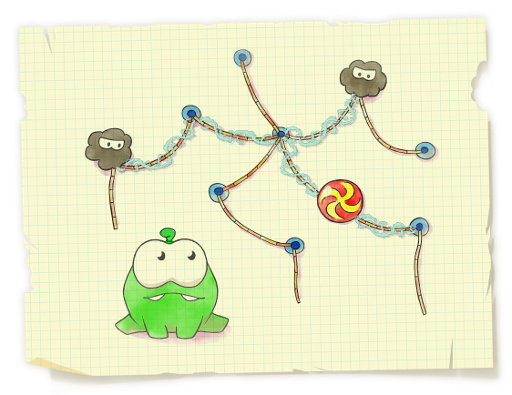

# Spiders Evil Plan
[CF526G]

Spiders are Om Nom's old enemies. They love eating candies as much as he does and that's why they keep trying to keep the monster away from his favorite candies. They came up with an evil plan to trap Om Nom.



Let's consider a rope structure consisting of n nodes and n - 1 ropes connecting the nodes. The structure is connected, thus, the ropes and the nodes form a tree. Each rope of the formed structure is associated with its length. A candy is tied to node x of the structure. Om Nom really wants to eat this candy.  
The y spiders are trying to stop him from doing it. They decided to entangle the candy and some part of the structure into a web, thus attaching the candy to as large as possible part of the rope structure.  
Each spider can use his web to cover all ropes on the path between two arbitrary nodes a and b. Thus, y spiders can cover the set of ropes which is a union of y paths in the given tree. These y paths can arbitrarily intersect each other. The spiders want the following conditions to be hold:  
the node containing the candy is adjacent to at least one rope covered with a web  
the ropes covered with the web form a connected structure (what's the idea of covering with a web the ropes that are not connected with the candy?)  
the total length of the ropes covered with web is as large as possible  
The spiders haven't yet decided to what node of the structure they will tie the candy and how many spiders will cover the structure with web, so they asked you to help them. Help them calculate the optimal plan for multiple values of x and y.

如果每次是单独的一组询问，那么直接以询问点为根，长链剖分贪心选取最长链。  
现在要处理多次询问，不能每次重新处理根。注意到每次选取的一定包含直径，那么以直径的两个端点为根分为维护长链剖分的结构。对于询问点，如果在查询的前 k 大链，那么直接输出，否则需要去掉最后一条链转而修改为当前这一条。

```cpp
#include<cstdio>
#include<cstring>
#include<algorithm>
#include<iostream>
using namespace std;

#define mem(Arr,x) memset(Arr,x,sizeof(Arr))
#define pw(x) (1<<(x))
const int maxN=100100;
const int maxM=maxN<<1;
const int maxB=17;

int n,Q,Log[maxN];
int edgecnt=-1,Head[maxN],Next[maxM],V[maxM],W[maxM],Dst[maxN];

class Tree{
    public:
    int root,Dep[maxN],Fa[maxN],Dst[maxN],Mx[maxN],ST[maxB][maxN],Mxd[maxB][maxN],dfncnt,dfn[maxN],lst[maxN];
    int lcnt,Mark[maxN];
    pair<int,int> Leaf[maxN];
    void dfs_init(int u,int fa){
        Dep[u]=0;ST[0][u]=fa;
        for (int i=Head[u];i!=-1;i=Next[i])
            if (V[i]!=fa){
                dfs_init(V[i],u);
                if (Dep[V[i]]+W[i]>Dep[u]) Mx[u]=V[i],Dep[u]=Dep[V[i]]+W[i];
            }
        return;
    }
    void dfs_push(int u,int fa,int w){
        Dep[u]=Dep[fa]+1;dfn[u]=++dfncnt;Mxd[0][dfncnt]=Dst[u];
        if (Mx[u]==0) Leaf[++lcnt]=make_pair(w,u);
        else{
            Fa[Mx[u]]=u;
            for (int i=Head[u];i!=-1;i=Next[i])
                if (V[i]!=fa) Dst[V[i]]=Dst[u]+W[i],dfs_push(V[i],u,(V[i]==Mx[u])?w+W[i]:W[i]);
        }
        lst[u]=dfncnt;
        return;
    }
    void Init(int r){
        root=r;dfs_init(root,0);Dep[root]=1;Dst[root]=0;dfs_push(root,0,0);
        for (int i=1;i<maxB;i++) for (int j=1;j<=n;j++) ST[i][j]=ST[i-1][ST[i-1][j]];
        sort(&Leaf[1],&Leaf[lcnt+1]);reverse(&Leaf[1],&Leaf[lcnt+1]);for (int i=1;i<=lcnt;i++) Leaf[i].first+=Leaf[i-1].first;
        for (int i=1;i<=lcnt;i++){
            int now=Leaf[i].second;
            while (now) Mark[now]=i,now=Fa[now];
        }
        for (int i=1;i<maxB;i++) for (int j=1;j+pw(i)-1<=n;j++) Mxd[i][j]=max(Mxd[i-1][j],Mxd[i-1][j+pw(i-1)]);
        return;
    }
    int LCA(int u,int v){
        if (Dep[u]<Dep[v]) swap(u,v);for (int i=maxB-1;i>=0;i--) if (ST[i][u]&&Dep[ST[i][u]]>=Dep[v]) u=ST[i][u];
        if (u==v) return u;for (int i=maxB-1;i>=0;i--) if (ST[i][u]&&ST[i][v]&&ST[i][u]!=ST[i][v]) u=ST[i][u],v=ST[i][v];
        return ST[0][u];
    }
    int GET(int u,int cnt){
        cnt=min(cnt*2-1,lcnt);
        if (Mark[u]<=cnt) return Leaf[cnt].first;
        int ret=Leaf[cnt-1].first;
        int now=u;for (int i=maxB-1;i>=0;i--) if (ST[i][now]&&Mark[ST[i][now]]>cnt) now=ST[i][now];now=ST[0][now];
        int l=dfn[u],r=lst[u],lg=Log[r-l+1];
        int mxd=max(Mxd[lg][l],Mxd[lg][r-pw(lg)+1]);
        ret=ret+mxd-Dst[now];
        return max(ret,Leaf[cnt].first+mxd-Dst[Leaf[Mark[now]].second]);
    }
};

Tree T1,T2;

void Add_Edge(int u,int v,int w);
void Bfs(int S);
int main(){
    for (int i=2;i<maxN;i++) Log[i]=Log[i>>1]+1;
    scanf("%d%d",&n,&Q);mem(Head,-1);
    for (int i=1;i<n;i++){
        int u,v,w;scanf("%d%d%d",&u,&v,&w);
        Add_Edge(u,v,w);Add_Edge(v,u,w);
    }
    int S,T;
    Bfs(1);S=1;for (int i=1;i<=n;i++) if (Dst[S]<Dst[i]) S=i;
    Bfs(S);T=1;for (int i=1;i<=n;i++) if (Dst[T]<Dst[i]) T=i;
    T1.Init(S);T2.Init(T);int lstans=0;
    while (Q--){
        int x,y;scanf("%d%d",&x,&y);
        x=(x+lstans-1)%n+1;y=(y+lstans-1)%n+1;
        printf("%d\n",lstans=max(T1.GET(x,y),T2.GET(x,y)));
    }
    return 0;
}
void Add_Edge(int u,int v,int w){
    Next[++edgecnt]=Head[u];Head[u]=edgecnt;V[edgecnt]=v;W[edgecnt]=w;
    return;
}
void Bfs(int S){
    static int vis[maxN],Qu[maxN];mem(vis,0);int l=1,r=1;Qu[1]=S;Dst[S]=0;vis[S]=1;
    while (l<=r) for (int u=Qu[l++],i=Head[u];i!=-1;i=Next[i]) if (vis[V[i]]==0) Dst[Qu[++r]=V[i]]=Dst[u]+W[i],vis[V[i]]=1;
    return;
}
```