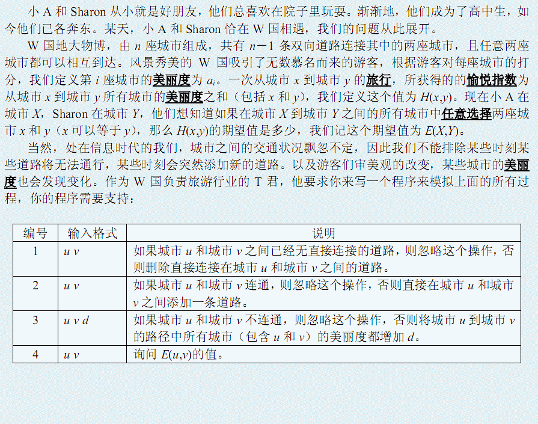

# 城市旅行
[BZOJ3091]



动态树问题用 LCT 维护。这个贡献可能不太好算，考虑合并左右儿子时，左边对右边的贡献以及右边对左边的贡献即可。

```cpp
#include<cstdio>
#include<cstdlib>
#include<cstring>
#include<algorithm>
#include<iostream>
using namespace std;

#define ll long long
#define mem(Arr,x) memset(Arr,x,sizeof(Arr))

const int maxN=50500;

class SplayData{
public:
    int ch[2],fa,sz,rev;
    ll lsum,rsum,pls,sum,key,ksum;
};

int n,m;
ll Ic[maxN],Is[maxN];
SplayData S[maxN];

bool Isroot(int x);
void Update(int x);
void Reverse(int x);
void Plus(int x,ll k);
void PushDown(int x);
void Rotate(int x);
void Splay(int x);
void Access(int x);
int Findroot(int x);
void Makeroot(int x);
void Split(int x,int y);
void Link(int x,int y);
void Cut(int x,int y);
void outp();

int main(){
    ll ss=0;
    for (int i=1;i<maxN;i++) ss=ss+1ll*i*i,Ic[i]=1ll*i*(i+1)/2,Is[i]=1ll*(i+1)*Ic[i]-ss;
    scanf("%d%d",&n,&m);
    for (int i=1;i<=n;i++) scanf("%lld",&S[i].key),S[i].sz=1,S[i].lsum=S[i].rsum=S[i].sum=S[i].ksum=S[i].key;
    for (int i=1;i<n;i++){
	int u,v;scanf("%d%d",&u,&v);
	Link(u,v);
    }
    while (m--){
	int opt,u,v,d;scanf("%d%d%d",&opt,&u,&v);
	if (opt==1) Cut(u,v);
	if (opt==2) Link(u,v);
	if (opt==3){
	    scanf("%d",&d);
	    if (Findroot(u)!=Findroot(v)) continue;
	    Split(u,v);Plus(u,d);
	}
	if (opt==4){
	    if (Findroot(u)!=Findroot(v)){
		printf("-1\n");continue;
	    }
	    Split(u,v);
	    ll Ans=S[u].sum,fr=Ic[S[u].sz];
	    ll g=__gcd(Ans,fr);
	    printf("%lld/%lld\n",S[u].sum/g,fr/g);
	}
    }
    return 0;
}
bool Isroot(int x){
    int fa=S[x].fa;
    if (S[fa].ch[0]==x||S[fa].ch[1]==x) return 0;
    return 1;
}
#define ls S[x].ch[0]
#define rs S[x].ch[1]
void Update(int x){
    S[x].sum=S[ls].sum+S[rs].sum+S[ls].lsum*(S[rs].sz+1)+(S[ls].sz+1)*S[rs].rsum+S[x].key*(S[ls].sz+1)*(S[rs].sz+1);
    S[x].lsum=S[ls].lsum+(S[x].key+S[rs].ksum)*(S[ls].sz+1)+S[rs].lsum;
    S[x].rsum=S[ls].rsum+(S[x].key+S[ls].ksum)*(S[rs].sz+1)+S[rs].rsum;
    S[x].ksum=S[ls].ksum+S[rs].ksum+S[x].key;
    S[x].sz=S[ls].sz+S[rs].sz+1;
    return;
}
void Reverse(int x){
    S[x].rev^=1;swap(ls,rs);swap(S[x].lsum,S[x].rsum);
    return;
}
void Plus(int x,ll k){
    S[x].sum+=k*Is[S[x].sz];
    S[x].lsum+=k*Ic[S[x].sz];
    S[x].rsum+=k*Ic[S[x].sz];
    S[x].ksum+=k*S[x].sz;
    S[x].pls+=k;S[x].key+=k;
    return;
}
void PushDown(int x){
    if (S[x].rev){
	if (ls) Reverse(ls);
	if (rs) Reverse(rs);
	S[x].rev=0;
    }
    if (S[x].pls){
	if (ls) Plus(ls,S[x].pls);
	if (rs) Plus(rs,S[x].pls);
	S[x].pls=0;
    }
    return;
}
void Rotate(int x){
    int y=S[x].fa,z=S[y].fa,sx=(x==S[y].ch[1]),sy=(y==S[z].ch[1]);
    S[x].fa=z;if (!Isroot(y)) S[z].ch[sy]=x;
    S[y].ch[sx]=S[x].ch[sx^1];if (S[x].ch[sx^1]) S[S[x].ch[sx^1]].fa=y;
    S[y].fa=x;S[x].ch[sx^1]=y;
    Update(y);return;
}
int St[maxN];
void Splay(int x){
    int now=x,top=1;St[1]=now;
    while (!Isroot(now)) St[++top]=now=S[now].fa;
    while (top) PushDown(St[top--]);
    while (!Isroot(x)){
	int y=S[x].fa,z=S[y].fa;
	if (!Isroot(y))
	    ((x==S[y].ch[0])^(y==S[z].ch[0]))?Rotate(x):Rotate(y);
	Rotate(x);
    }
    Update(x);return;
}
void Access(int x){
    int lstx=0;
    while (x){
	Splay(x);rs=lstx;Update(x);
	lstx=x;x=S[x].fa;
    }
    return;
}
int Findroot(int x){
    Access(x);Splay(x);PushDown(x);
    while (ls) x=ls,PushDown(x);
    Splay(x);return x;
}
void Makeroot(int x){
    Access(x);Splay(x);
    Reverse(x);return;
}
void Split(int x,int y){
    Makeroot(x);Access(y);Splay(x);
    return;
}
void Link(int x,int y){
    if (Findroot(x)==Findroot(y)) return;
    Makeroot(x);S[x].fa=y;return;
}
void Cut(int x,int y){
    if (Findroot(x)!=Findroot(y)) return;
    Split(x,y);
    if (S[x].ch[1]!=y) return;
    S[x].ch[1]=S[y].fa=0;Update(x);return;
}
```