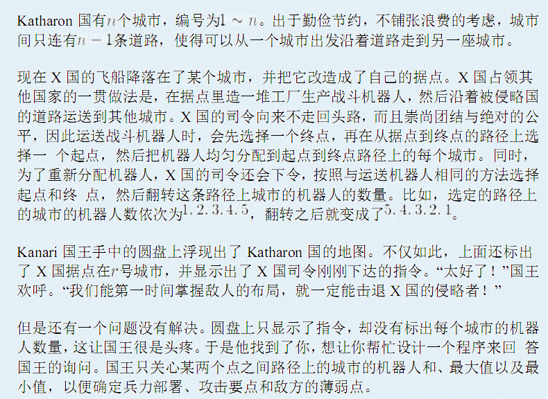
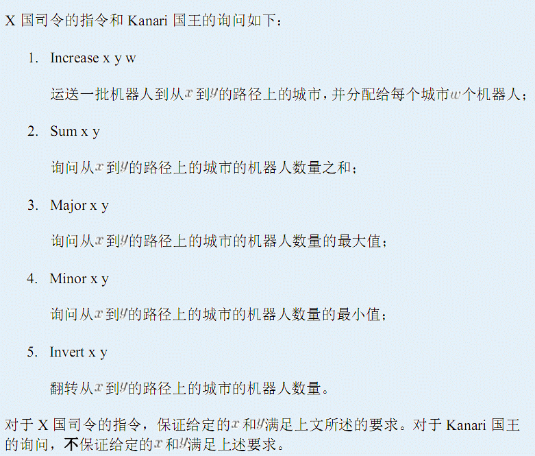

# 决战
[BZOJ3159]





观察到翻转操作是对路径上的机器人数量而不是城市，需要支持 Merge+Split+Reverse 的数据结构，自然就是 Treap+树链剖分了。

```cpp
#include<cstdio>
#include<cstdlib>
#include<cstring>
#include<algorithm>
using namespace std;

#define mem(Arr,x) memset(Arr,x,sizeof(Arr))
#define Max(x,y) x=max(x,y)
#define Min(x,y) x=min(x,y)
#define ll long long

const int maxN=50500;
const int maxM=maxN<<1;

class Treap{
public:
    int ls,rs,sz;
    ll sum,mx,mn,pls,rev,key;
};

int n,m,root;
int edgecnt=0,Head[maxN],Next[maxM],V[maxM],dep[maxN];
int Sz[maxN],Hs[maxN],Fa[maxN],Top[maxN],Rt[maxN],nodecnt;
Treap T[maxN];

void Add_Edge(int u,int v);
void dfs1(int u,int fa);
void dfs2(int u,int top);
void Build(int &x,int l,int r);
void Plus(int x,int k);
void Reverse(int x);
void PushDown(int x);
void Update(int x);
void Split(int u,int k,int &x,int &y);
int Merge(int u,int v);
int Split(int x,int y);
void Pushback(int rt,int x,int y);

int main(){
    scanf("%d%d%d",&n,&m,&root);mem(Head,-1);
    for (int i=1;i<n;i++){
		int u,v;scanf("%d%d",&u,&v);
		Add_Edge(u,v);Add_Edge(v,u);
    }
    dfs1(root,0);dfs2(root,root);
    while (m--){
		char ipt[10];int x,y;scanf("%s%d%d",ipt,&x,&y);
		int rt=Split(x,y);
		if (ipt[0]=='I'&&ipt[2]=='c'){
			int w;scanf("%d",&w);
			Plus(rt,w);
		}
		if (ipt[0]=='S') printf("%lld\n",T[rt].sum);
		if (ipt[0]=='M'&&ipt[1]=='a') printf("%lld\n",T[rt].mx);
		if (ipt[0]=='M'&&ipt[1]=='i') printf("%lld\n",T[rt].mn);
		if (ipt[0]=='I'&&ipt[2]=='v') Reverse(rt);
		Pushback(rt,x,y);
    }
    return 0;
}
void Add_Edge(int u,int v){
    Next[++edgecnt]=Head[u];Head[u]=edgecnt;V[edgecnt]=v;
    return;
}
void dfs1(int u,int fa){
    dep[u]=dep[fa]+1;Sz[u]=1;Fa[u]=fa;
    for (int i=Head[u];i!=-1;i=Next[i])
		if (V[i]!=fa){
			dfs1(V[i],u);Sz[u]+=Sz[V[i]];
			if (Sz[V[i]]>Sz[Hs[u]]) Hs[u]=V[i];
		}
    return;
}
void dfs2(int u,int top){
    Top[u]=top;
    if (Hs[u]==0){
		Build(Rt[top],dep[top],dep[u]);
		return;
    }
    dfs2(Hs[u],top);
    for (int i=Head[u];i!=-1;i=Next[i])
		if (V[i]!=Fa[u]&&V[i]!=Hs[u]) dfs2(V[i],V[i]);
    return;
}
void Build(int &x,int l,int r){
    x=++nodecnt;T[x].sz=r-l+1;
    int mid=(l+r)>>1;
    if (l<mid) Build(T[x].ls,l,mid-1);
    if (mid<r) Build(T[x].rs,mid+1,r);
    return;
}
void Plus(int x,int k){
    T[x].pls+=k;T[x].sum+=k*T[x].sz;T[x].mn+=k;T[x].mx+=k;T[x].key+=k;
    return;
}
void Reverse(int x){
    T[x].rev^=1;swap(T[x].ls,T[x].rs);
    return;
}
void PushDown(int x){
    if (T[x].rev){
		if (T[x].ls) Reverse(T[x].ls);
		if (T[x].rs) Reverse(T[x].rs);
		T[x].rev=0;
    }
    if (T[x].pls){
		if (T[x].ls) Plus(T[x].ls,T[x].pls);
		if (T[x].rs) Plus(T[x].rs,T[x].pls);
		T[x].pls=0;
    }
    return;
}
void Update(int x){
    T[x].sz=T[T[x].ls].sz+T[T[x].rs].sz+1;
    T[x].sum=T[T[x].ls].sum+T[T[x].rs].sum+T[x].key;
    T[x].mn=T[x].mx=T[x].key;
    if (T[x].ls) Min(T[x].mn,T[T[x].ls].mn),Max(T[x].mx,T[T[x].ls].mx);
    if (T[x].rs) Min(T[x].mn,T[T[x].rs].mn),Max(T[x].mx,T[T[x].rs].mx);
    return;
}
void Split(int u,int k,int &x,int &y){
    if (u==0){
		x=y=0;return;
    }
    PushDown(u);
    if (T[T[u].ls].sz>=k) y=u,Split(T[u].ls,k,x,T[y].ls),Update(y);
    else x=u,Split(T[u].rs,k-T[T[u].ls].sz-1,T[u].rs,y),Update(x);
    return;
}
int Merge(int u,int v){
    if (!u||!v) return u+v;
    PushDown(u);PushDown(v);
    if (rand()%(T[u].sz+T[v].sz)+1<=T[u].sz){
		T[u].rs=Merge(T[u].rs,v);Update(u);return u;
    }
    else{
		T[v].ls=Merge(u,T[v].ls);Update(v);return v;
    }
}
int Split(int x,int y){
    int rt1=0,rt2=0;
    while (Top[x]!=Top[y]){
		if (dep[Top[x]]>=dep[Top[y]]){
			int left,right;Split(Rt[Top[x]],dep[x]-dep[Top[x]]+1,left,right);
			Rt[Top[x]]=right;rt1=Merge(left,rt1);x=Fa[Top[x]];
		}
		else{
			int left,right;Split(Rt[Top[y]],dep[y]-dep[Top[y]]+1,left,right);
			Rt[Top[y]]=right;rt2=Merge(left,rt2);y=Fa[Top[y]];
		}
    }
    if (dep[x]<=dep[y]){
		int a,b,c;
		Split(Rt[Top[x]],dep[y]-dep[Top[x]]+1,a,c);
		Split(a,dep[x]-dep[Top[x]],a,b);
		Rt[Top[x]]=Merge(a,c);
		rt2=Merge(b,rt2);
    }
    else{
		int a,b,c;
		Split(Rt[Top[x]],dep[x]-dep[Top[x]]+1,a,c);
		Split(a,dep[y]-dep[Top[x]],a,b);
		Rt[Top[x]]=Merge(a,c);
		rt1=Merge(b,rt1);
    }
    if (rt1) Reverse(rt1);
    return Merge(rt1,rt2);
}
void Pushback(int rt,int x,int y){
    while (Top[x]!=Top[y]){
		if (dep[Top[x]]>=dep[Top[y]]){
			int push;Split(rt,dep[x]-dep[Top[x]]+1,push,rt);
			Reverse(push);Rt[Top[x]]=Merge(push,Rt[Top[x]]);
			x=Fa[Top[x]];
		}
		else{
			int push;Split(rt,T[rt].sz-(dep[y]-dep[Top[y]]+1),rt,push);
			Rt[Top[y]]=Merge(push,Rt[Top[y]]);
			y=Fa[Top[y]];
		}
    }
    if (dep[x]<=dep[y]){
		int a,b;
		Split(Rt[Top[x]],dep[x]-dep[Top[x]],a,b);
		Rt[Top[x]]=Merge(Merge(a,rt),b);
    }
    else{
		int a,b;Reverse(rt);
		Split(Rt[Top[x]],dep[y]-dep[Top[x]],a,b);
		Rt[Top[y]]=Merge(Merge(a,rt),b);
    }
    return;
}
```