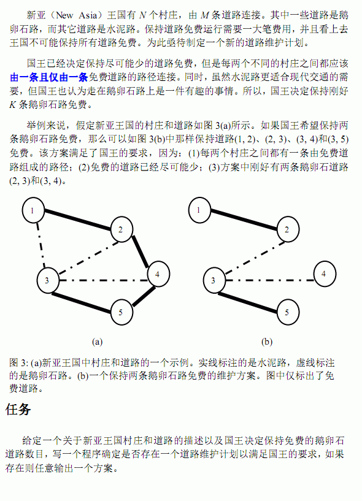

# [APIO2008]免费道路
[BZOJ3624 Luogu3623]



先把水泥路所有的边联通起来，得到必须连的鹅卵石路，然后再把能加的鹅卵石路加进去。注意随时判断无解。

```cpp
#include<iostream>
#include<cstdio>
#include<cstdlib>
#include<algorithm>
using namespace std;

#define ll long long
#define mem(Arr,x) memset(Arr,x,sizeof(Arr))

const int maxN=20200;
const int maxM=101000;
const int inf=2147483647;

class Edge
{
public:
	int u,v;
};

int n,m,K;
int UFS[maxN];
Edge E1[maxM],E2[maxM];
bool Mark[maxM];

int Find(int x);

int main(){
	scanf("%d%d%d",&n,&m,&K);
	int e1=0,e2=0;
	for (int i=1;i<=m;i++){
		int u,v,opt;scanf("%d%d%d",&u,&v,&opt);
		if (opt==0) E1[++e1]=((Edge){u,v});
		if (opt==1) E2[++e2]=((Edge){u,v});
	}

	for (int i=1;i<=n;i++) UFS[i]=i;
	for (int i=1;i<=e2;i++)	if (Find(E2[i].u)!=Find(E2[i].v)) UFS[Find(E2[i].u)]=Find(E2[i].v);

	int cnt=0;
	for (int i=1;i<=e1;i++)
		if (Find(E1[i].u)!=Find(E1[i].v)){
			Mark[i]=1;UFS[Find(E1[i].u)]=Find(E1[i].v);cnt++;
		}

	if (cnt>K){
		printf("no solution\n");return 0;
	}

	for (int i=1;i<=n;i++)
		if (Find(i)!=Find(1)){
			printf("no solution\n");return 0;
		}

	for (int i=1;i<=n;i++) UFS[i]=i;
	for (int i=1;i<=e1;i++) if (Mark[i]) UFS[Find(E1[i].u)]=Find(E1[i].v);

	for (int i=1;(cnt<K)&&(i<=e1);i++)
		if ((Mark[i]==0)&&(Find(E1[i].u)!=Find(E1[i].v))){
			Mark[i]=1;cnt++;UFS[Find(E1[i].u)]=Find(E1[i].v);
		}

	if (cnt<K){
		printf("no solution\n");return 0;
	}

	for (int i=1;i<=e1;i++) if (Mark[i]) printf("%d %d 0\n",E1[i].u,E1[i].v);

	for (int i=1;i<=e2;i++)
		if (Find(E2[i].u)!=Find(E2[i].v)){
			printf("%d %d 1\n",E2[i].u,E2[i].v);
			UFS[Find(E2[i].u)]=Find(E2[i].v);
		}

	return 0;
}

int Find(int x){
	if (UFS[x]!=x) UFS[x]=Find(UFS[x]);
	return UFS[x];
}
```