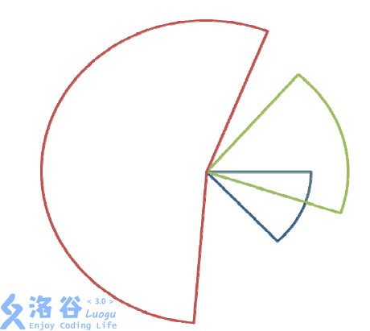

# [SHOI2013]扇形面积并
[BZOJ4418 Luogu3997]



给定 n 个同心的扇形，求有多少面积，被至少k 个扇形所覆盖。

扫描线一下，树状数组求第 K 大。

```cpp
#include<iostream>
#include<cstdio>
#include<cstdlib>
#include<cstring>
#include<algorithm>
#include<vector>
using namespace std;

#define ll long long
#define mem(Arr,x) memset(Arr,x,sizeof(Arr))

const int maxN=1010000*2;
const int inf=2147483647;

int n,m,K;
vector<int> V[maxN];
int num,Num[maxN];
int BIT[maxN];

void Add(int pos,int key);
int Kth(int k);

int main(){
	scanf("%d%d%d",&n,&m,&K);
	for (int i=1;i<=n;i++){
		int r,a,b;scanf("%d%d%d",&r,&a,&b);a+=m;b+=m-1;Num[++num]=r;
		if (a<=b) V[a].push_back(r),V[b+1].push_back(-r);
		else{
			V[a].push_back(r);
			V[0].push_back(r);V[b+1].push_back(-r);
		}
	}
	sort(&Num[1],&Num[num+1]);num=unique(&Num[1],&Num[num+1])-Num-1;
	ll Ans=0;
	for (int i=0,cnt=0;i<m+m;i++){
		for (int j=0,sz=V[i].size();j<sz;j++){
			int key=lower_bound(&Num[1],&Num[num+1],abs(V[i][j]))-Num;
			if (V[i][j]>0) ++cnt,Add(num-key+1,1);
			else --cnt,Add(num-key+1,-1);
		}
		if (cnt>=K){
			int p=Num[num-Kth(K)+1];
			Ans=Ans+1ll*p*p;
		}
	}
	printf("%lld\n",Ans);return 0;
}

void Add(int pos,int key){
	while (pos<=num){
		BIT[pos]+=key;pos+=(pos)&(-pos);
	}
	return;
}

int Kth(int k){
	int now=0,sum=0;
	for (int i=20;i>=0;i--){
		now=now+(1<<i);
		if ((now>num)||(sum+BIT[now]>=k)) now-=(1<<i);
		else sum+=BIT[now];
	}
	return now+1;
}
```