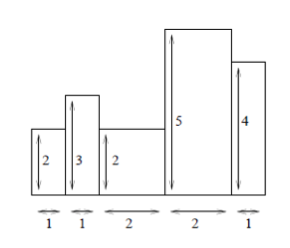
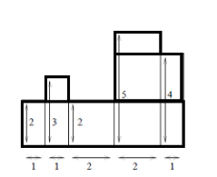

# [ZJOI2012]小蓝的好友
[BZOJ2658 Luogu2611]

终于到达了这次选拔赛的最后一题，想必你已经厌倦了小蓝和小白的故事，为了回馈各位比赛选手，此题的主角是贯穿这次比赛的关键人物——小蓝的好友。  
在帮小蓝确定了旅游路线后，小蓝的好友也不会浪费这个难得的暑假。与小蓝不同，小蓝的好友并不想将时间花在旅游上，而是盯上了最近发行的即时战略游戏——SangoCraft。但在前往通关之路的道路上，一个小游戏挡住了小蓝的好友的步伐。  
“国家的战争其本质是抢夺资源的战争”是整款游戏的核心理念，这个小游戏也不例外。简单来说，用户需要在给定的长方形土地上选出一块子矩形，而系统随机生成了N个资源点，位于用户所选的长方形土地上的资源点越多，给予用户的奖励也越多。悲剧的是，小蓝的好友虽然拥有着极其优秀的能力，但同时也有着极差的RP，小蓝的好友所选的区域总是没有一个资源点。  
终于有一天，小蓝的好友决定投诉这款游戏的制造厂商，为了搜集证据，小蓝的好友想算出至少包含一个资源点的区域的数量。作为小蓝的好友，这自然是你分内之事。

首先还是化成求补集：不包含任何一个资源点的区域的数量。然后考虑枚举行，那么，每一个点向上就能够确定一个高度。  

按照高度分割一下得到  

从下往上维护一个深度增加的树，对于每一个区间来说 C[size+1][h] 就是在这个区域内的矩形个数。  
可以发现是笛卡尔树的形式，那么使用 Treap 来动态地维护这个笛卡尔树。扫描线扫描到一个资源点的时候，相当于是把这个部分的高度强制设置为 0 ，而扫描线向下移动一层则相当于将根节点的高度增加 1 并打上一个 +1 标记。  
为了方便修改，在每一个节点上的 sum 维护的是其儿子而不包括自己的贡献，这样在修改高度的时候就不需要记录更多的信息了。

```cpp
#include<iostream>
#include<cstdio>
#include<cstring>
#include<cstdlib>
#include<algorithm>
#include<vector>
using namespace std;

#define ll long long
#define mem(Arr,x) memset(Arr,x,sizeof(Arr))

const int maxN=40100;
const int maxM=101000;

class TreapData
{
public:
	int ht,ch[2],size;
	ll pls,sum;
};

int n,m,K,root;
ll S[maxM],Ans=0;
vector<int> V[maxN];
TreapData T[maxN];

void Update(int x);
void Plus(int x,ll h);
void PushDown(int x);
void Rotate(int &x,int c);
void Modify(int &x,int kth);

int main(){
	for (int i=1;i<maxM;i++) S[i]=1ll*i*(i-1)/2;
	
	scanf("%d%d%d",&n,&m,&K);
	for (int i=1;i<=K;i++){
		int x,y;scanf("%d%d",&x,&y);
		V[x].push_back(y);
	}
	for (int i=1;i<m;i++) T[i].ch[1]=i+1;
	for (int i=m;i>=1;i--) Update(i);
	root=1;
	
	ll Ans=S[n+1]*S[m+1];
	for (int i=1;i<=n;i++){
		Plus(root,1);
		for (int j=0,sz=V[i].size();j<sz;j++) Modify(root,V[i][j]);
		Ans=Ans-T[root].sum-S[T[root].size+1]*T[root].ht;
	}
	printf("%lld\n",Ans);return 0;
}

void Update(int x){
	T[x].size=1;T[x].sum=0;
	if (T[x].ch[0]){
		T[x].size+=T[T[x].ch[0]].size;
		T[x].sum+=T[T[x].ch[0]].sum+S[T[T[x].ch[0]].size+1]*(T[T[x].ch[0]].ht-T[x].ht);
	}
	if (T[x].ch[1]){
		T[x].size+=T[T[x].ch[1]].size;
		T[x].sum+=T[T[x].ch[1]].sum+S[T[T[x].ch[1]].size+1]*(T[T[x].ch[1]].ht-T[x].ht);
	}
	return;
}

void Plus(int x,ll h){
	T[x].ht+=h;T[x].pls+=h;return;
}

void PushDown(int x){
	if (T[x].pls==0) return;
	if (T[x].ch[0]) Plus(T[x].ch[0],T[x].pls);
	if (T[x].ch[1]) Plus(T[x].ch[1],T[x].pls);
	T[x].pls=0;
	return;
}

void Rotate(int &x,int c){
	int y=T[x].ch[c];
	T[x].ch[c]=T[y].ch[c^1];
	T[y].ch[c^1]=x;
	Update(x);Update(y);x=y;return;
}

void Modify(int &x,int kth){
	PushDown(x);
	if (T[T[x].ch[0]].size+1==kth){
		T[x].ht=0;Update(x);return;
	}
	else if (T[T[x].ch[0]].size+1>kth){
		Modify(T[x].ch[0],kth);
		Rotate(x,0);return;
	}
	else{
		Modify(T[x].ch[1],kth-T[T[x].ch[0]].size-1);
		Rotate(x,1);return;
	}
}
```